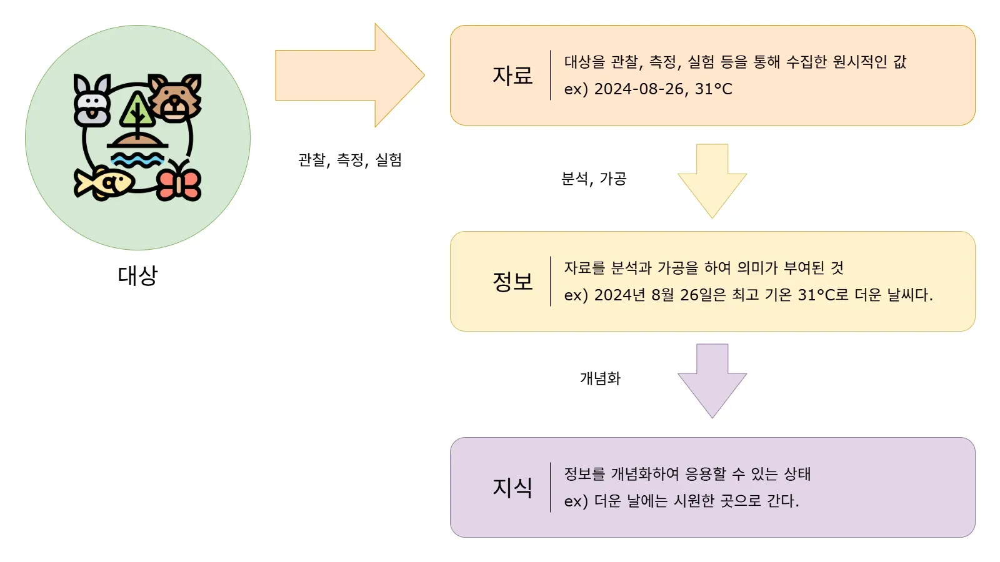
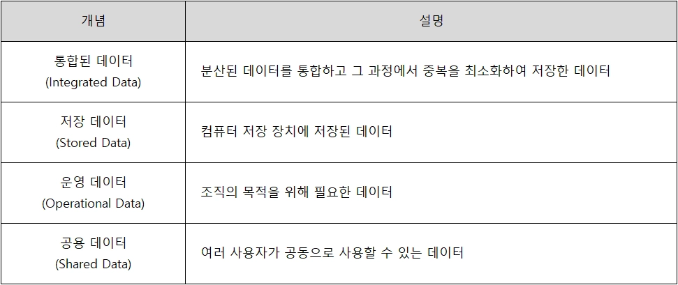
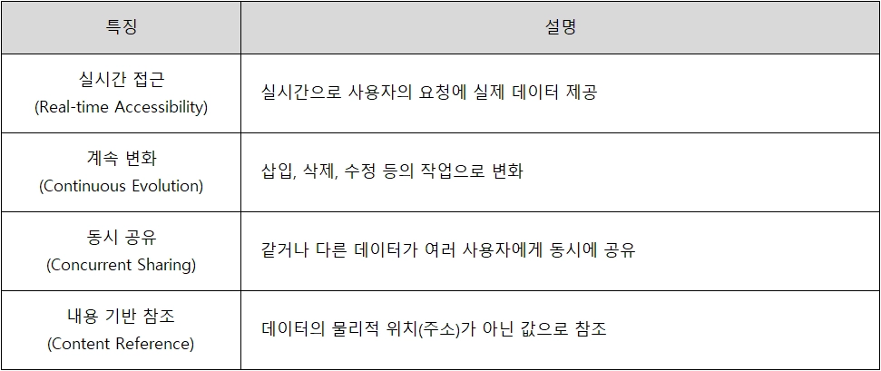
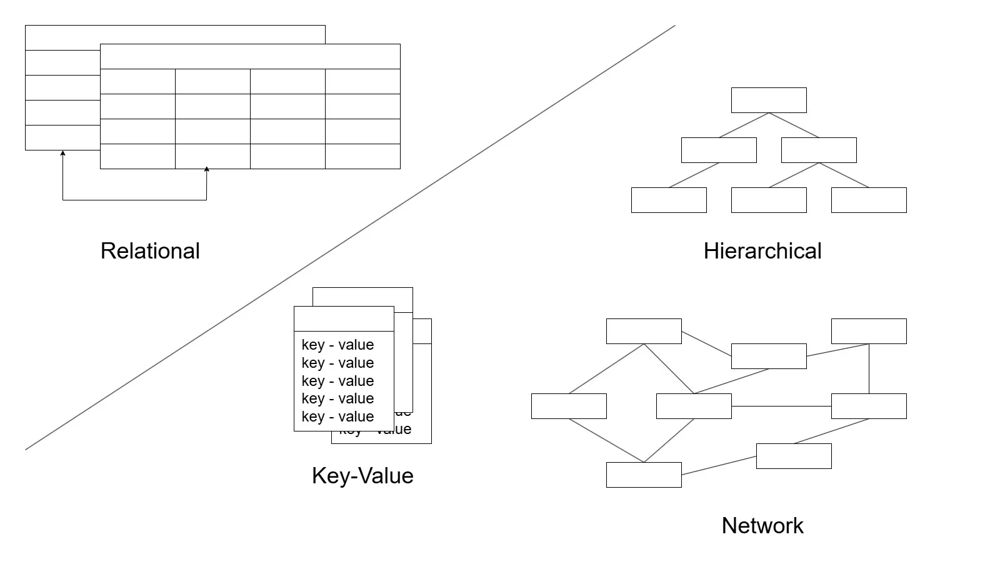
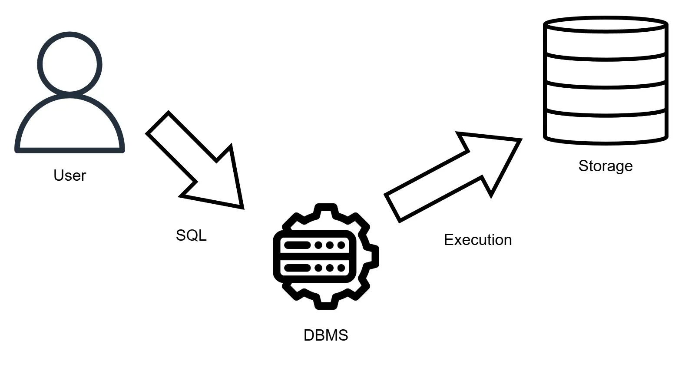
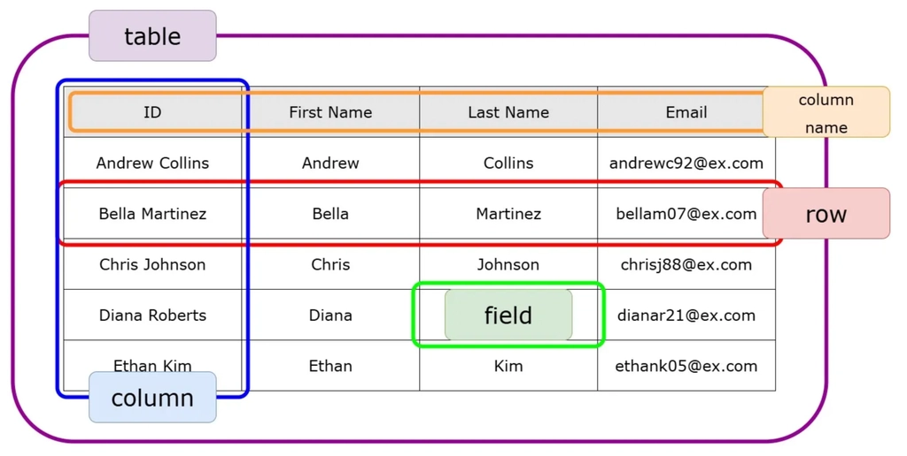
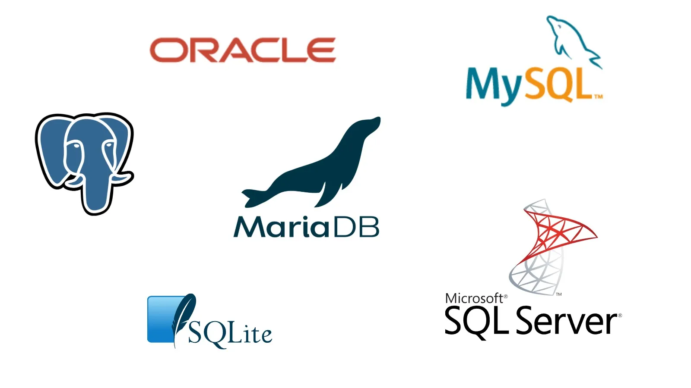

> 학습 원본 보존 문서. 개인 프로젝트 성과나 전체 코드의 직접 작성 사실을 주장하지 않음.
> 출처: [.기초수업](https://app.notion.com/p/36cddb1a637780758fd2f1a040247136), 원본 행 1941–2022.

<details>

<summary>자료(Data) vs 정보(Information) vs 지식(Knowledge)</summary>



</details>

<details>

<summary>개념</summary>



</details>

<details>

<summary>특징</summary>



</details>

<details>

<summary>vs 파일 시스템 (File System)</summary>

```text
Database이전에 자료를 저장하던 방식

- 데이터를 파일 단위로 저장
- 응용 프로그램마다 독립적으로 파일 제어
	=> 같은 데이터가 여러 파일에 저장될 수 있어 중복 가능성이 높음
- 하나의 파일을 여러 응용 프로그램이 제어할 수 없기 때문에 일관성이 훼손됨.
```

</details>

<details>

<summary>Model</summary>



</details>

<details>

<summary>DBMS</summary>

[데이터베이스 관리 시스템 — 원본 참고 링크](https://app.notion.com/p/36cddb1a637780758fd2f1a040247136#37cddb1a637780edbc9ad23c3632c4e5)
```javascript
DBMS - Database Management System

사용자가 Database에 접근하고 사용할 수 있게 해주는 시스템
```

<details>

<summary>동작 방식</summary>



</details>

<details>

<summary>용어정리</summary>



| 용어 | 설명 |
| --- | --- |
| **Schema(스키마)** | 자료의 구조, 표현, 관계를 정의한 것 |
| **Table (테이블)** | 데이터 저장 기본 단위<br>열과 행으로 구성된 표 형태 |
| **Row (행)** | 레코드(Record), 튜플(Tuple)<br>대상에 대한 정보를 확인 |
| **Column (열)** | 속성(attribute)<br>대상이 가지는 속성을 표기<br>속성은 모두 같은 데이터 타입(Data Type)을 가짐 |
| **Field (필드)** | 대상의 속성에 해당 하는 값<br>표에서 한 칸 |
| **Query(쿼리)** | 데이터를 검색하거나 수정하기 위한 명령어. SQL이 대표적 |

</details>

<details>

<summary>DBMS 종류</summary>



</details>

</details>
