> 학습 원본 보존 문서. 개인 프로젝트 성과나 전체 코드의 직접 작성 사실을 주장하지 않음.
> 출처: [.기초수업](https://app.notion.com/p/36cddb1a637780758fd2f1a040247136), 원본 행 2132–4294.

<details>

<summary>SQL</summary>

[SQL — 원본 참고 링크](https://app.notion.com/p/36cddb1a637780758fd2f1a040247136#37dddb1a637780268eded39272e3bec2)
```text
SQL - Structured Query Language

구조화된 질의 언어
사용자가 Database를 관리하기 위해 DBMS로 요청(질의)을 보내기 위한 언어
비절차적 언어로, 실행 절차에 대해서는 명시하지 않고 조건만 기술
```
### 종류
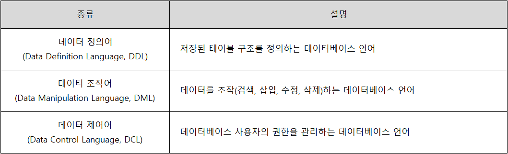

<details>

<summary>TCL - Transaction Control Language</summary>

```text
※※※※※※ TCL - Transaction Control Language ※※※※※※
트랜잭션 관리 언어
질의 실행 시 트랜잭션이 발생한 경우 그 트랜잭션을 관리하는 데이터베이스 언어
* 트랜잭션(Transaction): 데이터를 처리하는 논리적인 작업 단위
** 트랜잭션은 일부 DML에서만 발생
```

</details>

### Data Type - 자료형

```text
Table에 저장되는 자료의 형식
숫자, 문자, 날짜(시간) 등
```


| 구분 | 데이터 타입 |
| --- | --- |
| 숫자형 | INT, FLOAT, DOUBLE 등 |
| 문자형 | CHAR, VARCHAR, TEXT 등 |
| 날짜(시간) | DATE, TIMESTAMP 등 |
| 논리형 | BOOLEAN |

<details>

<summary>CHAR vs VARCHAR</summary>

CHAR - 지정된 길이만큼 디스크에 공간을 잡는다.
장점 : 길이가 고정된 값을 입력할 때 유리
단점 : 최대 길이보다 짧은 값 입력시 낭비가 된다.
VARCHAR - 최대 길이만 지정하고 입력받은 길이만큼만 공간을 잡는다.
장점 : 길이가 자주 변하는 값을 입력할 때 유리
단점 : 기억 공간에 연결된 형태로 저장하지 않기 때문에 길이가 길어지면 속도가 느릴 수 있다.

</details>

### Identifier - 식별자
```text
* Database Object: Database, Table, View, Index, Trigger, Procedure …
Database Object의 이름을 지정

규칙
- 알파벳 대소문자(a-z, A-Z), 숫자(0~9), 특수문자($, _) 사용 가능
- 최대 64자
- 예약어 불가(SELECT, INSERT, CHAR 등)
- 공백 포함 시 백틱(`, 키보드 ~ 위치)으로 묶어서 사용 - ex. `한국정보교육원 503호` 
```
### DDL - Data Definition Language
[데이터 정의 언어 — 원본 참고 링크](https://app.notion.com/p/36cddb1a637780758fd2f1a040247136#37dddb1a6377803eb3f5d85bac788c0c)
```text
DDL - Data Definition Language

데이터 정의 언어
저장될 데이터와 데이터가 저장될 구조를 정의하는 언어
Database Object의 생성/수정/삭제
```

<details>

<summary>Create - 생성</summary>

```javascript
# 기본 문법
# IF NOT EXISTS: 현재 존재하지 않으면 실행. (생략 가능)
CREATE <<Object Type>> [IF NOT EXISTS] <<Object Name>>;
```

<details>

<summary>Database 생성</summary>

```sql
CREATE DATABASE keduDB; 
```

</details>

<details>

<summary>Table 생성</summary>

<details>

<summary>userTBL</summary>

```sql
# Table 이름
## userTBL
CREATE TABLE userTBL (
    id VARCHAR(5),
    name VARCHAR(100),
    email VARCHAR(255),
    birth INT,
    age INT,
    mileage INT,
    major VARCHAR(10)
);
```


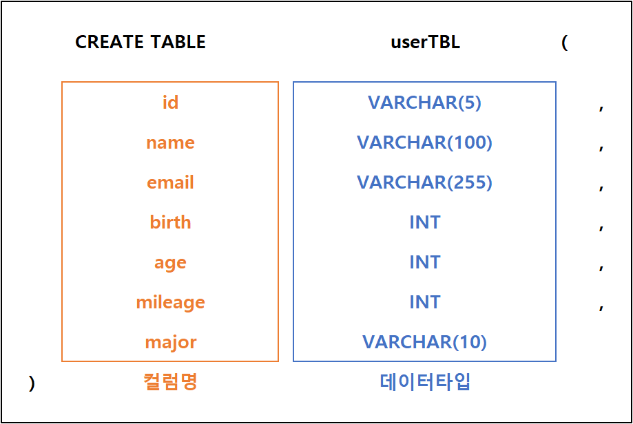

</details>

<details>

<summary>buyTBL</summary>

```javascript
# Table 이름
## buyTBL
CREATE TABLE buyTBL (
    id INT,
    userID VARCHAR(5),
    productName VARCHAR(50),
    amount INT,
    price INT,
    buyDate DATE
);

```


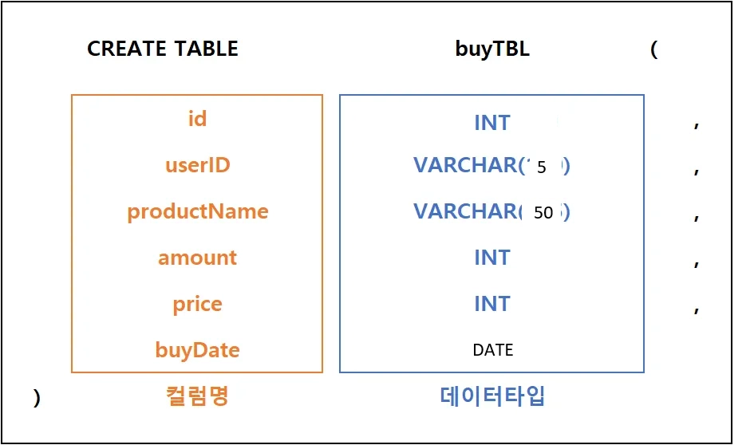

</details>

</details>

</details>

<details>

<summary>Alter - 수정</summary>

```sql
# 기본 문법
ALTER TABLE [IF EXISTS] <<Table Name>> <<Specification>>;
```
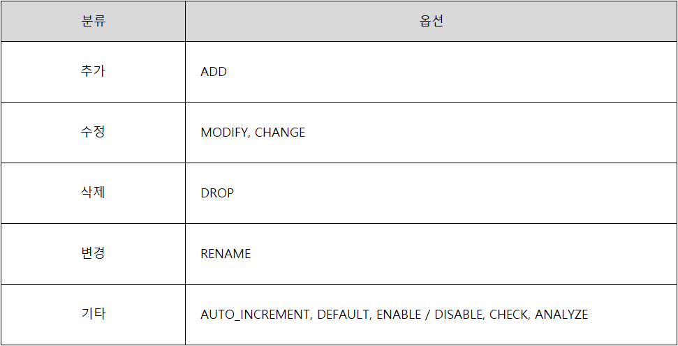

<details>

<summary>test용 테이블 생성</summary>

```sql
# test용 테이블 생성
CREATE TABLE alterTest (
    2nd INT,
    3rd INT,
    4th INT
);
```

</details>

<details>

<summary>컬럼 추가</summary>

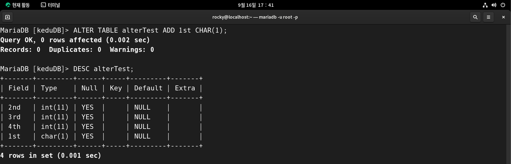
```sql
# 1st 컬럼 추가
ALTER TABLE alterTest ADD 1st CHAR(1);

# 추가된 컬럼 확인
DESC alterTest;
```

</details>

<details>

<summary>순서 변경</summary>

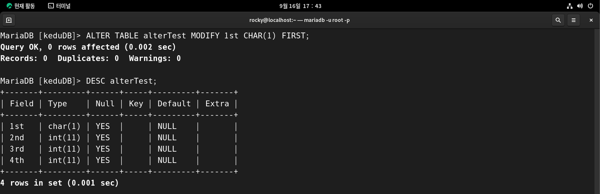
```sql
# 1st 컬럼의 위치를 첫번째로 변경
ALTER TABLE alterTest MODIFY 1st CHAR(1) FIRST;

# 순서 변경됐는지 확인
DESC alterTest;
```

</details>

<details>

<summary>타입 수정</summary>

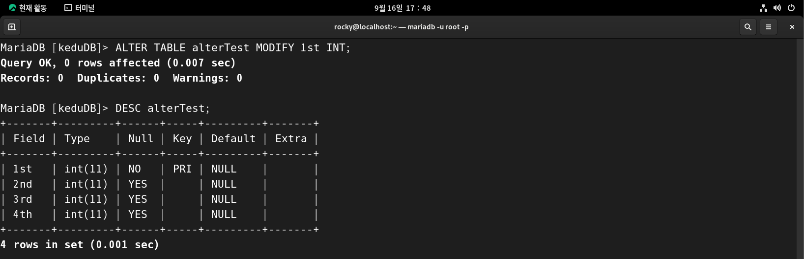
```sql
# 1st 컬럼의 Data Type을 INT로 변경
ALTER TABLE alterTest MODIFY 1st INT;

# 변경 확인
DESC alterTest;
```

</details>

<details>

<summary>컬럼 삭제</summary>

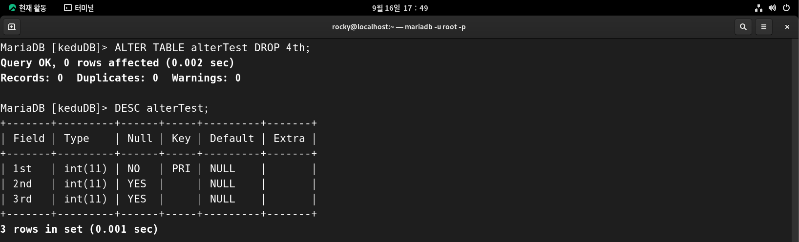
```sql
# 4th 컬럼을 삭제
ALTER TABLE alterTest DROP 4th;

# 확인
DESC alterTest;
```

</details>

</details>

<details>

<summary>Drop - 삭제</summary>

```sql
# 기본 문법
# IF EXISTS: 존재하면 실행. (생략 가능)
DROP <<Object Type>> [IF EXISTS] <<Object Name>>;
```

<details>

<summary>Test Table 삭제</summary>

```javascript
mysql> SHOW TABLES;
+------------------+
| Tables_in_keduDB |
+------------------+
| alterTest        |
| buyTBL           |
| userTBL          |
+------------------+
3 rows in set (0.00 sec)

mysql> DROP TABLE alterTest;
Query OK, 0 rows affected (0.00 sec)

mysql> SHOW TABLES;
+------------------+
| Tables_in_keduDB |
+------------------+
| buyTBL           |
| userTBL          |
+------------------+
2 rows in set (0.00 sec)

```

</details>

</details>

### DML - Data Manipulation Language \<

<details>

<summary>통합코드해석</summary>

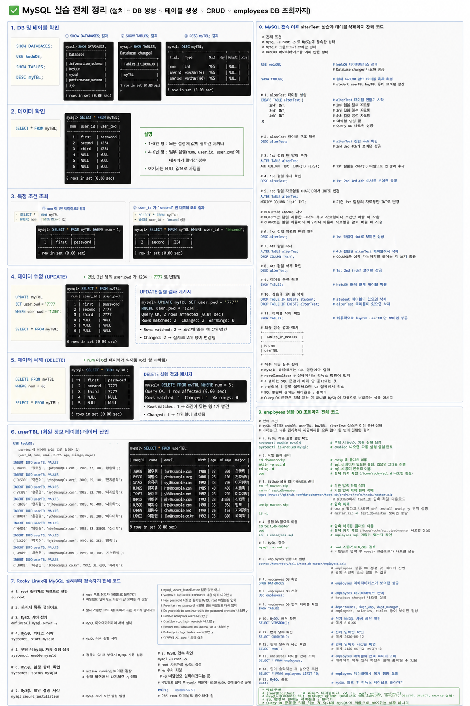

</details>

[데이터 조작 언어 — 원본 참고 링크](https://app.notion.com/p/36cddb1a637780758fd2f1a040247136#37dddb1a63778086bf44ce8968fac2ec)
```text
DML - Data Manipulation Language

데이터 조작 언어
DB에 저장된 데이터를 조작하는 언어
삽입, 수정, 삭제, 조회
```

<details>

<summary>예제 Database 다운로드</summary>

[MySQL :: Other MySQL Documentation — 원본 참고 링크](https://app.notion.com/p/36cddb1a637780758fd2f1a040247136#37dddb1a637780849298c992df4cd500)
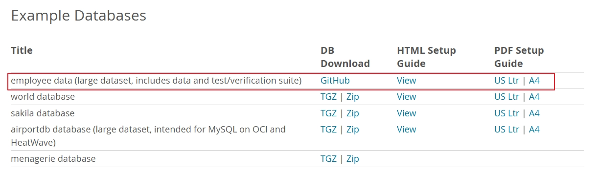
```javascript
# 예제 파일 모아둘 directory 생성
mkdir sql.d

# sql.d로 이동
cd sql.d

# wget으로 zip파일 다운로드
wget https://github.com/datacharmer/test_db/archive/refs/heads/master.zip
```
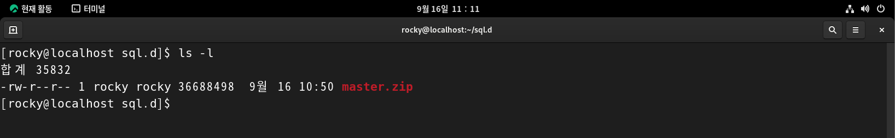
```shell
# ls로 파일 확인
ls -l
```
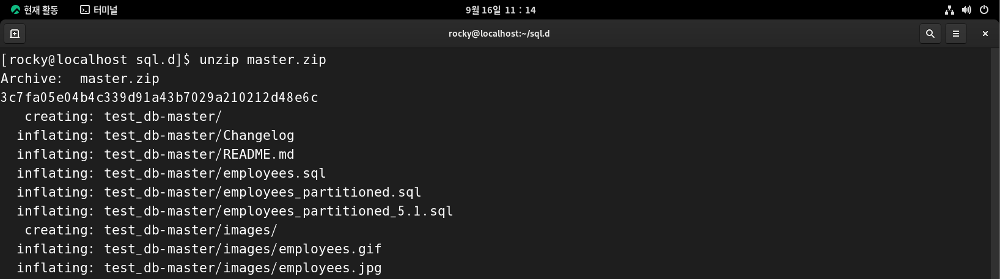
```shell
# unzip으로 압축 해제
unzip master.zip
```
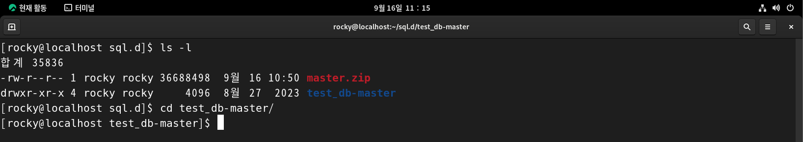
```shell
# ls로 압축 해제한 파일 확인
ls -l

# test_db-master로 이동
cd test_db-master
```
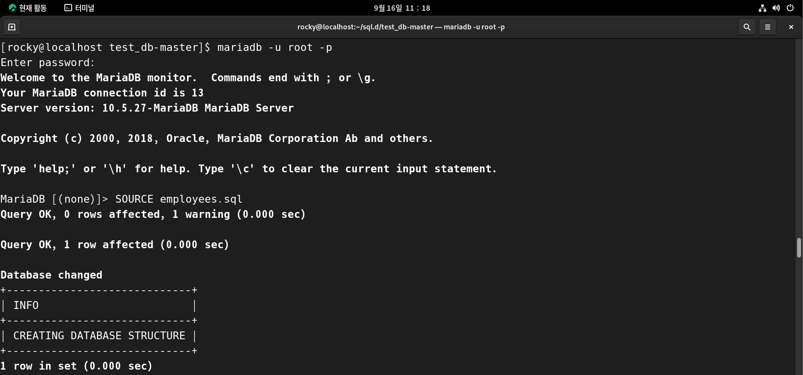
```sql
# mysql -u root -p로 접속
# 예제 db 불러오기
SOURCE employees.sql
```
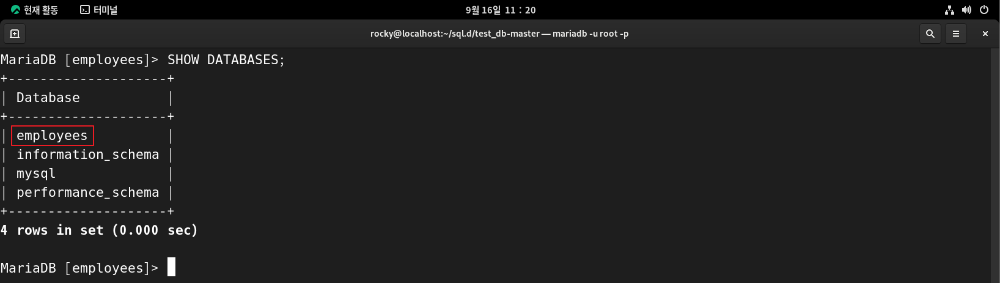
```sql
# 예제 db가 생성됐는지 확인
SHOW DATABASES;
```

</details>

### Select Ⅰ
```sql
# 기본 문법
# FROM: 조회할 대상
SELECT <<Column List>>
[FROM <<Table Name>>];
```
#### 대상을 지정하지 않고 조회
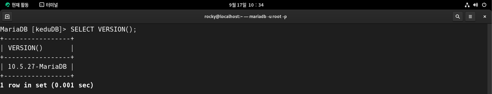
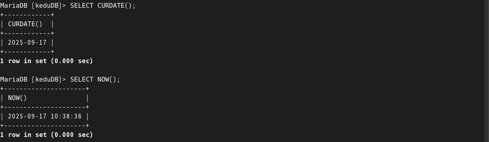
```sql
# MariaDB 내장 함수 사용

# MariaDB 버전 확인
SELECT VERSION();

# 현재 날짜 조회
SELECT CURDATE();

# 현재 날짜에 시간 조회
SELECT NOW();
```
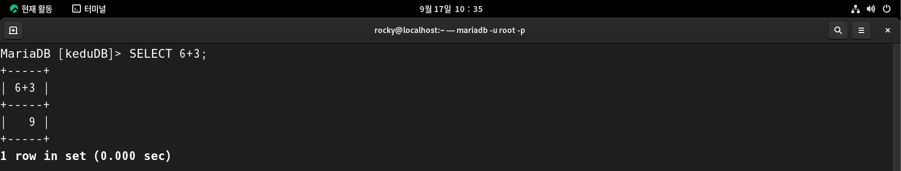
```sql
# 숫자 계산
SELECT 6+3;
```
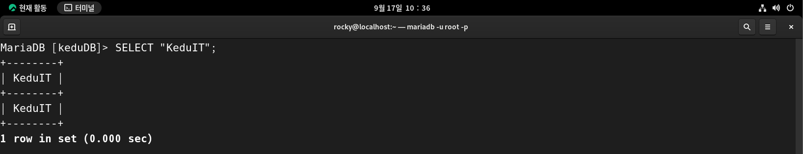
```sql
# 문자열 출력
SELECT "KeduIT";
```
#### 대상을 지정하고 조회
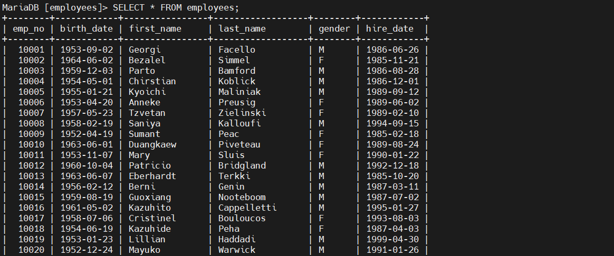
```sql
# employees table 조회
# *: 모든 컬럼 조회
SELECT * FROM employees;
```
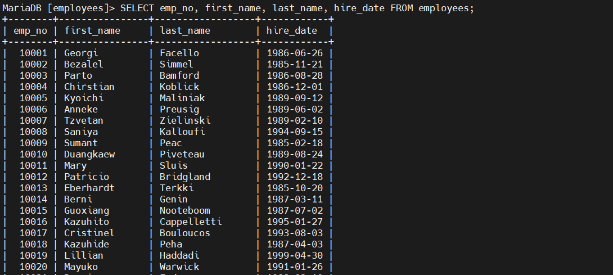
```sql
# 특정 컬럼만 조회
SELECT emp_no, first_name, last_name, hire_date FROM employees;
```
### Insert Ⅰ
```sql
# 기본 문법
INSERT INTO <<Table Name>> [(<<Column1>>, <<Column2>>, …)] VALUES (<<Value1>>, <<Value2>>, …);
```

<details>

<summary>DB 변경</summary>

```sql
USE keduDB
```

</details>

<details>

<summary>test table 생성</summary>

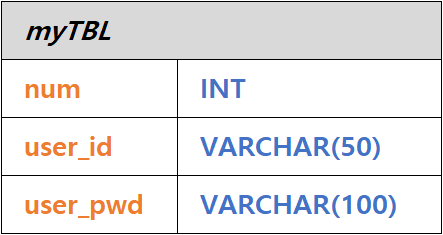

```sql
CREATE TABLE myTBL(
    num INT,
    user_id VARCHAR(50),
    user_pwd VARCHAR(100)
);
```


</details>

<details>

<summary>data 삽입</summary>

```sql
# 모든 컬럼에 data 삽입
INSERT INTO myTBL VALUES (1, 'first', 'P@ssw0rd');
INSERT INTO myTBL VALUES (2, 'second', '1234');
INSERT INTO myTBL VALUES (3, 'third', '1234');
#INSERT INTO myTBL VALUES (3, 'third', CONCAT('*', UPPER(SHA1(UNHEX(SHA1('1234'))))));

# 특정 컬럼에만 data 삽입
INSERT INTO myTBL (num, user_PWD) VALUES (4, CONCAT('*', UPPER(SHA1(UNHEX(SHA1('1234'))))));
INSERT INTO myTBL (num, user_ID) VALUES (5, 'fifth');
INSERT INTO myTBL (num, user_PWD) VALUES (6, CONCAT('*', UPPER(SHA1(UNHEX(SHA1('1234'))))));
```

</details>

<details>

<summary>입력한 data 조회</summary>

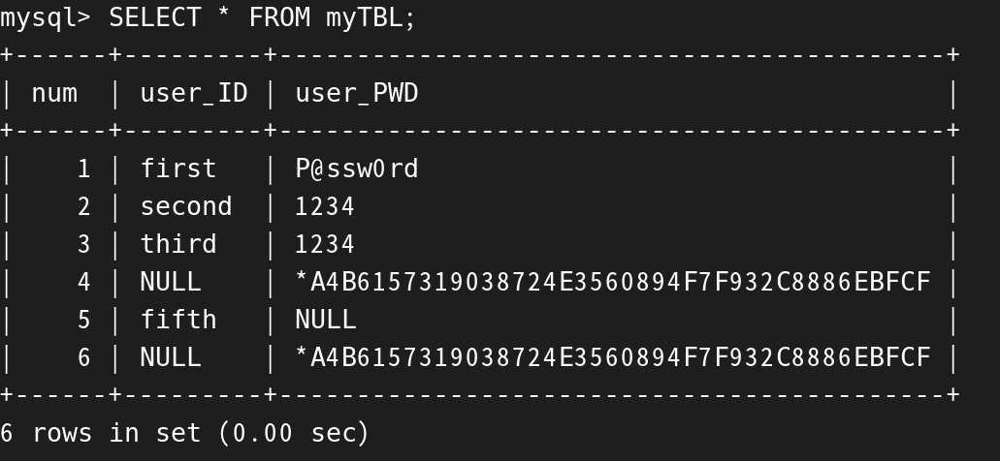
```sql
SELECT * FROM myTBL;
```

</details>

<details>

<summary>실습</summary>

userTBL, buyTBL에 data 삽입

<details>

<summary>userTBL</summary>

| id | name | email | birth | age | mileage | major |
| --- | --- | --- | --- | --- | --- | --- |
| KSH95 | 김서현 | ksh@example.com | 1995 | 30 | 500 | 컴퓨터공학 |
| JWR88 | 정우림 | jwr@example.com | 1988 | 37 | 300 | 경영학 |
| PHS00 | 박현수 | phs@example.org | 2000 | 25 | 100 | 전자공학 |
| SYJ92 | 송유정 | syj@example.com | 1992 | 33 | 700 | 디자인학 |
| HJH85 | 한지훈 | hjh@example.com | 1985 | 40 | 400 | 사회학 |
| YKH97 | 윤경호 | ykh@example.net | 1997 | 28 | 200 | 미디어학 |
| MHR92 | 민하린 | mhr@example.com | 1992 | 33 | 800 | 심리학 |
| BJS90 | 백지수 | bjs@example.com | 1990 | 35 | 350 | 법학 |
| CHW99 | 최현우 | chw@example.net | 1999 | 26 | 150 | 기계공학 |
| LKM92 | 이강민 | lkm@example.co.kr | 1992 | 33 | 600 | 국제학 |

```sql
INSERT INTO userTBL VALUES 
('KSH95', '김서현', 'ksh@example.com', 1995, 30, 500, '컴퓨터공학'),
('JWR88', '정우림', 'jwr@example.com', 1988, 37, 300, '경영학'),
('PHS00', '박현수', 'phs@example.org', 2000, 25, 100, '전자공학'),
('SYJ92', '송유정', 'syj@example.com', 1992, 33, 700, '디자인학'),
('HJH85', '한지훈', 'hjh@example.com', 1985, 40, 400, '사회학'),
('YKH97', '윤경호', 'ykh@example.net', 1997, 28, 200, '미디어학'),
('MHR92', '민하린', 'mhr@example.com', 1992, 33, 800, '심리학'),
('BJS90', '백지수', 'bjs@example.com', 1990, 35, 350, '법학'),
('CHW99', '최현우', 'chw@example.net', 1999, 26, 150, '기계공학'),
('LKM92', '이강민', 'lkm@example.co.kr', 1992, 33, 600, '국제학');
```

</details>

<details>

<summary>buyTBL</summary>

| userID | productName | amount | price | buyDate |
| --- | --- | --- | --- | --- |
| KSH95 | 블루투스 이어폰 | 3 | 150000 | 2024-10-27 |
| JWR88 | 스마트폰 | 1 | 1200000 | 2024-11-01 |
| PHS00 | 노트북 | 2 | 1500000 | 2024-10-28 |
| SYJ92 | 태블릿 | 1 | 600000 | 2024-11-01 |
| HJH85 | 스마트폰 | 1 | 1200000 | 2024-11-02 |
| HJH85 | 블루투스 이어폰 | 2 | 150000 | 2024-11-02 |
| YKH97 | 노트북 | 1 | 1500000 | 2024-10-28 |
| MHR92 | 태블릿 | 2 | 600000 | 2024-11-01 |
| BJS90 | 블루투스 이어폰 | 2 | 150000 | 2024-11-03 |
| CHW99 | 스마트폰 | 2 | 1200000 | 2024-10-30 |
| LKM92 | 노트북 | 3 | 1500000 | 2024-11-03 |
| PHS00 | 스마트폰 | 1 | 1200000 | 2024-11-01 |

```sql
INSERT INTO buyTBL (userID, productName, amount, price, buyDate) VALUES
('KSH95', '블루투스 이어폰', 3, 150000, '2024-10-27'),
('JWR88', '스마트폰', 1, 1200000, '2024-11-01'),
('PHS00', '노트북', 2, 1500000, '2024-10-28'),
('SYJ92', '태블릿', 1, 600000, '2024-11-01'),
('HJH85', '스마트폰', 1, 1200000, '2024-11-02'),
('HJH85', '블루투스 이어폰', 2, 150000, '2024-11-02'),
('YKH97', '노트북', 1, 1500000, '2024-10-28'),
('MHR92', '태블릿', 2, 600000, '2024-11-01'),
('BJS90', '블루투스 이어폰', 2, 150000, '2024-11-03'),
('CHW99', '스마트폰', 2, 1200000, '2024-10-30'),
('LKM92', '노트북', 3, 1500000, '2024-11-03'),
('PHS00', '스마트폰', 1, 1200000, '2024-11-01');
```

</details>

</details>

### Select Ⅱ
```sql
# 조건이 추가된 SELECT
# WHERE: 조건
SELECT <<Column List>>
FROM <<Table Name>>
WHERE <<Condition>>;
# 조건식에는 연산자(산술, 논리, 비교 연산자)를 이용한 조건 작성
## 비교(조건) 연산자 : =, <, >, <=, >=, <>, != 등
## 논리(관계) 연산자 : AND, OR, NOT 등
```

<details>

<summary>비교 연산</summary>

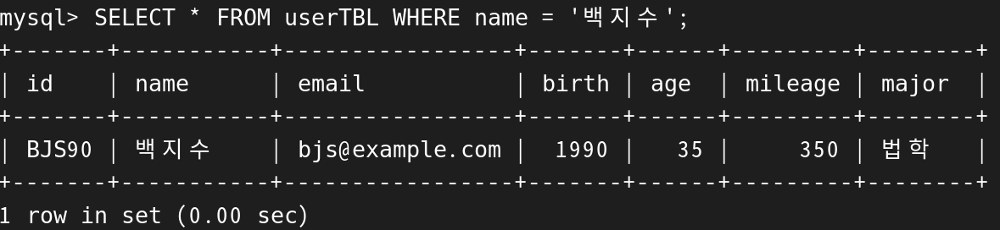
```sql
# 이름이 백지수인 사람의 정보만 조회
SELECT * FROM userTBL WHERE name = '백지수';
```
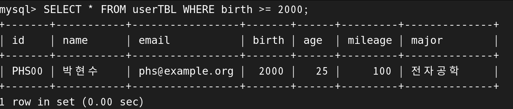
```sql
# 2000년 이후 태어난 사람만 조회
SELECT * FROM userTBL WHERE birth >= 2000;
```

</details>

<details>

<summary>BETWEEN … AND …</summary>

```sql
SELECT * FROM userTBL WHERE mileage >= 300 AND mileage <= 700;
+-------+-----------+-------------------+-------+------+---------+-----------------+
| id    | name      | email             | birth | age  | mileage | major           |
+-------+-----------+-------------------+-------+------+---------+-----------------+
| KSH95 | 김서현    | ksh@example.com   |  1995 |   30 |     500 | 컴퓨터공학      |
| JWR88 | 정우림    | jwr@example.com   |  1988 |   37 |     300 | 경영학          |
| SYJ92 | 송유정    | syj@example.com   |  1992 |   33 |     700 | 디자인학        |
| HJH85 | 한지훈    | hjh@example.com   |  1985 |   40 |     400 | 사회학          |
| BJS90 | 백지수    | bjs@example.com   |  1990 |   35 |     350 | 법학            |
| LKM92 | 이강민    | lkm@example.co.kr |  1992 |   33 |     600 | 국제학          |
+-------+-----------+-------------------+-------+------+---------+-----------------+
6 rows in set (0.00 sec)

SELECT * FROM userTBL WHERE mileage BETWEEN 300 AND 700;
+-------+-----------+-------------------+-------+------+---------+-----------------+
| id    | name      | email             | birth | age  | mileage | major           |
+-------+-----------+-------------------+-------+------+---------+-----------------+
| KSH95 | 김서현    | ksh@example.com   |  1995 |   30 |     500 | 컴퓨터공학      |
| JWR88 | 정우림    | jwr@example.com   |  1988 |   37 |     300 | 경영학          |
| SYJ92 | 송유정    | syj@example.com   |  1992 |   33 |     700 | 디자인학        |
| HJH85 | 한지훈    | hjh@example.com   |  1985 |   40 |     400 | 사회학          |
| BJS90 | 백지수    | bjs@example.com   |  1990 |   35 |     350 | 법학            |
| LKM92 | 이강민    | lkm@example.co.kr |  1992 |   33 |     600 | 국제학          |
+-------+-----------+-------------------+-------+------+---------+-----------------+
6 rows in set (0.00 sec)

```

</details>

<details>

<summary>IN (NOT IN)</summary>

```sql
# 전공이 법학, 사회학, 경영학인 사람들 조회
SELECT * FROM userTBL WHERE major IN ('법학', '사회학', '경영학', '국제학');
+-------+-----------+-------------------+-------+------+---------+-----------+
| id    | name      | email             | birth | age  | mileage | major     |
+-------+-----------+-------------------+-------+------+---------+-----------+
| JWR88 | 정우림    | jwr@example.com   |  1988 |   37 |     300 | 경영학    |
| HJH85 | 한지훈    | hjh@example.com   |  1985 |   40 |     400 | 사회학    |
| BJS90 | 백지수    | bjs@example.com   |  1990 |   35 |     350 | 법학      |
| LKM92 | 이강민    | lkm@example.co.kr |  1992 |   33 |     600 | 국제학    |
+-------+-----------+-------------------+-------+------+---------+-----------+
4 rows in set (0.00 sec)

# 전공이 법학, 사회학, 경영학이 아닌 사람들 조회
SELECT * FROM userTBL WHERE major NOT IN ('법학', '사회학', '경영학', '국제학');
+-------+-----------+-----------------+-------+------+---------+-----------------+
| id    | name      | email           | birth | age  | mileage | major           |
+-------+-----------+-----------------+-------+------+---------+-----------------+
| KSH95 | 김서현    | ksh@example.com |  1995 |   30 |     500 | 컴퓨터공학      |
| PHS00 | 박현수    | phs@example.org |  2000 |   25 |     100 | 전자공학        |
| SYJ92 | 송유정    | syj@example.com |  1992 |   33 |     700 | 디자인학        |
| YKH97 | 윤경호    | ykh@example.net |  1997 |   28 |     200 | 미디어학        |
| MHR92 | 민하린    | mhr@example.com |  1992 |   33 |     800 | 심리학          |
| CHW99 | 최현우    | chw@example.net |  1999 |   26 |     150 | 기계공학        |
+-------+-----------+-----------------+-------+------+---------+-----------------+
6 rows in set (0.00 sec)

```

</details>

<details>

<summary>LIKE (NOT LIKE)</summary>

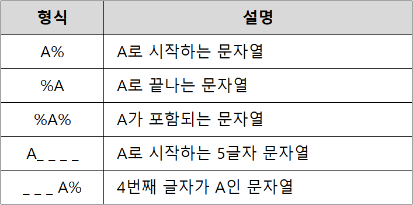
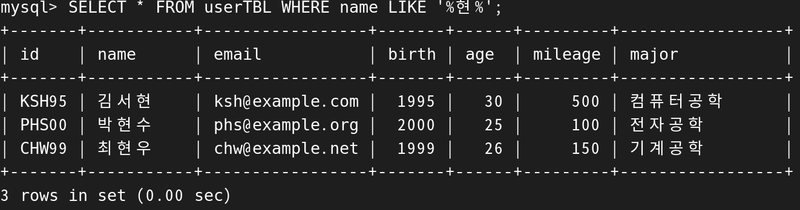
```sql
# 이름에 '현'이 들어가는 사람 조회
SELECT * FROM userTBL WHERE name LIKE '%현%';
```
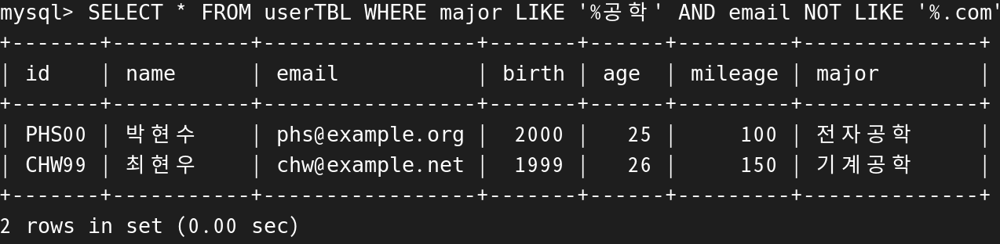
```sql
# 전공이 '공학'으로 끝나고 이메일이 '.com'으로 끝나지 않는 사람들 조회 
# 전공이 '공학'으로 끝난다 -> major LIKE '%공학'
# 이메일이 '.com'으로 끝나지 않는다 -> email NOT LIKE '.com'
SELECT * FROM userTBL WHERE major LIKE '%공학' AND email NOT LIKE '%.com';
```

</details>

### Insert Ⅱ
```sql
# 다른 table의 내용을 활용해서 삽입
# 문법
INSERT INTO <<Table Name>> (<<Column1>>, <<Column2>>, …) SELECT <<Column List>> FROM <<Table Name>>;
```

<details>

<summary>Test Table 생성</summary>

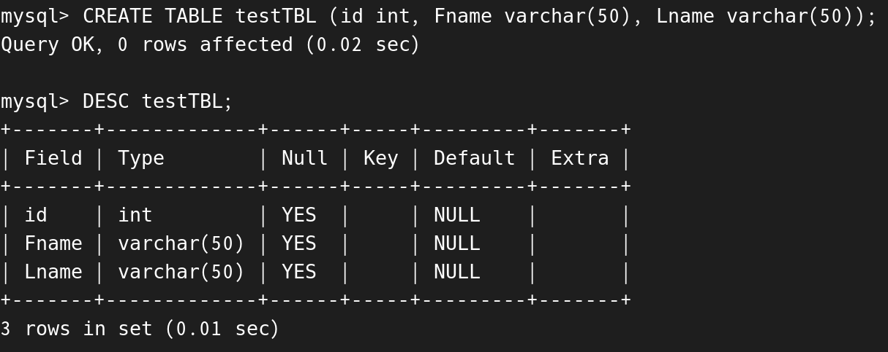
```sql
CREATE TABLE testTBL (id int, Fname varchar(50), Lname varchar(50));
```

</details>

<details>

<summary>다른 Table의 내용을 참조해서 test table에 삽입</summary>

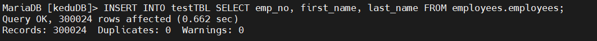
```sql
# employees database의 employees table에서 emp_no, first_name, last_name 가져와서 삽입
# 다른 database의 table을 참조하기 위해
# <<Database Name>>.<<Table Name>> 으로 표기
INSERT INTO testTBL SELECT emp_no, first_name, last_name FROM employees.employees;
```
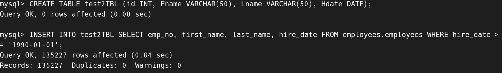
```sql
# 참조 시 조건을 걸어서 가져오는 방법
# 테스트 테이블 생성
CREATE TABLE test2TBL (id INT, Fname VARCHAR(50), Lname VARCHAR(50), Hdate DATE);
Query OK, 0 rows affected (0.00 sec)

# employees.employees에서 고용일이 1990-01-01 이후 고용사람들만 참조 
INSERT INTO test2TBL 
SELECT emp_no, first_name, last_name, hire_date 
FROM employees.employees 
WHERE hire_date >= '1990-01-01';

Query OK, 135227 rows affected (0.84 sec)
Records: 135227  Duplicates: 0  Warnings: 0

```

</details>

### Update
```sql
# 기본 문법
# WHERE 조건 필수
UPDATE <<Table Name>>
SET <<Column1>> = <<Value1>>,
    <<Column2>> = <<Value2>>, …
[WHERE <<Condition>>];
```

<details>

<summary>실습</summary>

testTBL에서 Fname이 Aral인 사람들의 Lname을 NULL로 변경
```sql
UPDATE testTBL
SET Lname = NULL
WHERE Fname = 'Aral';

SELECT * FROM testTBL WHERE Fname = 'Aral';
```

</details>

### Delete
```sql
# 기본 문법
# WHERE 조건 생략 시 테이블 모든 데이터 삭제
DELETE FROM <<Table Name>>
[WHERE <<Condition>>];
```

<details>

<summary>data 삭제</summary>

```sql
# testTBL에서 Fname이 Aral인 사람 조회
SELECT COUNT(*) FROM testTBL WHERE fname = 'Aral';
+----------+
| COUNT(*) |
+----------+
|      225 |
+----------+
1 row in set (0.12 sec)

# testTBL에서 Fname이 Aral인 사람을 전부 삭제
DELETE FROM testTBL WHERE Fname = 'Aral';
Query OK, 225 rows affected (0.20 sec)

#
SELECT COUNT(*) FROM testTBL WHERE fname = 'Aral';
+----------+
| COUNT(*) |
+----------+
|        0 |
+----------+
1 row in set (0.10 sec)
```

</details>

<details>

<summary>※ Truncate</summary>

```sql
# table 초기화
# 실행 시 rollback(복원)불가
# 기본 문법
TRUNCATE TABLE <<Table Name>>;

SELECT COUNT(*) FROM testTBL;
+----------+
| COUNT(*) |
+----------+
|   299799 |
+----------+
1 row in set (0.01 sec)

TRUNCATE TABLE testTBL;
Query OK, 0 rows affected (0.02 sec)

SELECT COUNT(*) FROM testTBL;
+----------+
| COUNT(*) |
+----------+
|        0 |
+----------+
1 row in set (0.00 sec)
```

</details>

### Select Ⅲ
```sql
# 기본 문법
# FROM: 조회할 대상
# WHERE: 조건
# ORDER BY: 정렬
## 정렬 방식 생략 시 ASC가 기본값
SELECT <<Column List>>
FROM <<Table Name>>
WHERE <<Condition>>
ORDER BY <<Order Columns>> [ASC|DESC]
LIMIT <<Row Count>>;
```
```javascript
USE employees;

# 위에서 20명만 조회
SELECT * FROM employees LIMIT 20;
+--------+------------+------------+-------------+--------+------------+
| emp_no | birth_date | first_name | last_name   | gender | hire_date  |
+--------+------------+------------+-------------+--------+------------+
|  10001 | 1953-09-02 | Georgi     | Facello     | M      | 1986-06-26 |
|  10002 | 1964-06-02 | Bezalel    | Simmel      | F      | 1985-11-21 |
|  10003 | 1959-12-03 | Parto      | Bamford     | M      | 1986-08-28 |
|  10004 | 1954-05-01 | Chirstian  | Koblick     | M      | 1986-12-01 |
|  10005 | 1955-01-21 | Kyoichi    | Maliniak    | M      | 1989-09-12 |
|  10006 | 1953-04-20 | Anneke     | Preusig     | F      | 1989-06-02 |
|  10007 | 1957-05-23 | Tzvetan    | Zielinski   | F      | 1989-02-10 |
|  10008 | 1958-02-19 | Saniya     | Kalloufi    | M      | 1994-09-15 |
|  10009 | 1952-04-19 | Sumant     | Peac        | F      | 1985-02-18 |
|  10010 | 1963-06-01 | Duangkaew  | Piveteau    | F      | 1989-08-24 |
|  10011 | 1953-11-07 | Mary       | Sluis       | F      | 1990-01-22 |
|  10012 | 1960-10-04 | Patricio   | Bridgland   | M      | 1992-12-18 |
|  10013 | 1963-06-07 | Eberhardt  | Terkki      | M      | 1985-10-20 |
|  10014 | 1956-02-12 | Berni      | Genin       | M      | 1987-03-11 |
|  10015 | 1959-08-19 | Guoxiang   | Nooteboom   | M      | 1987-07-02 |
|  10016 | 1961-05-02 | Kazuhito   | Cappelletti | M      | 1995-01-27 |
|  10017 | 1958-07-06 | Cristinel  | Bouloucos   | F      | 1993-08-03 |
|  10018 | 1954-06-19 | Kazuhide   | Peha        | F      | 1987-04-03 |
|  10019 | 1953-01-23 | Lillian    | Haddadi     | M      | 1999-04-30 |
|  10020 | 1952-12-24 | Mayuko     | Warwick     | M      | 1991-01-26 |
+--------+------------+------------+-------------+--------+------------+
20 rows in set (0.01 sec)

# 20번째 행부터 20줄 조회
SELECT * FROM employees LIMIT 20 OFFSET 20;
+--------+------------+------------+------------+--------+------------+
| emp_no | birth_date | first_name | last_name  | gender | hire_date  |
+--------+------------+------------+------------+--------+------------+
|  10021 | 1960-02-20 | Ramzi      | Erde       | M      | 1988-02-10 |
|  10022 | 1952-07-08 | Shahaf     | Famili     | M      | 1995-08-22 |
|  10023 | 1953-09-29 | Bojan      | Montemayor | F      | 1989-12-17 |
|  10024 | 1958-09-05 | Suzette    | Pettey     | F      | 1997-05-19 |
|  10025 | 1958-10-31 | Prasadram  | Heyers     | M      | 1987-08-17 |
|  10026 | 1953-04-03 | Yongqiao   | Berztiss   | M      | 1995-03-20 |
|  10027 | 1962-07-10 | Divier     | Reistad    | F      | 1989-07-07 |
|  10028 | 1963-11-26 | Domenick   | Tempesti   | M      | 1991-10-22 |
|  10029 | 1956-12-13 | Otmar      | Herbst     | M      | 1985-11-20 |
|  10030 | 1958-07-14 | Elvis      | Demeyer    | M      | 1994-02-17 |
|  10031 | 1959-01-27 | Karsten    | Joslin     | M      | 1991-09-01 |
|  10032 | 1960-08-09 | Jeong      | Reistad    | F      | 1990-06-20 |
|  10033 | 1956-11-14 | Arif       | Merlo      | M      | 1987-03-18 |
|  10034 | 1962-12-29 | Bader      | Swan       | M      | 1988-09-21 |
|  10035 | 1953-02-08 | Alain      | Chappelet  | M      | 1988-09-05 |
|  10036 | 1959-08-10 | Adamantios | Portugali  | M      | 1992-01-03 |
|  10037 | 1963-07-22 | Pradeep    | Makrucki   | M      | 1990-12-05 |
|  10038 | 1960-07-20 | Huan       | Lortz      | M      | 1989-09-20 |
|  10039 | 1959-10-01 | Alejandro  | Brender    | M      | 1988-01-19 |
|  10040 | 1959-09-13 | Weiyi      | Meriste    | F      | 1993-02-14 |
+--------+------------+------------+------------+--------+------------+
20 rows in set (0.00 sec)

SELECT * FROM employees LIMIT 20, 20;
+--------+------------+------------+------------+--------+------------+
| emp_no | birth_date | first_name | last_name  | gender | hire_date  |
+--------+------------+------------+------------+--------+------------+
|  10021 | 1960-02-20 | Ramzi      | Erde       | M      | 1988-02-10 |
|  10022 | 1952-07-08 | Shahaf     | Famili     | M      | 1995-08-22 |
|  10023 | 1953-09-29 | Bojan      | Montemayor | F      | 1989-12-17 |
|  10024 | 1958-09-05 | Suzette    | Pettey     | F      | 1997-05-19 |
|  10025 | 1958-10-31 | Prasadram  | Heyers     | M      | 1987-08-17 |
|  10026 | 1953-04-03 | Yongqiao   | Berztiss   | M      | 1995-03-20 |
|  10027 | 1962-07-10 | Divier     | Reistad    | F      | 1989-07-07 |
|  10028 | 1963-11-26 | Domenick   | Tempesti   | M      | 1991-10-22 |
|  10029 | 1956-12-13 | Otmar      | Herbst     | M      | 1985-11-20 |
|  10030 | 1958-07-14 | Elvis      | Demeyer    | M      | 1994-02-17 |
|  10031 | 1959-01-27 | Karsten    | Joslin     | M      | 1991-09-01 |
|  10032 | 1960-08-09 | Jeong      | Reistad    | F      | 1990-06-20 |
|  10033 | 1956-11-14 | Arif       | Merlo      | M      | 1987-03-18 |
|  10034 | 1962-12-29 | Bader      | Swan       | M      | 1988-09-21 |
|  10035 | 1953-02-08 | Alain      | Chappelet  | M      | 1988-09-05 |
|  10036 | 1959-08-10 | Adamantios | Portugali  | M      | 1992-01-03 |
|  10037 | 1963-07-22 | Pradeep    | Makrucki   | M      | 1990-12-05 |
|  10038 | 1960-07-20 | Huan       | Lortz      | M      | 1989-09-20 |
|  10039 | 1959-10-01 | Alejandro  | Brender    | M      | 1988-01-19 |
|  10040 | 1959-09-13 | Weiyi      | Meriste    | F      | 1993-02-14 |
+--------+------------+------------+------------+--------+------------+
20 rows in set (0.00 sec)

```
### Select Ⅳ

<details>

<summary>데이터 중복 제거 - DISTINCT</summary>

```sql
# 기본 문법
SELECT DISTINCT <<Colume Name>> FROM <<Table Name>>;
```
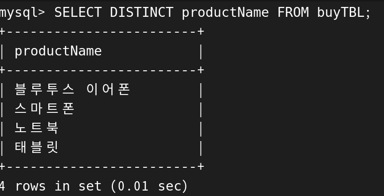

</details>

<details>

<summary>그룹화 - GROUP BY</summary>

```sql
# 기본 문법
SELECT <<Colume Name>>, <<Aggregate Functions>> FROM <<Table Name>> GROUP BY <<Colume Name>>;
```

<details>

<summary>집계 함수 - Aggregate Functions</summary>

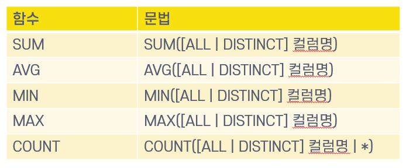
DBMS에서 제공하는 내장 함수
많은 양의 데이터에 대해 연산 → 하나의 결과 값으로 반환
대규모 데이터를 요약, 분석에 활용 

</details>

<details>

<summary>실습 1 (DB: keduDB)</summary>

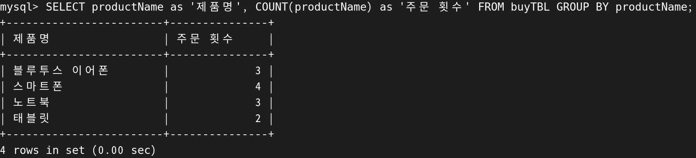

</details>

<details>

<summary>실습 2 (DB: employees)</summary>

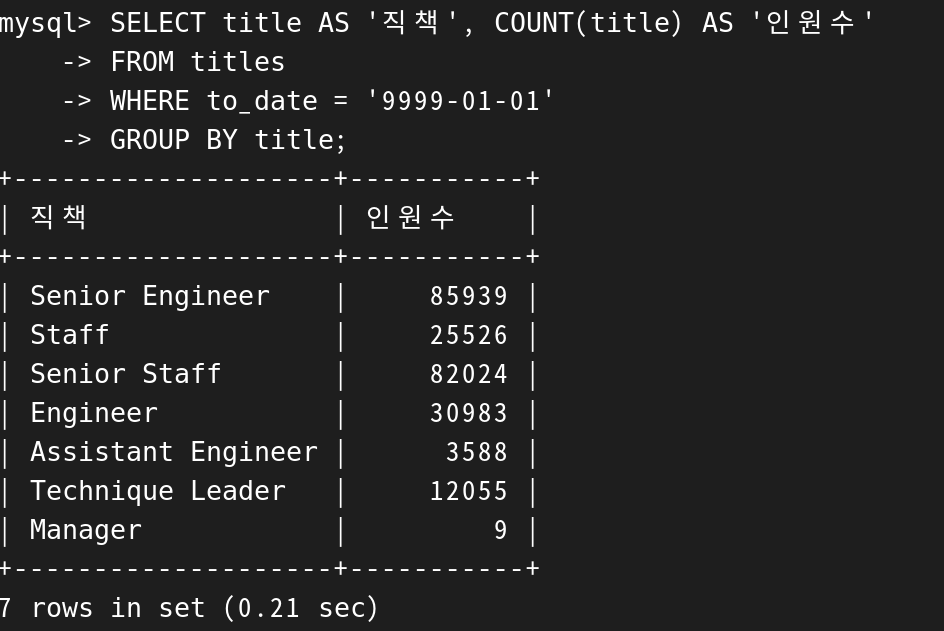

</details>

<details>

<summary>실습 3 (DB: employees)</summary>

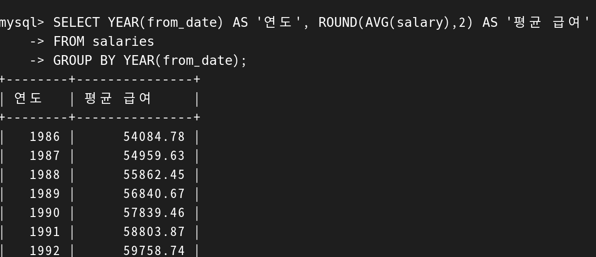

</details>

</details>

<details>

<summary>그룹화 - GROUP BY \~\~ HAVING</summary>

```sql
# 그룹화할때 조건을 거는 명령어
# 기본 문법
SELECT <<Colume Name>>, <<Aggregate Functions>> FROM <<Table Name>> GROUP BY <<Colume Name>> HAVING <<Condition>>;
```

<details>

<summary>실습1 (DB: keduDB)</summary>

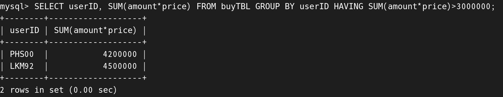

</details>

<details>

<summary>실습2 (DB: employees)</summary>

</details>

</details>

### Select Ⅴ
```javascript
# Subquery
# SQL 결과에서 다시 SQL을 사용하는 방식 
# SELECT에서 사용시 스칼라(단일값)이 결과로 나오는 SQL만 사용 가능 
# SELECT 절에 사용한 방식
#    SELECT (SELECT ~) FROM <<Table Name>>;
# FROM 절에 사용하는 방식
#    SELECT <<Colume Name>>, FROM (SELECT ~~);
# WHERE 절에 사용하는 방식
#    SELECT <<Colume Name>>. FROM <<Table Name>> WHERE <<Colume Name>> <<Operator>> (SELECT ~~~);
```

<details>

<summary>실습 1 (DB: keduDB)</summary>

2024년 11월 1일에 주문한 회원의 아이디, 이름 제품명을 조회

</details>

### 연습문제
- employees 테이블에서 모든 사원의 사번, 이름을 조회하시오.
- employees 테이블에서 사원 번호가 10001번 이상 10010번 이하인 사원의 사번과 이름을 조회하시오.
- employees 테이블에서 1995년에 입사한 사원의 사번, 이름, 입사 연도를 조회하시오.
*(YEAR 함수 사용, 기본 문법: **`YEAR(date)`**)*
- salaries 테이블에서 현재 급여가 50,000 이상인 사원의 사번, 급여, 적용 기간을 조회하시오.
- dept_emp 테이블에서 현재 부서 번호가 d005인 사원의 사번, 부서번호, 적용 기간을 조회하시오.
- departments 테이블에서 부서 번호가 d001인 부서의 번호와 이름을 대문자로 조회하시오.
*(UPPER 함수 사용, 기본 문법: **`UPPER(str)`**)*
- titles 테이블에서 현재 직책이 Senior Engineer인 사원의 사번, 직책, 적용 기간을 조회하시오.
- employees 테이블에서 입사일이 빠른 순으로 정렬하여 사원 5명의 사번, 이름, 입사일을 조회하시오.
*(ORDER BY, LIMIT 사용)*
- employees, dept_emp, departments 테이블을 이용하여 사원의 사번, 이름, 소속 부서명을 조회하시오. 단, **현재 소속된 부서만** 조회하며, dept_emp 테이블에서 `to_date`가 `'9999-01-01'`인 경우가 현재 소속을 의미한다.
- employees 테이블에서 사번이 짝수인 사원의 사번과 이름을 조회하시오.
*(MOD 함수 사용, 기본 문법: **`MOD(n, m)`**)*

## DCL - Data Control Language
[데이터 제어 언어 — 원본 참고 링크](https://app.notion.com/p/36cddb1a637780758fd2f1a040247136#382ddb1a63778079b489e69e4ca38a41)
```text
DCL - Data Control Language

데이터 제어 언어
DB 접근을 제어하기 위한 언어
권한 부여, 제거
```

<details>

<summary>현재 사용자 확인 - DML</summary>

```sql
mysql> SELECT User, Host FROM user;
+------------------+-----------+
| User             | Host      |
+------------------+-----------+
| mysql.infoschema | localhost |
| mysql.session    | localhost |
| mysql.sys        | localhost |
| root             | localhost |
+------------------+-----------+
4 rows in set (0.00 sec)

```

</details>

<details>

<summary>사용자 생성 - DDL</summary>

```javascript
# 기본 문법
CREATE USER '<<username>>'@'<<host>>' IDENTIFIED BY '<<password>>';
```
```sql
# User: kedu / Host: %/ Password: P@ssw0rd
CREATE USER 'kedu'@'%' IDENTIFIED BY 'P@ssw0rd';

# kedu 사용자 확인
SELECT User, Host FROM user WHERE User = 'kedu';
```

</details>

<details>

<summary>권한 부여</summary>

```sql
# 기본 문법
GRANT <<Privilege1>>[, <<Privilege2>>, …]
  ON <<DatabaseName>>.<<TableName>>
  TO '<<username>>'@'<<host>>';
  
# 권한 확인
# 사용자 이름 생략 시 접속 중인 계정의 권한
SHOW GRANTS
	[FOR '<<username>>'@'<<host>>'] 
```

<details>

<summary>권한 종류</summary>

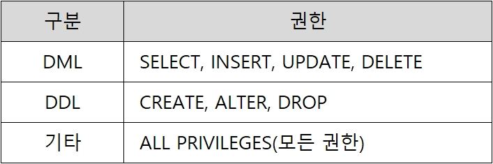

</details>

</details>

<details>

<summary>권한 제거</summary>

```sql
# 기본 문법
REVOKE <<Privilege1>>[, <<Privilege2>>, …]
  ON <<DatabaseName>>.<<TableName>>
  FROM '<<username>>'@'<<host>>';
```

</details>

<details>

<summary>모든 권한 부여</summary>

```sql
# kedu 사용자에세 SELECT 권한 부여
GRANT ALL PRIVILEGES ON *.* TO 'kedu'@'%';

# kedu 권한 확인
SHOW GRANTS FOR 'kedu'@'%'
```

</details>

</details>

<details>

<summary>JOIN</summary>

- 두 개 이상의 테이블을 엮어서 하나의 결과를 생성 
- 테이블 이름을 지정하여 컬럼의 출처를 명확히 표기 <br>ex. A테이블과 B 테이블 조인 시 [A.name](http://a.name/), B.name과 같이 테이블명(별칭, Alias).컬럼명으로 표기

<details>

<summary>종류</summary>

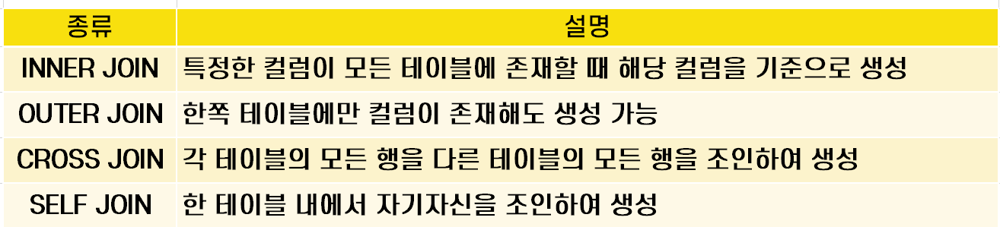

</details>

<details>

<summary>INNER JOIN</summary>

- 기본적인 JOIN의 형태 (INNER 생략 가능)
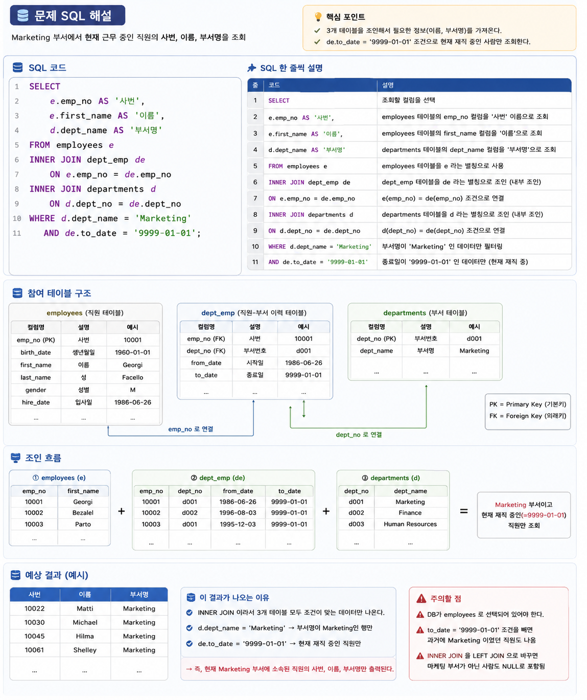
```javascript
# 기본 문법
# SELECT <<Colume Name>>, [<<Colume Name>>...]
# FROM <<Table Name A>>
# [INNER] JOIN <<Table Name B>> A.Column
# WHERE <<Condition>>

# 예제
# shopDB
# 주문 테이블에 주문한 회원 이름까지 출력
SELECT m.memberID, m.memberName, o.productName
FROM orderTBL o
INNER JOIN memberTBL m
WHERE o.memberID = m.memberID 
;
```

<details>

<summary>실습 - DB : employees</summary>

<details>

<summary>1. Marketing 부서에서 일하는 직원의 부서명과, 이름을 출력하시오.</summary>

```javascript
# 1. 요구하는 컬럼이 어느 테이블에 있는지 확인
# 부서명 - 부서(departments) / 직원 이름 - 직원 
# 2. 확인 테이블들의 관계 확인. 
# 연결해주는 테이블 - dept_emp (사번, 부서번호)
# 사번 - 사원 테이블 / 부서번호 - 부서 테이블
# 3. 최종적으로 확인 테이블 정리
# departments + employees + dept_emp 
# 4. 조건 없이 일단 SQL 작성
SELECT emp_no as '사번', first_name as '이름', dept_name as '부서명'
FROM employees
INNER JOIN departments
INNER JOIN dept_emp
;

# 5. 조건 추가
# 사원.사번 = dept_emp.사번 AND 부서.부서번호 = dept_emp.부서번호
# 부서명이 Marketing
# 현재 속해있는지 to_date = '9999-01-01'
SELECT e.emp_no as '사번', e.first_name as '이름', d.dept_name as '부서명'
FROM employees e
INNER JOIN departments d ON d.dept_no = de.dept_no
INNER JOIN dept_emp de ON e.emp_no = de.emp_no
WHERE 
	d.dept_name = 'Marketing' AND
	de.to_date = '9999-01-01'
;
```

</details>

<details>

<summary>2. 각 부서별 직원수</summary>

```sql
SELECT 
	d.dept_no AS 부서번호, 
	d.dept_name AS 부서명, 
	COUNT(de.emp_no) AS 직원수
FROM departments d
JOIN dept_emp de ON d.dept_no = de.dept_no
-- JOIN employees e ON de.emp_no = e.emp_no
WHERE de.to_date = '9999-01-01'
GROUP BY d.dept_no, d.dept_name;
```

</details>

<details>

<summary>3. 각 부서별 평균 급여</summary>

- 부서에 현재 속한 직원의 급여 평균을 구하라
- 평균은 소수점 둘째 자리에서 반올림 <br>- ROUND(컬럼명, 반올림할 소수점 자리수) 

<details>

<summary>정답</summary>

```sql
SELECT 
	d.dept_no AS 부서번호, 
	d.dept_name AS 부서명, 
	ROUND(AVG(s.salary), 2) AS `평균 급여`
FROM departments d
JOIN dept_emp de ON d.dept_no = de.dept_no
JOIN salaries s ON de.emp_no = s.emp_no
WHERE de.to_date = '9999-01-01'
GROUP BY d.dept_no, d.dept_name
ORDER BY d.dept_no;
```

</details>

</details>

</details>

</details>

<details>

<summary>OUTER JOIN</summary>

- 대상 테이블들을 합쳐서 출력 
- OUTER 키워드 생략 가능 
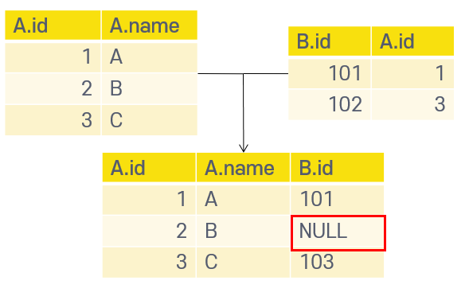

<details>

<summary>종류</summary>

- LEFT OUTER JOIN
- RIGHT  OUTER JOIN
- FULL OUTER JOIN - MySQL에는 존재하지 X - 양쪽 테이블의 모든 데이터 출력 

</details>

<details>

<summary>실습 - DB: shopDB</summary>

<details>

<summary>LEFT JOIN</summary>

- 회원ID, 회원명, 제품명, 가격을 조회 (한번도 주문하지 않은 회원도 포함해서) 
```sql
SELECT
	m.memberID ,
	m.memberName ,
	o.productName
FROM
	memberTBL m
	LEFT OUTER JOIN orderTBL o ON o.memberID = m.memberID 
;
```

</details>

<details>

<summary>RIGHT JOIN</summary>

- 회원ID, 회원명, 제품명, 가격을 조회 (한번도 주문하지 않은 회원도 포함해서) 
```sql
SELECT
	p.productName as 'prodctTBL.productName',
	o.productName as 'orderTBL.productName',
	o.memberID
FROM
	orderTBL o
	RIGHT OUTER JOIN productTBL p ON p.productName = o.productName
;
```

</details>

</details>

<details>

<summary>실습 - DB: keduDB</summary>

모든 회원 기준으로 구매 내역 확인
```sql
INSERT INTO userTBL VALUES ('HGD26', '홍길동', 'HGD26@test.com', 2026, 0, 0, '컴퓨터공학');

SELECT 
	u.userID,
	u.name,
	b.productName 
FROM
	userTBL u
	LEFT JOIN buyTBL b ON u.userID = b.userID 
;

```

</details>

</details>

<details>

<summary>CROSS JOIN</summary>

- 두 테이블의 모든 행을 1:1로 각각 결합<br>⇒ 카티션 곱(Cartesian Product) 반환 
- JOIN에 조건을 지정하지 않는다. 
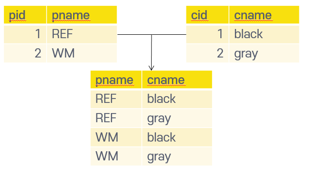
```sql
# CROSS JOIN
SELECT
	m.memberID,
	p.productName
FROM memberTBL m
CROSS JOIN productTBL p;
```

</details>

<details>

<summary>SELF JOIN</summary>

- 하나의 테이블이 자기 자신을 조인 
- 계층 구조(Hierarchical)를 평면화 할 때 주로 사용
- INNER JOIN 방식으로 작성 

</details>

</details>

<details>

<summary>Database - Table Key</summary>

Key - Table 내에서 튜플()을 유일하게 구별할 수 있는 속성(집합)

<details>

<summary>특징</summary>

- 유일성(Uniqueness) - 각 행을 고유하게 식별할 수 있는 성질 <br>동일 데이터는 입력되서는 안된다. 
- 최소성(Minimality) - 필요한 최소한의 속성들로 구성 <br>각 행을 구분하기 위한 중복이 불가능한 속성은 최소로 구성되어야 한다

</details>

<details>

<summary>종류</summary>

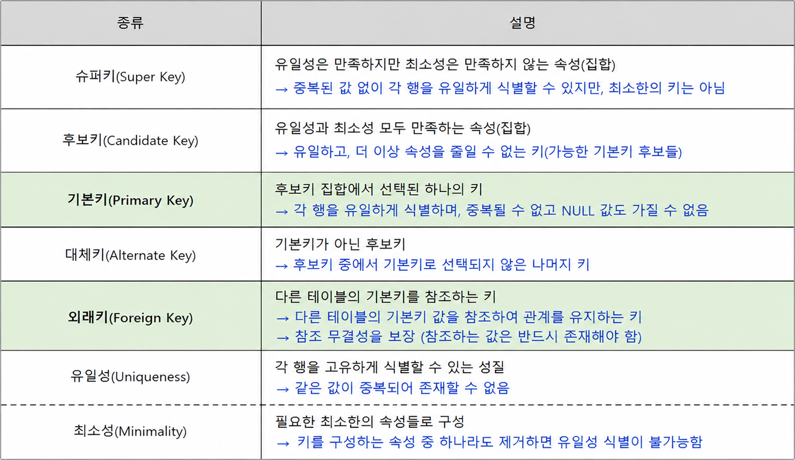

<details>

<summary>기본키(PK)</summary>

- 후보키 집합에서 선택된 하나의 키
- 테이블 내 행을 식별(특정)할 수 있는 고유한 값을 가지는 속성 (유일성)<br>특정하는데 필요한 최소한의 속성을 가진것 (최소성)
- NULL 값 불가
- 키 값의 변화가 없는 안정적인 속성
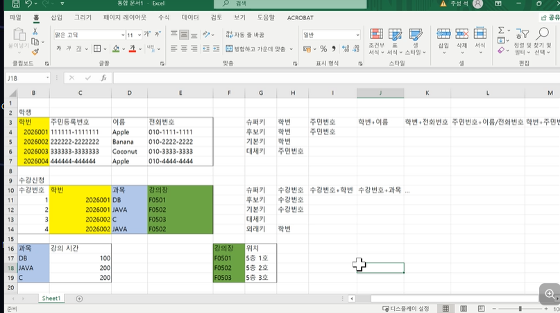

</details>

<details>

<summary>외래키(FK)</summary>

- 다른 테이블의 **기본키**를 참조하는 키
- RDB(관계형 데이터베이스)의 특징인 관계(Relationship)을 표현 
- 데이터 중복 가능하다
- 참조되는 속성(컬럼)과 데이터 타입이 동일해야 한다.
- 여러 개의 외래키 존재 가능

</details>

</details>

</details>

<details>

<summary>Database - 제약 조건 Constraints</summary>

## Table에서 데이터 무결성을 보장하기 위해 제한된 조건<br>\* 데이터 무결성 : 저장된 데이터의 일관성과 정확성 유지
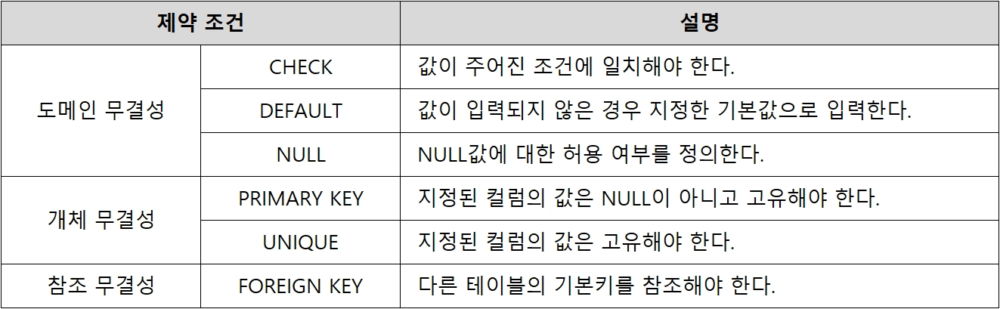

<details>

<summary>개체 무결성</summary>

<details>

<summary>Primary Key(기본키) 제약 조건</summary>

- 기본키로 지정된 컬럼의 값은 중복되지 않는다.
- NULL 값 불가
- 여러 컬럼을 묶어서 기본키로 설정가능하다-복합 기본키
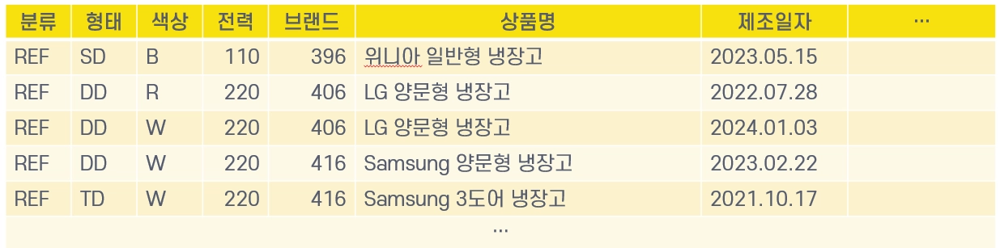

</details>

<details>

<summary>UNIQUE 제약 조건</summary>

- 중복되지 않는 값, 또는 NULL 값만 허용 <br>NULL : 알 수 없음 / 데이터 없음
- 여러 컬럼에 설정 가능 
- ex) 회원 테이블 - ID (PK) / email(UNIQUE)

</details>

</details>

<details>

<summary>참조 무결성</summary>

<details>

<summary>FOREIGN KEY(외래키) 제약 조건</summary>

- 외래키
- 다른 테이블의 기본 키(or UNIQUE)를 참조하는 키다.
- 테이블 간 참조 관계를 설정.<br>부모 테이블 - 참조되는 테이블 / 자식 테이블 - 참조하는 테이블 
- 참조된 값에 변동이 있을 시 부모-자식 테이블 모두 제약을 받는다.
- 자식 테이블의 외래 키로 설정된 컬럼에 값을 넣을 때 부모 테이블에 존재하는 값만 입력 가능하다.
- 부모 테이블에 관계 설정 시 옵션 지정 가능하다.

</details>

</details>

<details>

<summary>도메인 무결성</summary>

<details>

<summary>CHECK 제약 조건</summary>

- 입력되는 데이터의 범위 조건 지정
- EX) 성적 테이블에 성적 입력 - 과목 별 최대 100점

</details>

<details>

<summary>DEFAULET 제약 조건</summary>

- 값을 입력하지 않을 떄 기본 값 설정
- EX)회원 테이블의 마일리지 기본 값을 0으로 설정/제품 테이블에서 가격 수량 초기 값으로 0을 넣을 때

</details>

<details>

<summary>NULL 제약 조건</summary>

- NULL 값에 대한 허용 여부를 설정
- 기본 값 = NULL 허용된다.
- 기본 키 컬럼은 자동으로 NOT NULL 설정된다.

</details>

</details>

<details>

<summary>제약 조건 실습</summary>

<details>

<summary>외래키 제약 조건 실습</summary>

```sql
# shopDB
CREATE DATABASE shopDB;

# memberTBL
# memberID CHAR(8) PRIMARY KEY
# memberName CHAR(5) NOT NULL
# memberAddress CHAR(20)
CREATE TABLE memberTBL (
	memberID CHAR(8) PRIMARY KEY,
	memberName CHAR(5) NOT NULL,
	memberAddress CHAR(20)
);


# productTBL
# productName CHAR(4) PRIMARY KEY
# cost INT NOT NULL
# makeDate DATE
# company CHAR(5)
# amount INT NOT NULL 
CREATE TABLE productTBL (
	productName CHAR(4) PRIMARY KEY,
	cost INT NOT NULL,
	makeDate DATE,
	company CHAR(5),
	amount INT NOT NULL
);

# memberTBL에 값 입력
INSERT INTO memberTBL VALUES 
('Arin', '김아린', '경기 부천시 중동'),
('Baram', '이바람', '서울 은평구 증산동'),
('Chaerin', '박채린', '인천 남구 주안동'),
('Dayun', '최다윤', '경기 성남시 분당구');

INSERT INTO productTBL VALUES 
('컴퓨터', 10, '2017-01-01', '삼성', 17),
('세탁기', 20, '2018-09-01', 'LG', 3),
('냉장고', 30, '2019-02-01', '대우', 22);

# orderTBL
# memberID CHAR(8) NOT NULL
# productName CHAR(4) NOT NULL
# amount INT NOT NULL
# orderDate DATE NOT NULL
CREATE TABLE orderTBL (
	memberID CHAR(8) NOT NULL,
	productName CHAR(4) NOT NULL,
	amount INT NOT NULL,
	orderDate DATE NOT NULL,
	FOREIGN KEY (memberID) REFERENCES memberTBL(memberID),
	FOREIGN KEY (productName) REFERENCES productTBL(productName)
);

# 제품 테이블에 없는 제품을 주문할 때 
# SQL Error [1452] [23000]: Cannot add or update a child row: 
# a foreign key constraint fails (`shopDB`.`orderTBL`,  
# CONSTRAINT `orderTBL_ibfk_2` FOREIGN KEY 
# (`productName`) REFERENCES `productTBL` (`productName`))
INSERT INTO orderTBL VALUES 
('Arin', '스마트폰', 1, NOW());

# 회원 테이블에 없는 회원이 주문할 때
# SQL Error [1452] [23000]: Cannot add or update a child row: 
# a foreign key constraint fails (`shopDB`.`orderTBL`, 
# CONSTRAINT `orderTBL_ibfk_1` FOREIGN KEY 
# (`memberID`) REFERENCES `memberTBL` (`memberID`))
INSERT INTO orderTBL VALUES
('Hong','냉장고', 1, NOW());

# 두 테이블(회원, 제품)에 존재하는 값을 입력 
INSERT INTO orderTBL VALUES
('Arin', '냉장고', 1, NOW());
```

</details>

<details>

<summary>CHECK 제약 조건 실습</summary>

```javascript
USE keduDB

# CHECK 제약 조건
# Table 생성 - 성적 테이블
# AUTO_INCREMENT : 순차적인 정수 값을 넣을때 사용 
CREATE TABLE scoreTBL (
	id INT AUTO_INCREMENT PRIMARY KEY,
	name VARCHAR(10) NOT NULL,
	kor INT CHECK (kor <= 100),
	eng INT CHECK (eng <= 100),
	math INT CHECK (math <= 100)
);

INSERT INTO scoreTBL (name, kor, eng, math) 
VALUES ('홍길동', 100, 100, 100); 

# SQL Error [3819] [HY000]: Check constraint 'scoreTBL_chk_1' is violated.
INSERT INTO scoreTBL (name, kor, eng, math)
VALUES ('이름', 101, 100, 100);
```

</details>

<details>

<summary>NULL 제약 조건 실습</summary>

```javascript
# keduDB.scoreTBL
# NULL 제약 조건
# name 컬럼은 NOT NULL 제약 조건 설정되어 있음.

# SQL Error [1048] [23000]: Column 'name' cannot be null 
INSERT INTO scoreTBL (name, kor, eng, math)
VALUES (NULL, 90, 90, 90);

INSERT INTO scoreTBL (name, kor, eng, math)
VALUES ('이름', NULL, 90, 90);
```

</details>

<details>

<summary>DEFAULT 제약 조건 실습</summary>

```sql
# DEFAULT 제약 조건
# 컬럼의 기본값을 설정
CREATE TABLE prodTBL (
	id INT AUTO_INCREMENT PRIMARY KEY,
	name VARCHAR(10) NOT NULL,
	price INT DEFAULT 0,
	amount INT DEFAULT 0
);
INSERT INTO prodTBL (name) VALUES ('냉장고');
SELECT * FROM prodTBL;
```

</details>

</details>

</details>

<details>

<summary>Data Modeling</summary>

Data Modeling - 현실에 존재하는 데이터를 추상화하여 데이터베이스에 저장하는 과정 

<details>

<summary>추상화  Abstraction</summary>

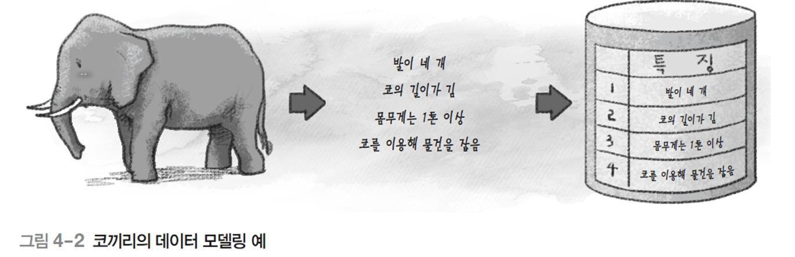

</details>

<details>

<summary>단계</summary>

- 1단계 : 개념적 모델링 (Conceptual Modeling)
- 현실 데이터를 수집/분석한 정보를 추상화하는 단계 
- ERD 
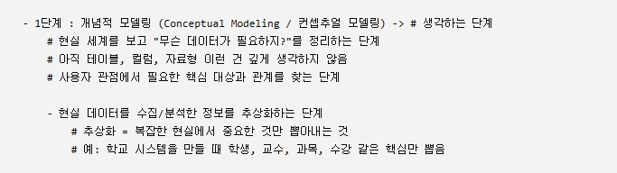
- 2단계 : 논리적 모델링 (Logical Modeling)
- 추상화한 정보를 Database에 저장하기 위한 구조를 정의하고 표현하는 단계. 
- 관계 데이터 모델 
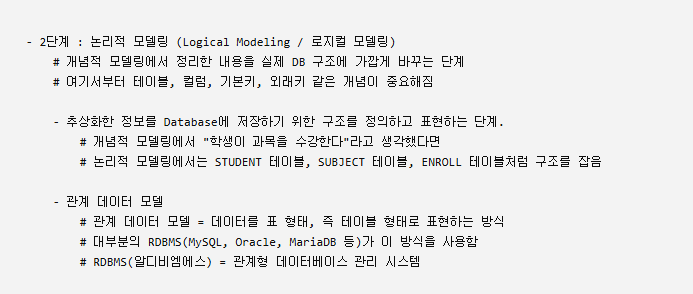
- 3단계 : 물리적 모델링 (Physical Modeling)
- DB에 저장하기 위한 물리적인 구조를 정의, 구현하는 단계 
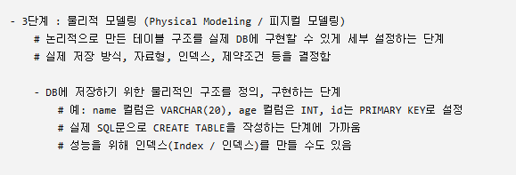

</details>

<details>

<summary>1단계 - 개념적 모델링</summary>

- 현실 데이터를 수집, 분석한 정보를 추상화 단계
- 핵심 **개체**를 정의하고 개체의 **속성**과 각 개체 간의 **관계**를 표현 
- 개체 : 고유한 정보를 가지고 구분할 수 있는 대상 
- 속성 : 개체를 구분할 수 있는 특정 
- 관계 : 개체 사이의 연관성 
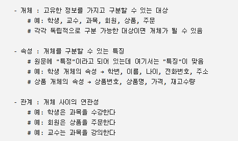

<details>

<summary>ERD</summary>

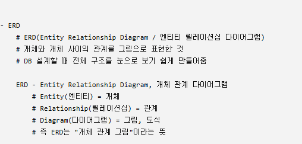
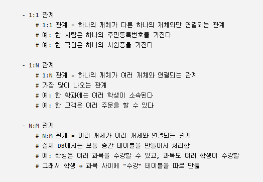
ERD - Entity Relationship Diagram, 개체 관계 다이어그램 

<details>

<summary>예시</summary>


</details>

- 사용자 관점에서 데이터를 어떻게 인식하는지를 표현한 그림 
- 사물을 개체와 개체간의 관계로 표현
- 1:1 관계 / 1:N 관계 / N:M 관계 

<details>

<summary>개체와 개체 타입</summary>

- 개체 : 독립적으로 구분할 수 있는 특징을 가지는 대상
- 개체 집합 : 동일한 속성을 가지는 개체들의 집합 
- 개체 타입 : 개체 집합의 공통된 특징을 정의한 것 
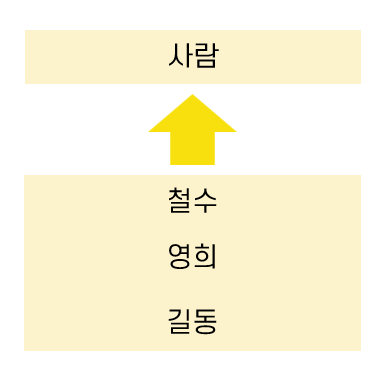

</details>

<details>

<summary>개체 타입 표현 방식</summary>

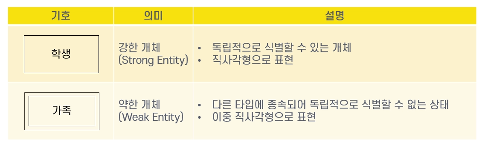
- 강한 개체 (Strong Entity)
- 독립적으로 식
- ER-Diagram에서 직사각형으로 표현 
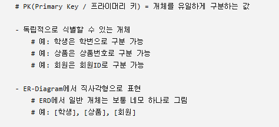
- 약한 개체 (Weak Entity)
- 다른 타입에 종속되어 독립적으로 식별할 수 없는 개체 
- ER-Diagram에서 이중 직사각형으로 표현 
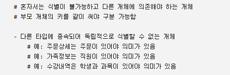

</details>

<details>

<summary>속성 종류</summary>

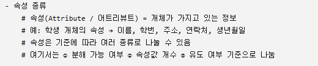
- 분해 가능 여부
- 단순 속성 (Simple Attribute) - 분해 불가능한 속성
- ex. 이름, 학번, 주민등록번호 등 

- 복합 속성 (Composite Attribute) - 단순 속성으로 분해 가능한 속성 
- ex. 주소 ( 시 / 구 / 동 )
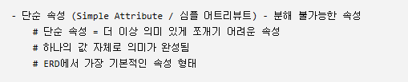
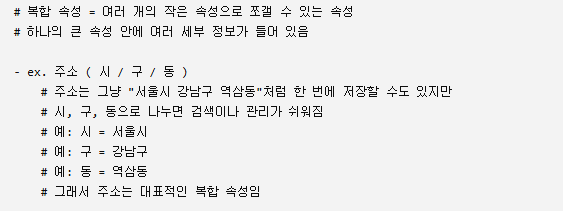

- 속성 값의 개수
- 단일값 속성 (Single-Valued Attribute) - 속성값이 1개인 속성 
- ex. 이름, 주민등록번호 등 
- 다중값 속성 (Multi-Valued Attribute) - 속성값이 2개 이상인 속성 
- ex. 연락처(전화번호, 이메일)
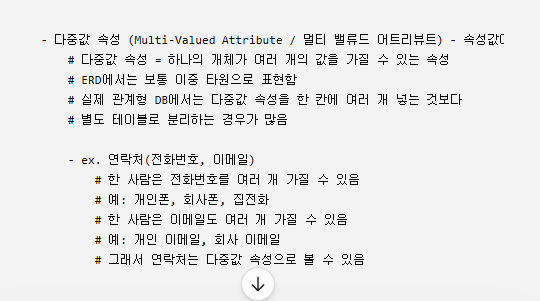
- 유도 여부
- 저장 속성 (Stored Attribute) - 단독적으로 저장되는 속성 
- 유도 속성 (Derived Attribute) - 저장 속성으로 부터 유도되는 속성 
- ex. 출생년도 → “나이 “
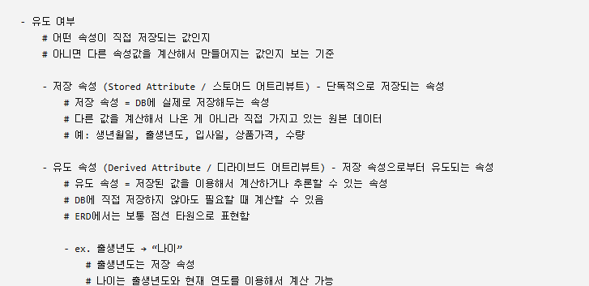

</details>

<details>

<summary>속성 표현 방식</summary>

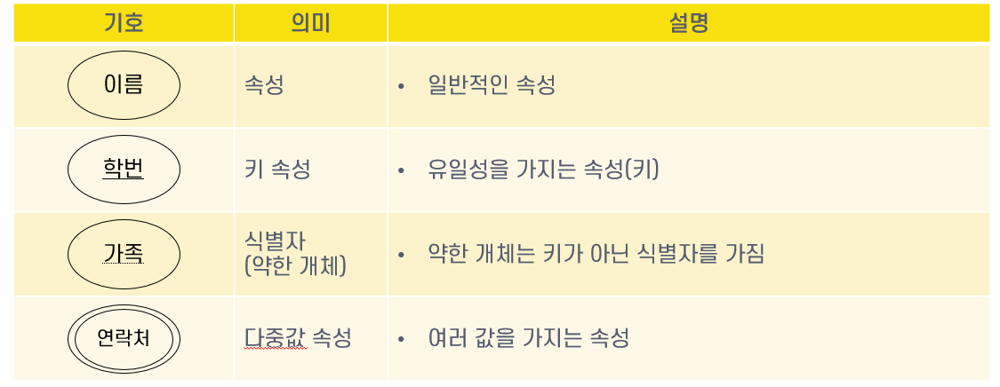
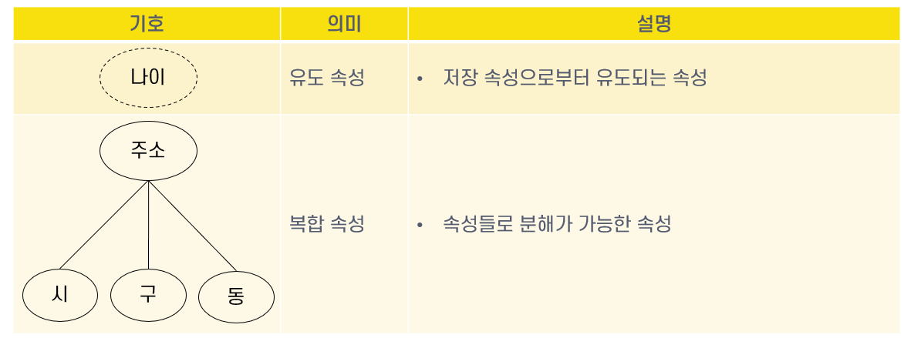

</details>

<details>

<summary>관계와 관계 타입</summary>

- 관계 : 개체 간의 연관성
- 관계 타입 : 개체 타입 간의 관계를 정의 
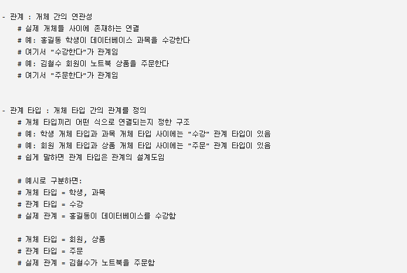
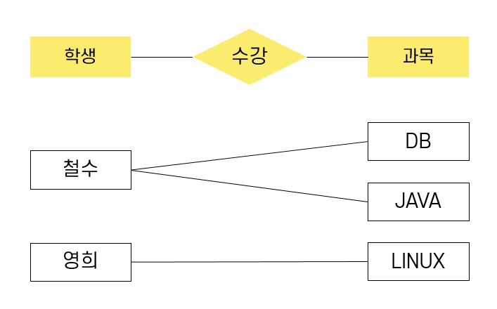

<details>

<summary>관계 타입 유형</summary>

- 차수와 관계 대응 수에 따라 유형 구분
- 차수 Degree 
- 관계를 구성하는 개체 타입의 수
- 관계 데이터 모델(표)에서 열(속성)의 개수 
# "관계에 몇 종류의 개체가 참여하냐"를 보는 것
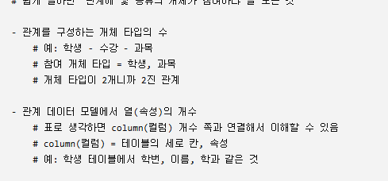
- 관계 대응 수 Cardinality
- 관계가 구성된 두 개체 타입에서 각 개체들의 수
- 관계 데이터 모델(표)에서 행(튜플)의 개수 
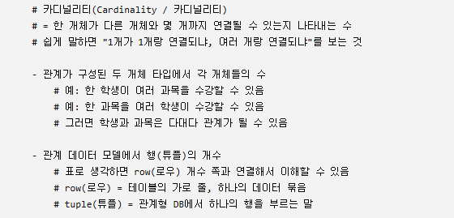

<details>

<summary>참고</summary>

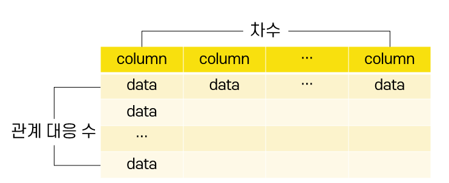

</details>

</details>

<details>

<summary>차수에 따른 유형</summary>

- 1진 관계 (Recursive Relationship) : 한 개체가 자기 자신과의 관계를 구성 
- 학생 - 학습  
# 즉, 같은 개체 타입 안에서 관계가 생기는 구조
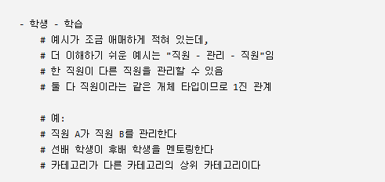
- 2진 관계 (Binary Relationship) : 두 개의 개체 간의 관계를 구성
- 회원 - 주문 - 제품 
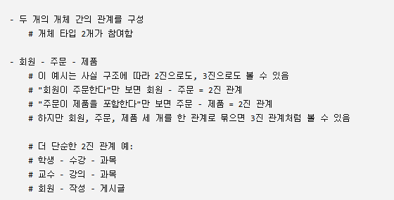
- 3진 관계 (Ternary Relationship) : 세 개의 개체 간의 관계를 구성 
- 구매자 - 구매 - 판매자<br>                    \| <br>                제품
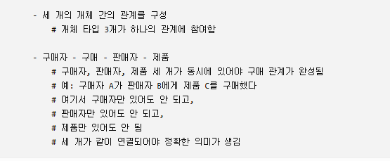

<details>

<summary>기호</summary>

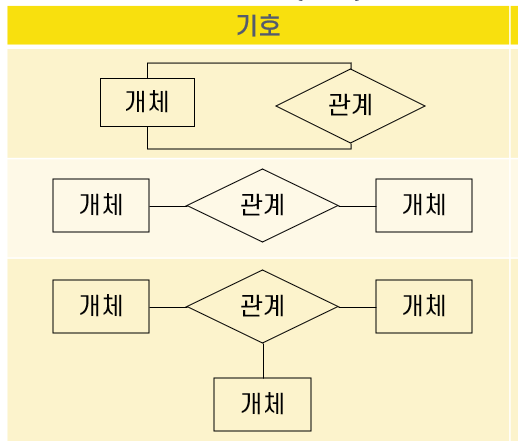

</details>

</details>

<details>

<summary>관계 대응 수에 따른 유형</summary>

- 일대일 관계 : 한 개의 개체가 다른 한 개의 개체에 대응 

- 일대다 관계 : 한 개의 개체가 여러 개의 개체에 대응 
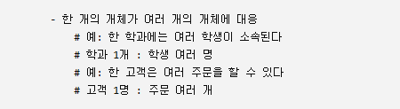
<br>다대일 관계 : 여러 개의 개체가 한 개의 개체에 대응 
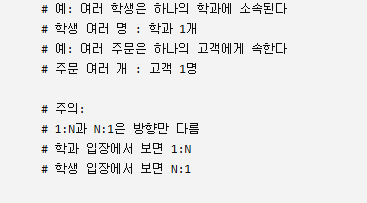
- 다대다 관계 : 여러 개의 개체가 여러 개의 개체에 대응 
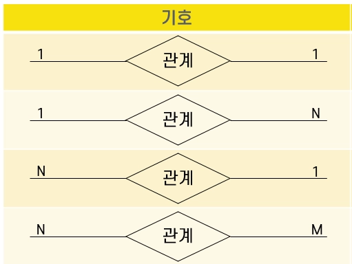
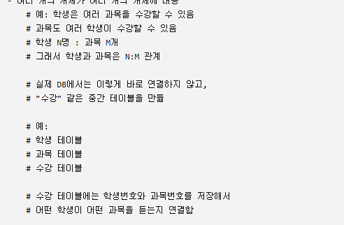

</details>

<details>

<summary>IE 표기법</summary>

- 정보 공학 표기법 (Information Engineering Notation)
- 직사각형과 선으로 된 기호로 표기
- 새발표기법(Crow Foot Notation) 

</details>

<details>

<summary>ERD 도구</summary>

[https://draw.io/](https://draw.io/)
[https://mermaid.ai/web/](https://mermaid.ai/web/) - AI 탑제 (참고용 공식 문서: 
[https://dbdiagram.io/home](https://dbdiagram.io/home)

</details>

</details>

</details>

</details>

<details>

<summary>2단계 - 논리적 모델링</summary>

- 추상화한 정보를 DB에 저장하기 위한 구조를 결정하고 표현하는 단계 
- ERD를 기반으로 실제 DB 구조에 맞춰서 표현 

<details>

<summary>과정</summary>

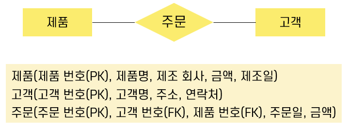
- 개체마다 필요한 모든 상세 속성 추출
- **정규화** 수행
- 데이터 유형과 크기 설정 

</details>

<details>

<summary>정규화</summary>

정규화 - Normal Form

<details>

<summary>개념</summary>

- 이상 현상이 있는 테이블을 분해하여 이상 현상을 없애는 과정 
- 이상 현상 : 테이블의 일관성을 해치고 데이터 무결성을 위반하는 현상 
- 삽입 이상 : 데이터 삽입 시 중복된 값이거나 NULL 값인 경우 
- 삭제 이상 : 데이터 삭제 시 삭제되면 안되는 값까지 삭제되는 경우 
- 수정 이상 : 데이터 수정 시 관계성이 있는 테이블 간 데이터 일관성을 해하는 경우 
- 함수 종속성을 파악하고 분석하여 테이블 구조를 최적화 
- 함수 종속성
- 테이블의 기본키가 다른 속성들을 결정하는 성질 
- 기본키가 아닌 속성들은 기본키에 종속한다.
- 기본키는 다른 속성들의 결정자 

<details>

<summary>유형</summary>

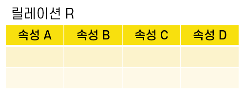
- 완전 함수 종속 : R의 기본키가 A인 경우 B,C,D는 각각 A에만 종속되고 서로는 종속되지 않는 경우 
- 부분 함수 종속 : R의 기본기카 A,B인 복합 기본키인 경우 C와 D는 (A, B)에 종속되고 A 또는 B에도 종속되는 경우.
- 이행 함수 종속 : R에서 A가 B를 결정하고 B가 C를 결정할 때 A가 C를 결정할 수 있는 경우 (A=B / B=C → A=C) 

</details>

</details>

<details>

<summary>단계</summary>

제 1\~6 정규화, BCNF 정규화
일반적으로는 제 3 정규화까지 진행 → 제 3 정규화가 진행된 테이블은 제 4, 5 정규화와 BCNF 정규화가 된 것으로 간주 
- 제 1 정규화 (1NF) : 테이블의 모든 속성값이 원자값인 상태로 만드는 과정 
- 제 2 정규화 (2NF) : 테이블이 제 1 정규형이고, 기본키가 아닌 속성이 기본키에 완전 함수 종속된 상태로 만드는 과정 
- 제 3 정규화 (3NF) : 테이블이 제 2 정규형이고, 기본키가 아닌 속성이 기본키에 비이행 함수 종속된 상태로 만드는 과정 
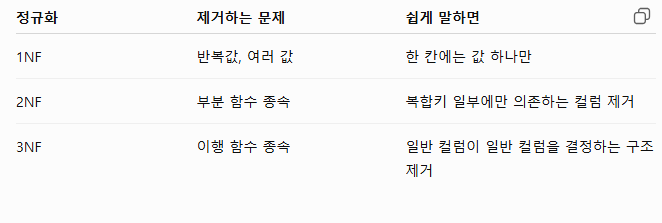
- BCNF 정규화 : 테이블의 모든 결정자가 후보키인 상태로 만드는 과정 
- 제 4 정규화 (4NF) : 테이블이 BCNF 정규형이고, 다치 종속이 없게 만드는 과정 
- 제 5 정규화 (5NF) : 테이블이 제 4 정규형이고, 테이블을 더 이상 분해할 수 없게 만드는 과정 (JOIN 종속이 없어야 함) 
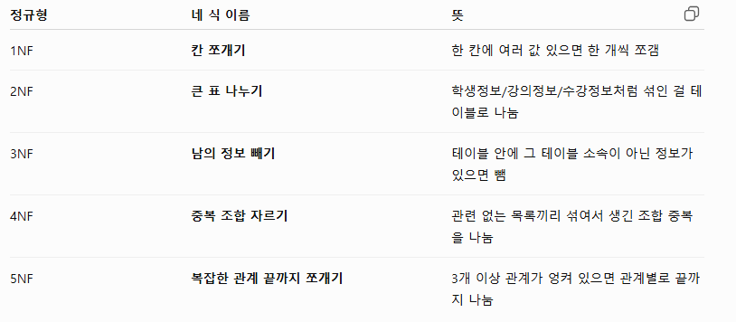

</details>

<details>

<summary>예시</summary>

<details>

<summary>제 1 정규화</summary>

- 속성값이 원자값이여야 함. 
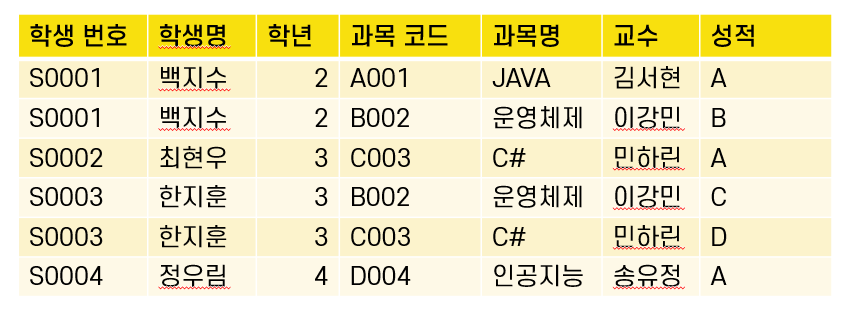

</details>

<details>

<summary>제 2 정규화</summary>

- 기본키에 완전 함수 종속
- 학생 정보, 과목 정보, 성적이 각각 기본키에 종속되도록 테이블 분해
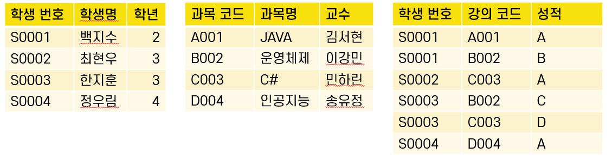

</details>

<details>

<summary>제 3 정규화</summary>

- 이행 함수 종속 제거 

</details>

<details>

<summary>실습</summary>

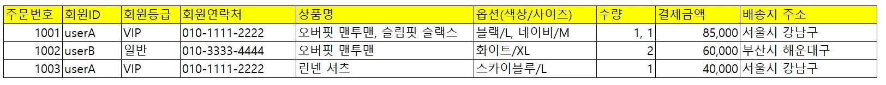
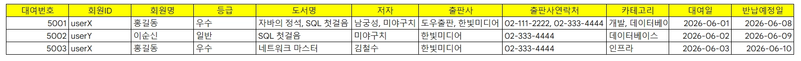

<details>

<summary>쇼핑몰</summary>

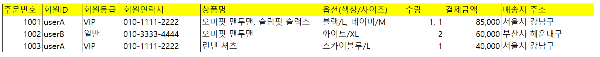

<details>

<summary>제 1 정규화</summary>

- 원자값을 가지도록 
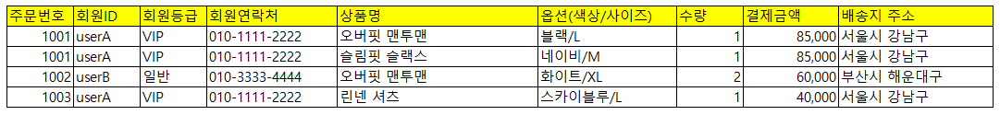

</details>

<details>

<summary>제 2 정규화</summary>

- 주문 번호를 기준으로 기본키에 종속되도록 분리
- 주문 (주문번호, 회원ID, 회원등급, 회원 연락처, 결제 금액, 배송지 주소)
- 주문 상세 ( *주문번호*, 상품명, 옵션, 수량)
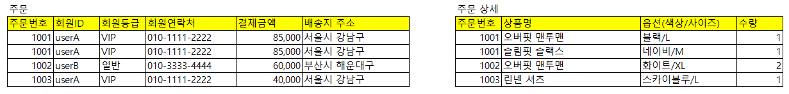

</details>

<details>

<summary>제 3 정규화</summary>

- 주문 테이블에 존재하는 이행함수 종속 제거
- (배송지 주소는 한명이 여러 주소로 주문할 수 있기 때문에 주문 테이블에 존재)
- 주문 (주문번호, *회원ID*, 결제 금액, 배송지 주소)
- 주문 상세 ( *주문번호*, 상품명, 옵션, 수량)
- 회원 (회원ID, 회원등급, 회원 연락처)
- **주문 테이블에서 복합 기본키를 사용하지 않는 경우 제품 테이블과 옵션 테이블로 분리 가능**
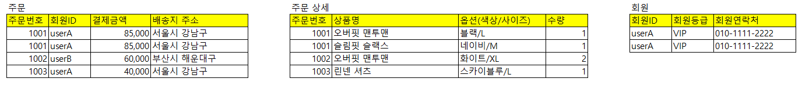

</details>

</details>

<details>

<summary>서점</summary>


<details>

<summary>제 1 정규화</summary>

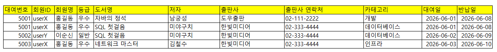

</details>

<details>

<summary>제 2 정규화</summary>

- 대여 (대여번호, 회원ID, 회원명, 등급, 대여일, 반납일)
- 도서 (도서명, 저자, 출판사, 출판사 연락처, 카테고리)
- 대여 상세(*대여번호*, *도서명*)
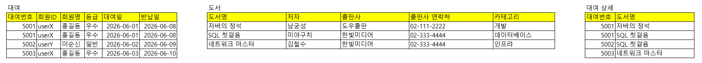

</details>

<details>

<summary>제 3 정규화</summary>

- 대여 (대여번호, *회원ID*, 회원명, 등급, 대여일, 반납일)
- 도서 (도서명, 저자, *출판사*, 카테고리)
- 대여 상세(*대여번호*, *도서명*)
- 회원 (회원ID, 회원명, 등급)
- 출판사 (출판사, 출판사 연락처)
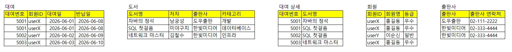

</details>

</details>

</details>

</details>

</details>

</details>

</details>

<details>

<summary>Transaction</summary>

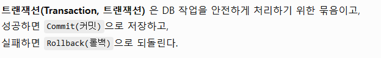
- data를 처리하는 논리적인 작업 단위 
- 특징
- 원자성(Atomicity) : 트랜잭션에 포함된 작업은 전부 성공 or 실패해야 함. (오류 →원상복구)
- 일관성(Consistency) : 데이터베이스는 트랜잭션 수행 전후로 일관된 상태를 유지해야 함. <br>(정해놓은 규칙이 깨지지 않게한다, )
- 독립/고립성(Isolation) : 각 트랜잭션은 독립적이며 다른 트랜잭션에 간섭이 없어야 함. <br>(동시 실행해도 오류 발생x)
- 지속성(Durability) : 한 번 성공한 트랜잭션은 영구적이며 불변해야 함.(영구적 저장)
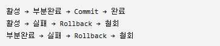

<details>

<summary>상태전이도</summary>

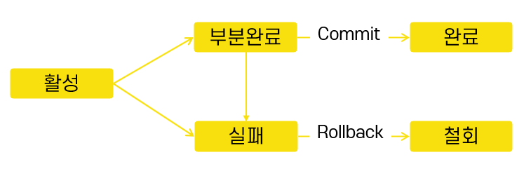
- 활성(Active) : 트랜잭션이 실행중인 상태
- 부분완료(Partially Committed) : 마지막 명령문이 실행된 상태
- 완료(Committed) : 트랜잭션이 성공적으로 완료된 상태
- 실패(Failed) : 정상적인 실행이 진행될 수 없는 상태 
- 철회(Aborted) : 트랜잭션이 취소되고 시작 전 상태로 환원된 상태

</details>

<details>

<summary>트랜잭션 연산</summary>

- Commit
- 부분 완료 상태에서 완료 상태로 변환
- 변경 내용 저장 
- Rollback
- 실패 상태에서 철회 상태로 변환
- 변경 내용 원상 복구
- Savepoint
- Rollback시 복구되는 시점을 지정
- 여러 개 생성 가능 

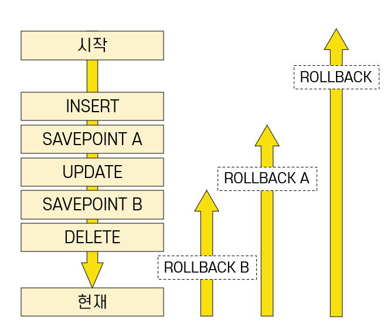

</details>

<details>

<summary>실습 1</summary>

```sql
# 트랜잭션 활성화
START TRANSACTION;
# memberID가 Baram인 회원의 주소를 '서울 관악구 봉천동'으로 수정
UPDATE memberTBL 
SET memberAddress = '서울 관악구 봉천동' 
WHERE memberID = 'Baram';
# 변경 사항 적용 - 트랜잭션 종료 
COMMIT;
```


```sql
# commit 전
SELECT * FROM memberTBL;
+----------+------------+----------------------------+
| memberID | memberName | memberAddress              |
+----------+------------+----------------------------+
| Arin     | 김아린     | 경기 부천시 중동           |
| Baram    | 이바람     | 서울 은평구 증산동         |
| Chaerin  | 박채린     | 인천 남구 주안동           |
| Dayun    | 최다윤     | 경기 성남시 분당구         |
+----------+------------+----------------------------+

# commit 후
SELECT * FROM memberTBL;
+----------+------------+----------------------------+
| memberID | memberName | memberAddress              |
+----------+------------+----------------------------+
| Arin     | 김아린     | 경기 부천시 중동           |
| Baram    | 이바람     | 서울 관악구 봉천동         |
| Chaerin  | 박채린     | 인천 남구 주안동           |
| Dayun    | 최다윤     | 경기 성남시 분당구         |
+----------+------------+----------------------------+
```


</details>

<details>

<summary>실습 2</summary>

```sql
# 트랜잭션 활성화
START TRANSACTION;

SELECT * FROM productTBL; # 재고량 조회

INSERT INTO orderTBL VALUES ('Baram', '세탁기', 4, NOW());

SELECT * FROM orderTBL;

UPDATE productTBL
SET amount = amount - 4
WHERE productName = '세탁기';

SELECT * FROM productTBL; # 재고량 조회

ROLLBACK;
```

</details>

<details>

<summary>실습 3</summary>

```sql
# 트랜잭션 활성화
START TRANSACTION;

SELECT * FROM productTBL; # 재고량 조회

INSERT INTO orderTBL VALUES ('Baram', '세탁기', 3, NOW());

SAVEPOINT after_insert;

SELECT * FROM orderTBL;

UPDATE productTBL
SET amount = amount - 4
WHERE productName = '세탁기';

SELECT * FROM productTBL; # 재고량 조회

ROLLBACK TO after_insert;

ROLLBACK;
```

</details>

<details>

<summary>Transaction의 적용 범위</summary>

Transaction 발생 O - DML(INSERT, UPDATE, DELETE)
Transaction 발생 X - DDL(CREATE, DROP, ALTER, **TRUNCATE**), DCL (GRANT, REVOKE)
Transaction  해당 없음 - SELECT 

</details>

</details>

<details>

<summary>Database Object - View</summary>

[VIEW (SQL) — 원본 참고 링크](https://app.notion.com/p/36cddb1a637780758fd2f1a040247136#38addb1a63778015ac88d9cc4fd24894)
```text
View

하나 이상의 테이블에서 조회한 결과를 저장하는 가상의 테이블
가상의 Database Object로 실제 데이터가 저장되지는 않음
View 생성 시 참조한 Table의 데이터를 실시간으로 반영
```


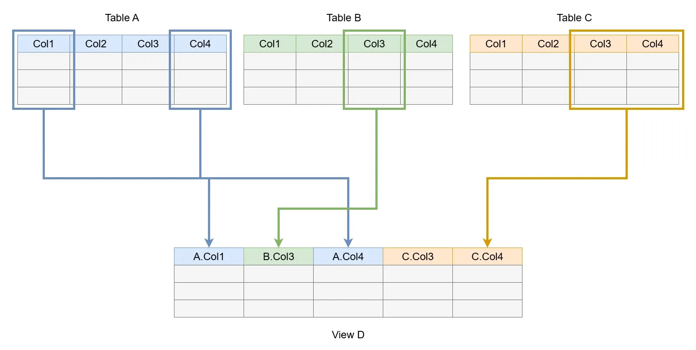

<details>

<summary>목적</summary>

1. Query의 단순화<br>⇒ 복잡한 Query의 결과를 View라는 객체로 저장하여 같은 결과를 조회할 때 View를 조회하여 Query의 복잡성 및 연산속도 상승 
2. 노출되는 컬럼을 제한하여 보안 강화<br>⇒ 중요한 컬럼을 제외한 결과를 저장하여 View를 생성하고 접근을 제한하여 보안을 강화<br>⇒ View에 대한 권한을 사용자별로 지정 
3. 데이터 일관성 유지
⇒ 가상의 Data가 실제 Data와 동기화되어 같은 내용을 보여준다. 

</details>

<details>

<summary>실습</summary>

<details>

<summary>View 생성</summary>

```sql
# 기본 문법
# OR REPLACE: View가 없으면 생성, 있으면 수정
CREATE [OR REPLACE] VIEW <<View Name>> AS
<<SELECT Statement>>;
# View 생성
CREATE VIEW v_receipt AS
SELECT
	u.userID AS 'ID', # 회원ID
	u.name AS '회원명', # 회원 이름
	b.productName AS '제품명', # 제품명
	(b.amount * b.price) AS '총 금액'# 총 금액
FROM userTBL u
JOIN buyTBL b ON u.userID = b.userID;

# 생성된 View 확인
SHOW TABLES;

# v_reciept가 View인지 Table인지 조회
SELECT TABLE_SCHEMA, TABLE_NAME, TABLE_TYPE 
FROM information_schema.tables
WHERE TABLE_SCHEMA = 'keduDB'
;

# View 내용 조회
SELECT * FROM v_receipt;

# View에 INSERT 시도
# SQL Error [1394] [HY000]: Can not insert into join view 'keduDB.v_receipt' without fields list
# View가 둘 이상의 table의 내용을 참조한 경우 Insert 불가
# *** 단일 table만 참조하는 경우 Insert 가능
INSERT INTO v_receipt VALUES ('kedu','한정교', '태블릿', 1400000);

# 기존 테이블 수정 후 View 확인 (buyTBL)
SELECT * FROM buyTBL;

# KSH95의 amount를 4개로 변경
UPDATE buyTBL SET amount = 4 WHERE userID = 'KSH95';

# 다시 View 확인
SELECT * FROM v_receipt;

# KSH95의 amount를 3개로 변경
UPDATE buyTBL SET amount = 3 WHERE userID = 'KSH95';

# 다시 View 확인
SELECT * FROM v_receipt;
```

</details>

</details>

</details>

<details>

<summary>Database Object - Index</summary>

- 테이블에 대한 동작 속도를 향상시키기 위한 자료 구조 
- B-Tree(Balanced-Tree) 구조
- 테이블에 저장된 데이터를 일정 구간마다 범위를 지정 
- Key-Value 형태로 범위의 정보와 저장되어있는 주소를 저장
- Primary Key 또는 Unique Key 지정 시 자동으로 생성
- 데이터 변경(삽입, 삭제, 수정)이 자주 발생 시 성능 저하
- 인덱스가 저장된 트리 구조의 변경으로 내부 작업량이 증가 

<details>

<summary>Index 확인</summary>

```sql
SHOW INDEX FROM productTBL;
```

</details>

<details>

<summary>Index 생성</summary>

```sql
CREATE TABLE indexTBL (
	first_name VARCHAR(14),
	last_name VARCHAR(16),
	hire_date DATE
);

# employees.employees에서 indexTBL로 값 삽입
INSERT INTO indexTBL 
SELECT first_name, last_name, hire_date
FROM employees.employees;

# indexTBL의 Index 확인
SHOW INDEX FROM indexTBL;

# first_name이 Mary인 사람 조회
# ex. 실행 시간 - 0.16s
SELECT * FROM indexTBL WHERE first_name = 'Mary';

# Index 생성
CREATE INDEX idx_indexTBL_firstname ON indexTBL(first_name);


# first_name이 Mary인 사람 조회
# ex. 실행 시간 - 0.004s
SELECT * FROM indexTBL WHERE first_name = 'Mary';
```

</details>

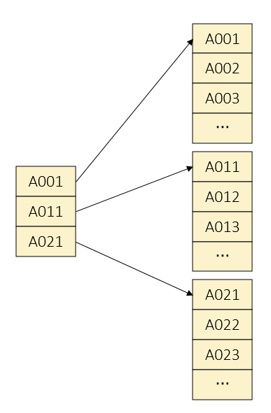

</details>

<details>

<summary>Database Object 고급 (필수x)</summary>

### DELIMITER
- SQL 문장의 끝을 알리는 기호(구분자)를 일시적으로 변경. (기본값 : 세미콜론)<br>⇒ Procedure/Trigger 내부에 세미콜론(;)이 여러 개 있으면, 생성이 완료되기 전에 문장이 끝나버리는 오류가 발생하기 때문.
### Database Object - Stored Procedure
- 여러 SQL을 묶어서 하나의 함수처럼 사용할 수 있는 기능
- Procedure내부에서 변수 선언, 제어, 반복, 출력 등의 기능 추가

<details>

<summary>실습</summary>

입력한 제품의 정보와 주문 내역을 확인하는 Procedure 생성
```sql
DELIMITER $$ # $$를 만나면 SQL 종료
CREATE PROCEDURE myProc(pName CHAR(4)) # myProc라는 이름의 Procedure 생성, 제품명을 매개변수로 받는다.
BEGIN        # Procedure가 호출되면 실행할 SQL문의 시작
	DECLARE digit INT DEFAULT 1000; # 변수 선언
	SELECT productName, (cost*digit) FROM productTBL WHERE productName = pName;
	SELECT * FROM orderTBL WHERE productName = pName;
END $$       # Procedure 종료
DELIMITER ; # 구분자 원상 복구
```

</details>

### Database Object - Trigger
- Table에 DML(INSERT, UPDATE, DELETE) 작업이 발생할 경우 자동으로 실행할 내용 
- 데이터 상태 관리를 자동화 

<details>

<summary>실습</summary>

회원 탈퇴가 발생했을 때 탈퇴한 회원의 정보를 다른 테이블에 저장 

<details>

<summary>탈퇴 회원 Table  생성</summary>

```sql
# 삭제한 회원을 저장할 테이블 생성
CREATE TABLE IF NOT EXISTS dMemberTBL (
	memberID CHAR(8),
	memberName CHAR(5),
	memberAddress CHAR(20),
	deletedDate DATE
);
```

</details>

<details>

<summary>Trigger 생성</summary>

```sql
# Trigger 생성
# 아래 명령어 실행 시 DELIMITER &&부터 DELIMITER ;까지 드래그 후 Alt+x로 실행

DELIMITER && # &&를 만나면 SQL문 종료
CREATE TRIGGER trg_deletedMember # Trigger 생성
	AFTER DELETE                   # Trigger 호출 시점
	ON memberTBL                   # Trigger 감시 대상
	FOR EACH ROW                   # 대상이 되는 행 전부를 실행 
BEGIN                            # Trigger가 호출되면 실행할 SQL문의 시작 (Trigger Block)
	INSERT INTO dMemberTBL VALUES 
	(OLD.memberID, OLD.memberName, 
	OLD.memberAddress, CURDATE()); # memberTBL에서 DELETE된 내용(OLD)를 dMemberTBL에 Insert
END &&                           # Trigger Block 종료
DELIMITER ; # 이후 사용을 위해 구분자 원상복구 
```

</details>

<details>

<summary>Trigger 확인</summary>

```sql
SHOW TRIGGERS [FROM|IN <<Database Name>>];
```

</details>

<details>

<summary>회원 삭제</summary>

```sql
# 현재 orderTBL에서 참조하고 있어 외래키 제약조건에 의해 삭제가 불가능하기 때문에 orderTBL 삭제
DROP TABLE IF EXISTS orderTBL;

# memberID가 Arin인 사람 삭제
DELETE FROM memberTBL WHERE memberID = 'Arin';
```

</details>

<details>

<summary>탈퇴 회원 Table 확인</summary>

```sql
SELECT * FROM dMemberTBL;
```

</details>

<details>

<summary>**의존성이 있어도 삭제할 수 있는 방법은?**</summary>

```sql
# 부모 테이블(memberTBL/productTBL)를 참조하는 자식 테이블(orderTBL)에서
# 부모 테이블의 값이 변경(수정/삭제)될 경우 연쇄적으로 반응하도록 설정
# CASCADE : 참조한 데이터에 변경이 있을 경우 연쇄적으로 해당 변경 내용을 반영함 
# 기본 문법
# 외래키 제약 조건 ON {DELETE | UPDATE} CASCADE
CREATE TABLE IF NOT EXISTS orderTBL (
	memberID CHAR(8) NOT NULL,
	productName CHAR(4) NOT NULL,
	amount INT NOT NULL,
	orderDate DATE NOT NULL,
	FOREIGN KEY (memberID) REFERENCES memberTBL(memberID) ON DELETE CASCADE ON UPDATE CASCADE,
	FOREIGN KEY (productName) REFERENCES productTBL(productName) ON DELETE CASCADE ON UPDATE CASCADE
);
```

</details>

</details>

</details>
