> 학습 원본 보존 문서. 개인 프로젝트 성과나 전체 코드의 직접 작성 사실을 주장하지 않음.
> 출처: [.기초수업](https://app.notion.com/p/36cddb1a637780758fd2f1a040247136), 원본 행 7174–9054.

# 파이썬

<details>

<summary>기초 단계</summary>

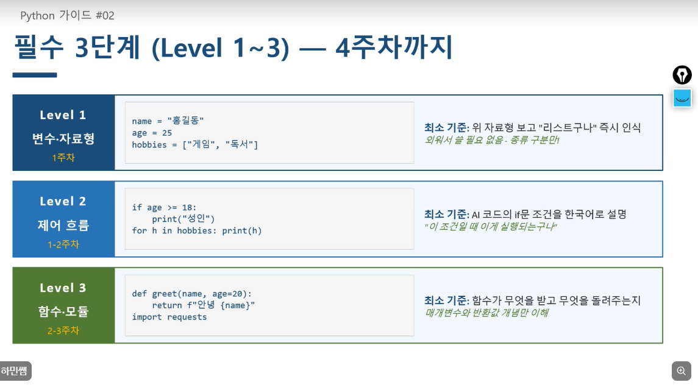
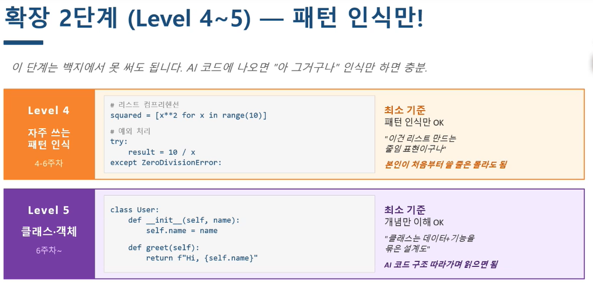
# 기초 코드
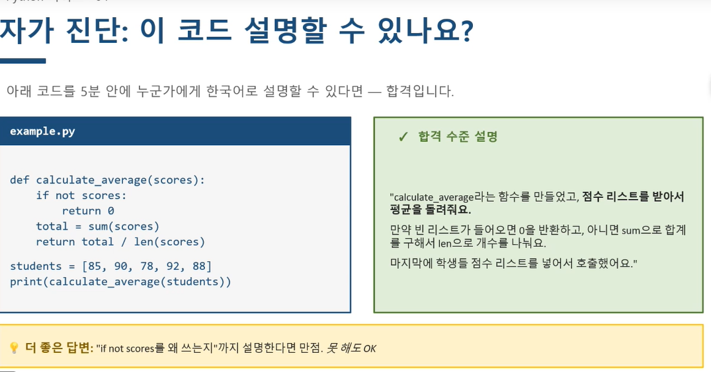

</details>

<details>

<summary>진수모음</summary>

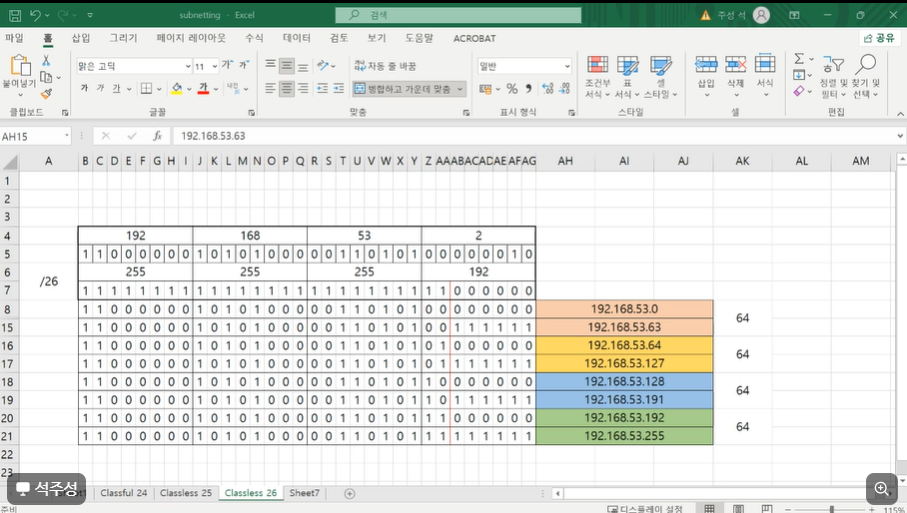

| 클래스 | 첫 번째 숫자 범위 | 기본 마스크 |
| --- | --- | --- |
| A Class(에이 클래스) | `1 ~ 126` | `/8` |
| B Class(비 클래스) | `128 ~ 191` | `/16` |
| C Class(씨 클래스) | `192 ~ 223` | `/24` |

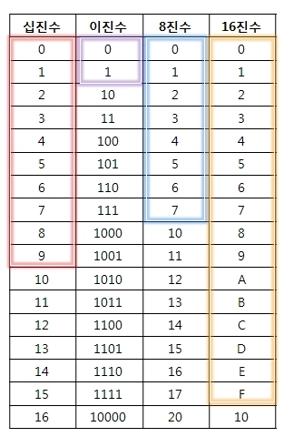

<details>

<summary>참고영상</summary>

[진법변환 10진수에서 2진수로 — 원본 참고 링크](https://app.notion.com/p/36cddb1a637780758fd2f1a040247136#36dddb1a63778050974fdebc570f9cdc)
[2진수를 10진수로 변환하는 방법 — 원본 참고 링크](https://app.notion.com/p/36cddb1a637780758fd2f1a040247136#36dddb1a6377809e8728ed81a093e7f8)
[2진수로 빠르게 바꾸는 법 — 원본 참고 링크](https://app.notion.com/p/36cddb1a637780758fd2f1a040247136#36dddb1a6377802e86bcc40495c706c1)
[16진수를 10진수로 변환 — 원본 참고 링크](https://app.notion.com/p/36cddb1a637780758fd2f1a040247136#36dddb1a63778058bd49f01befc633ef)

</details>

</details>

<details>

<summary>python(파이썬)</summary>

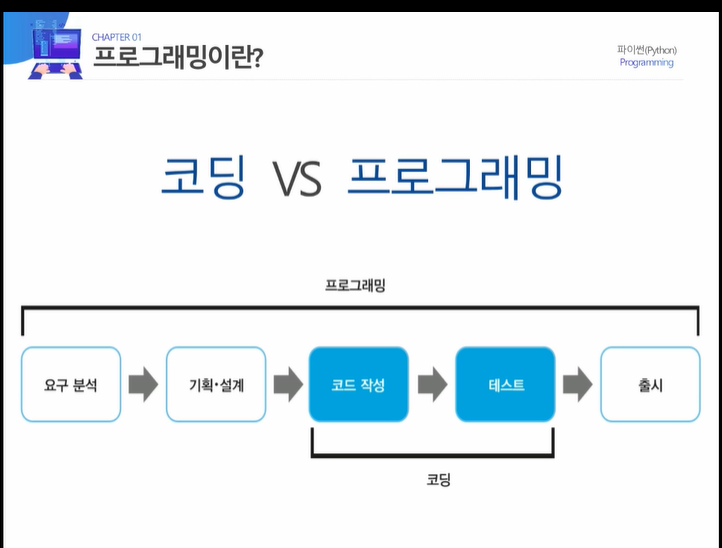

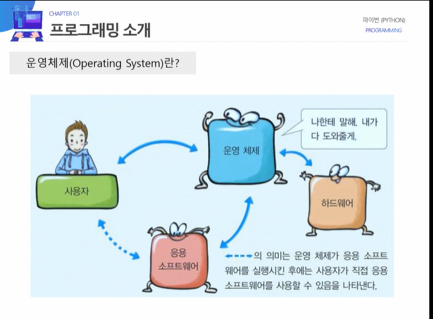
하드웨어에게 “이렇게 움직여라”라고 시키는 프로그램들.

| 소프트웨어 | 역할 | 하드웨어 |
| --- | --- | --- |
| **예)윈도우 11** | 컴퓨터 전체를 관리하는 기본 운영체제 | 컴퓨터를 구성하는 물체 |

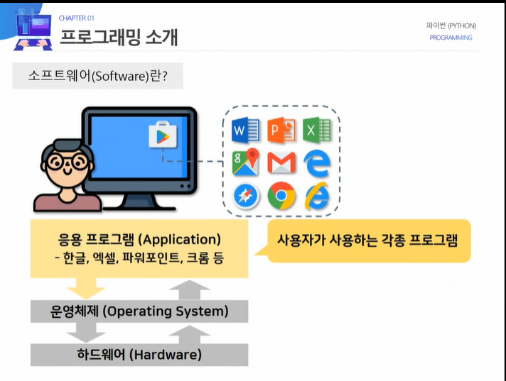

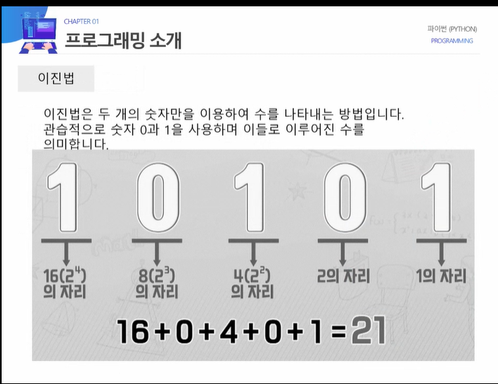
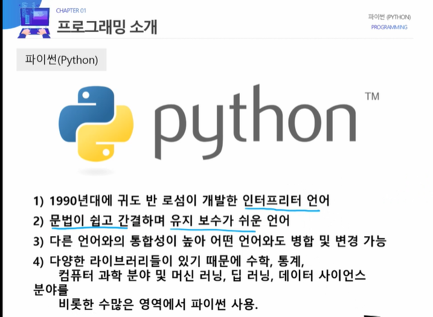

<details>

<summary>기초용어</summary>

| 분류 | 용어 / 코드 | 발음 | 뜻 | 예시 | 핵심 주의점 |
| --- | --- | --- | --- | --- | --- |
| 출력 | `print()` | 프린트 | 화면에 값을 보여주는 출력 함수 | `print("안녕")` | 결과를 눈으로 보려면 사용 |
| 입력 | `input()` | 인풋 | 사용자에게 값을 입력받는 함수 | `name = input("이름: ")` | 입력값은 기본적으로 문자열 `str`(스트링) |
| 변환 | `int()` | 인트 | 정수로 바꾸기 | `int("123")` → `123` | 소수 문자열 `"10.5"`는 바로 안 됨 |
| 변환 | `float()` | 플로트 | 소수 숫자로 바꾸기 | `float("3.14")` → `3.14` | `10`을 넣어도 `10.0` |
| 변환 | `str()` | 스트링 | 문자열로 바꾸기 | `str(123)` → `"123"` | 숫자 자리 인덱싱할 때 자주 씀 |
| 자료형 | `int` | 인트 | 정수 | `10`, `123`, `-5` | 인덱싱 불가 |
| 자료형 | `float` | 플로트 | 소수 | `3.14`, `10.0` | 인덱싱 불가 |
| 자료형 | `str` | 스트링 | 문자열, 글자 | `"hello"` | 인덱싱 가능 |
| 자료형 | `list` | 리스트 | 여러 값을 순서대로 담는 자료 | `[1, 2, 3]` | 수정 가능 |
| 자료형 | `tuple` | 튜플 | 여러 값을 순서대로 담지만 수정 불가 | `(1, 2, "a")` | 인덱싱 가능, 값 변경 불가 |
| 자료형 | `dictionary` | 딕셔너리 | `key`(키)-`value`(밸류)로 저장 | `{"name": "철수"}` | 번호가 아니라 키로 꺼냄 |
| 자료형 | `set` | 세트 | 중복 없는 값 묶음 | `{1, 2, 3}` | 순서 개념 약함 |
| 자료형 | `bool` | 불 | 참/거짓 자료형 | `True`, `False` | 조건문에서 자주 씀 |
| 불리언 | `True` | 트루 | 참, 맞다, 켜짐 | `10 > 3` → `True` | 첫 글자 대문자 |
| 불리언 | `False` | 폴스 | 거짓, 아니다, 꺼짐 | `10 < 3` → `False` | 첫 글자 대문자 |
| 불리언 | `not` | 낫 | 참/거짓을 반대로 바꿈 | `not True` → `False` | “아니다” 느낌 |
| 값 없음 | `None` | 논 | 값이 없음 | `a = None` | `0`, `False`, `""`와 다름 |
| 변수 | `variable` | 베어리어블 | 값을 담는 상자 | `x = 10` | 변수 이름은 직접 정함 |
| 변수 | `area` | 에어리어 | 넓이를 담을 때 자주 쓰는 변수명 | `area = w * h` | 명령어가 아니라 변수 이름 |
| 딕셔너리 | `key` | 키 | 값을 찾는 이름표 | `"name"` | 딕셔너리 안에서 사용 |
| 딕셔너리 | `value` | 밸류 | 키에 저장된 실제 값 | `"철수"` | `{"name": "철수"}`에서 `"철수"` |
| 위치 | `index` | 인덱스 | 위치 번호 | `a[0]` | 파이썬은 0부터 시작 |
| 위치 | `indexing` | 인덱싱 | 인덱스로 값을 꺼내는 것 | `"abc"[1]` → `"b"` | 같은 글자도 자리별로 따로 셈 |
| 리스트 기능 | `append()` | 어펜드 | 리스트 맨 뒤에 값 추가 | `a.append(4)` | 위치 지정 불가 |
| 리스트 기능 | `insert()` | 인서트 | 원하는 위치에 값 끼워 넣기 | `a.insert(1, 99)` | 기존 값은 뒤로 밀림 |
| 리스트 기능 | `remove()` | 리무브 | 특정 값을 찾아 삭제 | `a.remove("star")` | 인덱스가 아니라 값 기준 |
| 리스트 기능 | `pop()` | 팝 | 인덱스 번호로 삭제 | `a.pop(2)` | 삭제한 값을 변수로 받을 수도 있음 |
| 리스트 기능 | `sort()` | 소트 | 리스트 오름차순 정렬 | `a.sort()` | 원본 리스트 자체가 바뀜 |
| 리스트 기능 | `sorted()` | 소티드 | 정렬된 새 리스트 만들기 | `b = sorted(a)` | 원본은 그대로 |
| 리스트 기능 | `reverse()` | 리버스 | 현재 순서를 그대로 뒤집기 | `a.reverse()` | 정렬 아님, 단순 반전 |
| 리스트 옵션 | `reverse=True` | 리버스 트루 | 정렬 방향을 반대로 함 | `a.sort(reverse=True)` | 내림차순 정렬 |
| 문자열 | `" "` | 더블 쿼트 | 문자열 선언 | `"안녕"` | 한 줄 문자열 기본 추천 |
| 문자열 | `' '` | 싱글 쿼트 | 문자열 선언 | `'안녕'` | 문자열 안에 `"`가 있을 때 편함 |
| 문자열 | `""" """` | 트리플 더블 쿼트 | 여러 줄 문자열 | `"""안녕\n하세요"""` | 줄바꿈 포함 가능 |
| 문자열 | `''' '''` | 트리플 싱글 쿼트 | 여러 줄 문자열 | `'''안녕'''` | 여러 줄 가능 |
| 문자열 | `quote` | 쿼트 | 따옴표, 인용부호 | `"`, `'` | 정확히는 `quotation mark`(쿼테이션 마크) |
| 문자열 꾸미기 | `f-string` | 에프 스트링 | 문자열 안에 변수값 넣기 | `f"이름은 {name}"` | 앞에 `f` 없으면 `{name}` 그대로 나옴 |
| 문자열 꾸미기 | `{}` | 중괄호 | 에프 스트링 안 변수 자리 | `f"{name}"` | 인덱스용 아님 |
| 수학 | `import math` | 임포트 매쓰 | 수학 도구함 불러오기 | `import math` | 보통 코드 맨 위 |
| 수학 | `math.pi` | 매쓰 파이 | 원주율 | `math.pi` | `3.14`보다 정확 |
| 수학 | `math.sqrt()` | 매쓰 스퀘어 루트 | 제곱근, 루트 | `math.sqrt(16)` → `4.0` | `import math` 필요 |
| 조건문 | `if` | 이프 | 만약 조건이 맞으면 실행 | `if a > 10:` | 조건 필요 |
| 조건문 | `elif` | 엘리프 | 그게 아니고 다른 조건이면 | `elif a > 5:` | 위에 `if`가 있어야 함 |
| 조건문 | `else` | 엘스 | 위 조건이 전부 아니면 | `else:` | 조건 붙이면 안 됨 |
| 반복문 | `for` | 포 | 정해진 대상에서 하나씩 꺼내 반복 | `for x in list:` | 반복 대상이 있을 때 좋음 |
| 반복문 | `while` | 와일 | 조건이 참인 동안 계속 반복 | `while a < 5:` | 조건이 안 바뀌면 무한 반복 위험 |
| 반복문 | `in` | 인 | 안에서 하나씩 꺼냄 / 포함 확인 | `for x in a:` | `"a" in word`도 가능 |
| 반복문 | `range()` | 레인지 | 숫자 범위 만들기 | `range(5)` | `0~4`, 5는 포함 안 됨 |
| 논리 연산자 | `and` | 앤드 | 둘 다 참이어야 참 | `a >= 90 and a <= 100` | 범위 조건에 자주 씀 |
| 논리 연산자 | `or` | 오어 | 둘 중 하나만 참이어도 참 | `a < 0 or a > 100` | 조건 범위가 넓어짐 |
| 논리 연산자 | `not` | 낫 | 결과 반전 | `not is_login` | `True ↔ False` |
| 연산자 | `+` | 플러스 | 더하기 / 문자열 붙이기 | `1+3`, `"안녕"+"하세요"` | 문자열끼리는 이어붙임 |
| 연산자 | `-` | 마이너스 | 빼기 | `10 - 3` | 숫자 계산 |
| 연산자 | `*` | 스타 / 곱하기 | 곱하기 / 반복 | `3*4`, `"안녕"*3` | 문자열·리스트 반복 가능 |
| 연산자 | `/` | 슬래시 | 일반 나누기 | `11 / 3` | 결과가 소수형 |
| 연산자 | `//` | 더블 슬래시 | 몫 | `11 // 3` → `3` | 나눗셈의 몫만 |
| 연산자 | `%` | 퍼센트 | 나머지 | `11 % 3` → `2` | 나눴을 때 남는 값 |
| 연산자 | `**` | 더블 스타 | 거듭제곱 | `2 ** 3` → `8` | 제곱 |
| 연산자 | `=` | 이퀄 | 오른쪽 값을 왼쪽 변수에 저장 | `x = 10` | 수학의 같다와 다름 |
| 비교 연산자 | `==` | 더블 이퀄 | 같다 비교 | `pw == attempt` | 조건문에서 비교할 때 |
| 비교 연산자 | `!=` | 낫 이퀄 | 같지 않다 | `pw != "python"` | 다르면 참 |
| 비교 연산자 | `<` | 레스 댄 | 작다 | `a < 8` | 비교 결과는 불리언 |
| 비교 연산자 | `>` | 그레이터 댄 | 크다 | `a > 100` | 비교 결과는 불리언 |
| 비교 연산자 | `<=` | 레스 댄 오어 이퀄 | 작거나 같다 | `a <= 19` | 이하 |
| 비교 연산자 | `>=` | 그레이터 댄 오어 이퀄 | 크거나 같다 | `a >= 90` | 이상 |
| 괄호 | `()` | 소괄호 | 함수 실행 / 묶기 | `print()`, `input()` | 실행은 `()` |
| 괄호 | `[]` | 대괄호 | 리스트 만들기 / 인덱싱 | `[1,2,3]`, `a[0]` | 순서와 꺼내기 |
| 괄호 | `{}` | 중괄호 | 딕셔너리 / 세트 / 에프 스트링 | `{"name":"철수"}` | 인덱스에는 안 씀 |
| 주석 | `#` | 샵 | 실행 안 되는 설명 | `# 설명` | 파이썬이 무시 |
| 스타일 | `PEP 8` | 펩 에이트 | 파이썬 코드 스타일 규칙 | `a = 10` | 실행 규칙이 아니라 보기 좋게 쓰는 기준 |
| 영어 표현 | `of` | 오브 | “\~의” | `index of list` | 파이썬 기본 명령어 아님 |
| 이스케이프 | `\n` | 백슬래시 엔 | 줄바꿈, New Line(뉴 라인) | `"안녕\n하세요"` | 자주 씀 |
| 이스케이프 | `\t` | 백슬래시 티 | 수평 탭, Horizontal Tab(호리즌털 탭) | `"이름\t나이"` | 자주 씀 |
| 이스케이프 | `\\` | 백슬래시 백슬래시 | 백슬래시 자체 출력 | `"C:\\Users"` | 경로 쓸 때 |
| 이스케이프 | `\'` | 백슬래시 싱글 쿼트 | 작은따옴표 출력 | `'I\'m'` | 문자열 안 `'` |
| 이스케이프 | `\"` | 백슬래시 더블 쿼트 | 큰따옴표 출력 | `"그가 \"안녕\""` | 문자열 안 `"` |
| 이스케이프 | `\r` | 백슬래시 알 | Carriage Return(캐리지 리턴), 줄 맨 앞으로 | `"abc\r12"` | 거의 안 씀 |
| 이스케이프 | `\f` | 백슬래시 에프 | Form Feed(폼 피드), 페이지 넘김 제어 | `"a\fb"` | 거의 안 씀 |
| 이스케이프 | `\a` | 백슬래시 에이 | Bell / Alert(벨 / 얼럿), 경고음 | `"경고\a"` | 환경 따라 소리 안 날 수 있음 |
| 이스케이프 | `\b` | 백슬래시 비 | Backspace(백스페이스) | `"abc\bde"` | 출력 환경 따라 다름 |
| 이스케이프 | `\000` | 백슬래시 제로제로제로 | Null Character(널 캐릭터) | `"A\000B"` | 화면에는 보통 안 보임 |
| 이스케이프 | `\xhh` | 백슬래시 엑스 | 16진수 문자 코드 | `"\x41"` → `A` | 고급 쪽 |
| 이스케이프 | `\uXXXX` | 백슬래시 유 | 유니코드 4자리 | `"\uAC00"` → `가` | 유니코드 |
| 이스케이프 | `\UXXXXXXXX` | 백슬래시 대문자 유 | 유니코드 8자리 | `"\U0001F600"` → 😀 | 이모지 가능 |
| 이스케이프 | `\N{name}` | 백슬래시 엔 네임 | 유니코드 이름 문자 | `"\N{BLACK HEART SUIT}"` → ♥ | 거의 안 씀 |
|  | sep= | 셉 |  |  |  |
|  | 대문자 | 상수 |  | 변하지 않는 변수 |  |

<details>

<summary>표 요약본</summary>

| 분류 | 용어 / 코드 | 발음 | 뜻 | 예시 | 핵심 주의점 |
| --- | --- | --- | --- | --- | --- |
| 출력 | `print()` | 프린트 | 화면에 값을 보여주는 출력 함수 | `print("안녕")` | 결과를 눈으로 보려면 사용 |
| 입력 | `input()` | 인풋 | 사용자에게 값을 입력받는 함수 | `name = input("이름: ")` | 입력값은 기본적으로 문자열 `str`(스트링) |
| 변환 | `int()` | 인트 | 정수로 바꾸기 | `int("123") → 123` | 소수 문자열 `"10.5"`는 바로 안 됨 |
| 변환 | `float()` | 플로트 | 소수 숫자로 바꾸기 | `float("3.14") → 3.14` | `10`을 넣어도 `10.0` |
| 변환 | `str()` | 스트링 | 문자열로 바꾸기 | `str(123) → "123"` | 숫자 자리 인덱싱할 때 자주 씀 |
| 자료형 | `int` | 인트 | 정수 | `10`, `123`, `-5` | 인덱싱 불가 |
| 자료형 | `float` | 플로트 | 소수 | `3.14`, `10.0` | 인덱싱 불가 |
| 자료형 | `str` | 스트링 | 문자열, 글자 | `"hello"` | 인덱싱 가능 |
| 자료형 | `list` | 리스트 | 여러 값을 순서대로 담는 자료 | `[1, 2, 3]` | 수정 가능 |
| 자료형 | `tuple` | 튜플 | 여러 값을 순서대로 담지만 수정 불가 | `(1, 2, "a")` | 인덱싱 가능, 값 변경 불가 |
| 자료형 | `dictionary` | 딕셔너리 | `key`(키)-`value`(밸류)로 저장 | `{"name": "철수"}` | 번호가 아니라 키로 꺼냄 |
| 자료형 | `set` | 세트 | 중복 없는 값 묶음 | `{1, 2, 3}` | 순서 개념 약함 |
| 자료형 | `bool` | 불 | 참/거짓 자료형 | `True`, `False` | 조건문에서 자주 씀 |
| 불리언 | `True` | 트루 | 참, 맞다, 켜짐 | `10 > 3 → True` | 첫 글자 대문자 |
| 불리언 | `False` | 폴스 | 거짓, 아니다, 꺼짐 | `10 < 3 → False` | 첫 글자 대문자 |
| 불리언 | `not` | 낫 | 참/거짓을 반대로 바꿈 | `not True → False` | “아니다” 느낌 |
| 값 없음 | `None` | 논 | 값이 없음 | `a = None` | `0`, `False`, `""`와 다름 |
| 변수 | `variable` | 베어리어블 | 값을 담는 상자 | `x = 10` | 변수 이름은 직접 정함 |
| 변수 | `area` | 에어리어 | 넓이를 담을 때 자주 쓰는 변수명 | `area = w * h` | 명령어가 아니라 변수 이름 |
| 딕셔너리 | `key` | 키 | 값을 찾는 이름표 | `"name"` | 딕셔너리 안에서 사용 |
| 딕셔너리 | `value` | 밸류 | 키에 저장된 실제 값 | `"철수"` | `{"name": "철수"}`에서 `"철수"` |
| 위치 | `index` | 인덱스 | 위치 번호 | `a[0]` | 파이썬은 0부터 시작 |
| 위치 | `indexing` | 인덱싱 | 인덱스로 값을 꺼내는 것 | `"abc"[1] → "b"` | 같은 글자도 자리별로 따로 셈 |
| 리스트 기능 | `append()` | 어펜드 | 리스트 맨 뒤에 값 추가 | `a.append(4)` | 위치 지정 불가 |
| 리스트 기능 | `insert()` | 인서트 | 원하는 위치에 값 끼워 넣기 | `a.insert(1, 99)` | 기존 값은 뒤로 밀림 |
| 리스트 기능 | `remove()` | 리무브 | 특정 값을 찾아 삭제 | `a.remove("star")` | 인덱스가 아니라 값 기준 |
| 리스트 기능 | `pop()` | 팝 | 인덱스 번호로 삭제 | `a.pop(2)` | 삭제한 값을 변수로 받을 수도 있음 |
| 리스트 기능 | `sort()` | 소트 | 리스트 오름차순 정렬 | `a.sort()` | 원본 리스트 자체가 바뀜 |
| 리스트 기능 | `sorted()` | 소티드 | 정렬된 새 리스트 만들기 | `b = sorted(a)` | 원본은 그대로 |
| 리스트 기능 | `reverse()` | 리버스 | 현재 순서를 그대로 뒤집기 | `a.reverse()` | 정렬 아님, 단순 반전 |
| 리스트 옵션 | `reverse=True` | 리버스 트루 | 정렬 방향을 반대로 함 | `a.sort(reverse=True)` | 내림차순 정렬 |
| 수학 | `import math` | 임포트 매쓰 | 수학 도구함 불러오기 | `import math` | 보통 코드 맨 위 |
| 수학 | `math.pi` | 매쓰 파이 | 원주율 | `math.pi` | `3.14`보다 정확 |
| 수학 | `math.sqrt()` | 매쓰 스퀘어 루트 | 제곱근, 루트 | `math.sqrt(16) → 4.0` | `import math` 필요 |
| 시간 | `import time` | 임포트 타임 | 시간 도구함 불러오기 | `import time` | `time.sleep()` 쓰려면 먼저 필요 |
| 시간 | `time.sleep()` | 타임 슬립 | 지정한 초만큼 프로그램 멈추기 | `time.sleep(3)` | 괄호 안 숫자는 초 단위 |
| 조건문 | `if` | 이프 | 만약 조건이 맞으면 실행 | `if a > 10:` | 조건 필요 |
| 조건문 | `elif` | 엘리프 | 그게 아니고 다른 조건이면 | `elif a > 5:` | 위에 `if`가 있어야 함 |
| 조건문 | `else` | 엘스 | 위 조건이 전부 아니면 | `else:` | 조건 붙이면 안 됨 |
| 반복문 | `for` | 포 | 정해진 대상에서 하나씩 꺼내 반복 | `for x in list:` | 반복 대상이 있을 때 좋음 |
| 반복문 | `while` | 와일 | 조건이 참인 동안 계속 반복 | `while a < 5:` | 조건이 안 바뀌면 무한 반복 위험 |
| 반복문 | `in` | 인 | 안에서 하나씩 꺼냄 / 포함 확인 | `for x in a:` | `"a" in word`도 가능 |
| 반복문 | `range()` | 레인지 | 숫자 범위 만들기 | `range(5)` | `0~4`, 5는 포함 안 됨 |
| 반복 제어 | `continue` | 컨티뉴 | 이번 반복만 건너뛰고 다음 반복으로 이동 | `if i == 3: continue` | 반복문은 계속 진행됨 |
| 반복 제어 | `break` | 브레이크 | 반복문을 완전히 종료 | `if i == 3: break` | 반복 자체가 끝남 |
| 논리 연산자 | `and` | 앤드 | 둘 다 참이어야 참 | `a >= 90 and a <= 100` | 범위 조건에 자주 씀 |
| 논리 연산자 | `or` | 오어 | 둘 중 하나만 참이어도 참 | `a < 0 or a > 100` | 조건 범위가 넓어짐 |
| 논리 연산자 | `not` | 낫 | 결과 반전 | `not is_login` | `True ↔ False` |
| 기본 함수 | `min()` | 민 | 여러 값 중 최솟값 구하기 | `min(10, 20, 3) → 3` | 리스트에도 사용 가능 |
| 기본 함수 | `max()` | 맥스 | 여러 값 중 최댓값 구하기 | `max(10, 20, 3) → 20` | 리스트에도 사용 가능 |

</details>

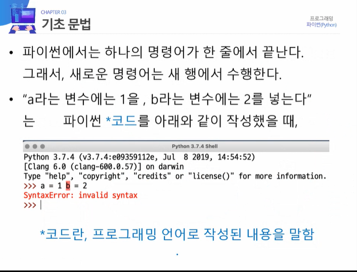

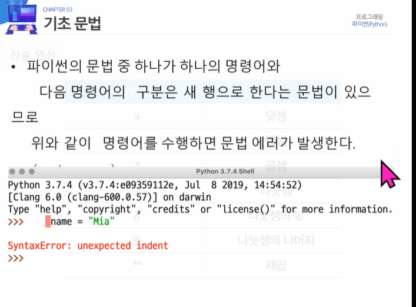
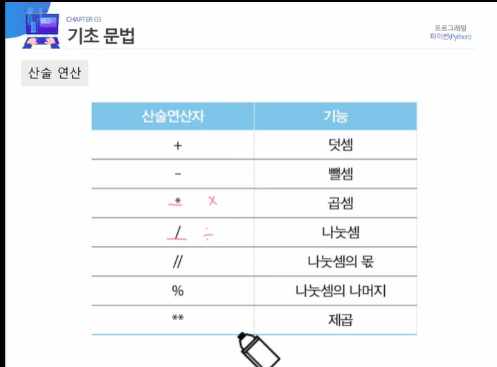
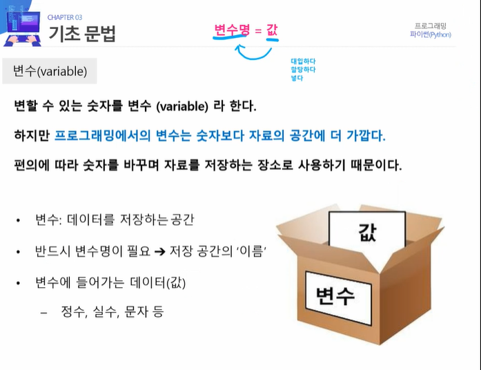

<details>

<summary>변수 예시</summary>

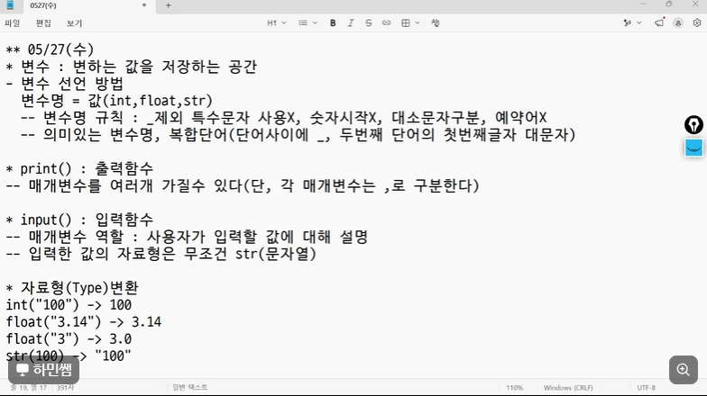

</details>

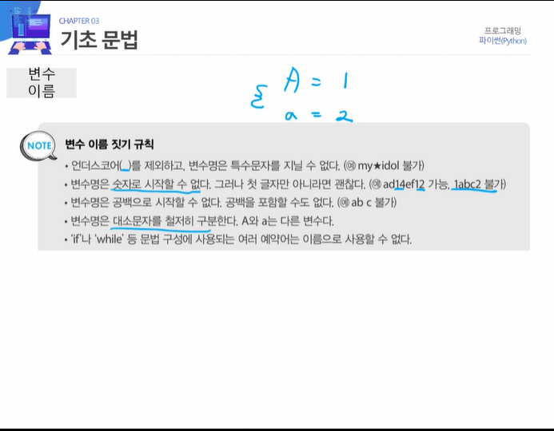
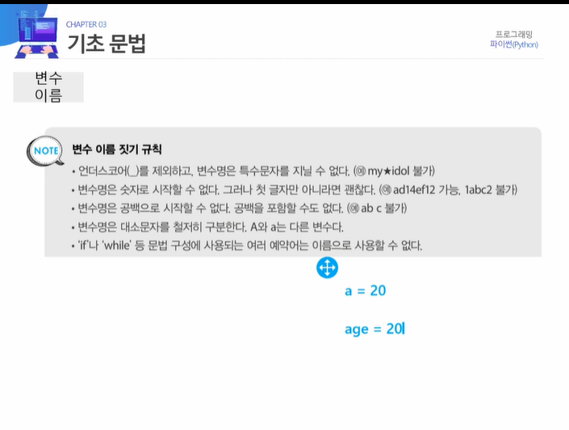
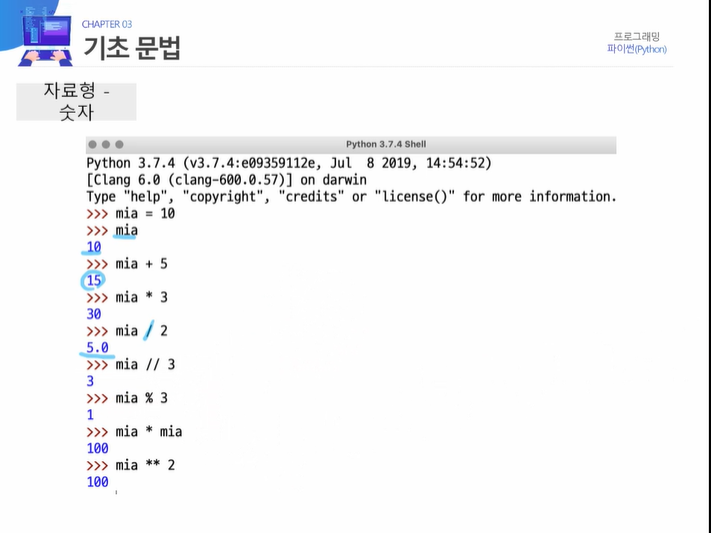
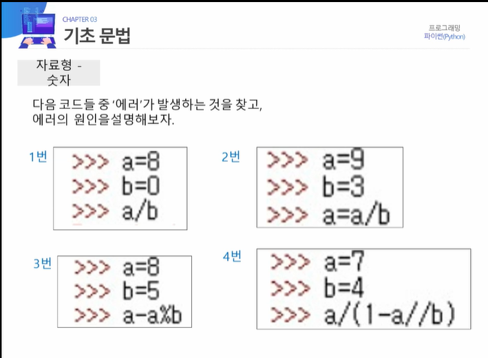
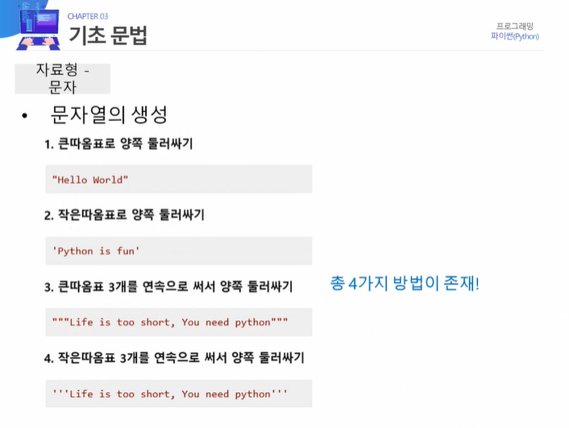
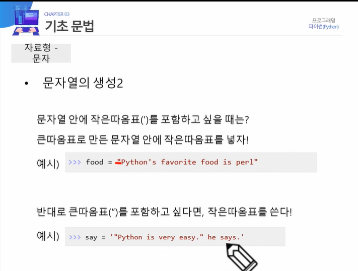

<details>

<summary>예시)</summary>

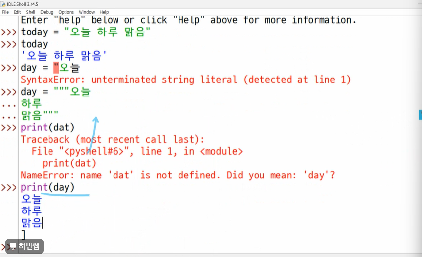

</details>

<details>

<summary>기초문법 이스케이프 코드</summary>

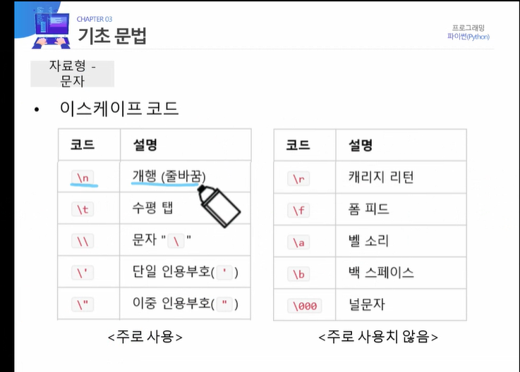
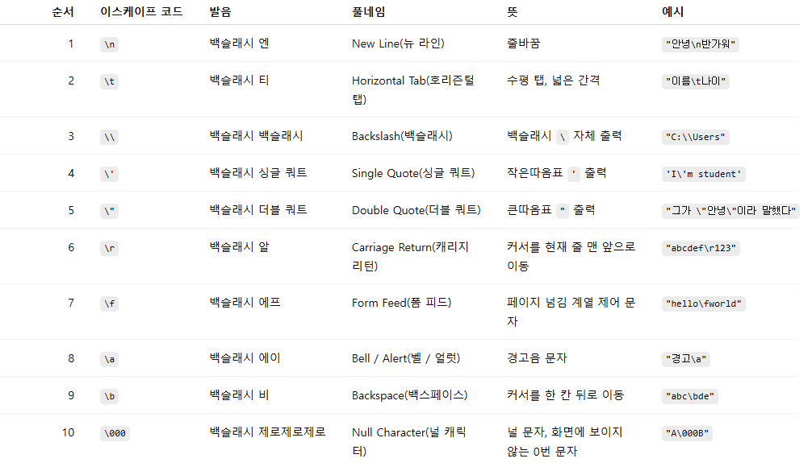
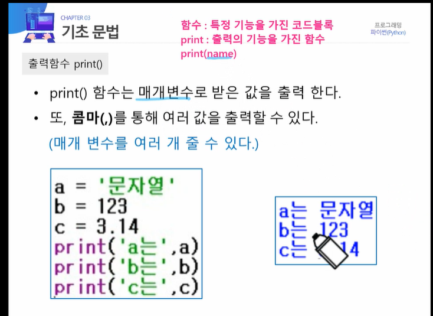

<details>

<summary>함수</summary>

> **함수 = 자주 쓰는 작업을 이름 붙여서 저장해놓은 명령 묶음**
이렇게 보면 돼. 🧠
## 1. 현실 비유로 설명
예를 들어 네가 매일 아침마다 이런 행동을 한다고 해봐.
```text
일어나기
세수하기
양치하기
옷 입기
나가기
```
이걸 매번 길게 말하기 귀찮잖아?
그래서 이 전체 행동을 그냥 \*\*“아침 준비”\*\*라고 이름 붙이는 거야.
```text
아침 준비 = 일어나기 + 세수하기 + 양치하기 + 옷 입기 + 나가기
```
프로그래밍의 함수도 똑같아.
```text
defmorning():
print("일어나기")
print("세수하기")
print("양치하기")
print("옷 입기")
print("나가기")
```
이제부터는 `morning()`만 쓰면 저 명령들이 한 번에 실행돼.
---
## 2. 파이썬 함수 기본 모양
```text
def함수이름():
실행할코드
```
예시:
```text
defhello():
print("안녕하세요")
```
이건 **함수를 만든 것**이야.
그런데 만든다고 바로 실행되지는 않아.
실행하려면 이렇게 불러야 해.
```text
hello()
```
결과:
```text
안녕하세요
```
---
## 3. 함수는 “만드는 것”과 “실행하는 것”이 다름
이게 초보 때 제일 중요해.
```text
defhello():
print("안녕하세요")
```
여기까지는 **함수 정의**야.
쉽게 말하면 **설명서 만든 것**.
```text
hello()
```
이건 **함수 호출**이야.
쉽게 말하면 **실제로 실행한 것**.

| 구분 | 뜻 |
| --- | --- |
| 함수 정의 | 함수를 만들어놓음 |
| 함수 호출 | 만들어놓은 함수를 실행함 |

---
## 4. 괄호 `()`가 중요한 이유
함수는 보통 이름 뒤에 괄호가 붙어.
```text
hello()
```
여기서 `()`는 \*\*“이 함수 실행해라”\*\*라는 뜻이야.
```text
hello
```
이렇게 괄호 없이 쓰면 보통 함수 자체를 가리키는 거고, 실행은 안 돼.
---
## 5. 값을 넣는 함수: 매개변수
함수는 안에 값을 넣어서 실행할 수도 있어.
```text
defgreet(name):
print(name+"님 안녕하세요")
```
실행:
```text
greet("철수")
```
결과:
```text
철수님 안녕하세요
```
여기서 `name`은 함수 안으로 들어오는 값이야.

| 용어 | 쉬운 뜻 |
| --- | --- |
| 매개변수 | 함수가 받을 값의 이름 |
| 인자 | 실제로 넣어주는 값 |

예를 들면:
```text
defgreet(name):
print(name+"님 안녕하세요")

greet("철수")
```
여기서:

| 부분 | 의미 |
| --- | --- |
| `name` | 매개변수 |
| `"철수"` | 인자 |

---
## 6. 값을 돌려주는 함수: `return`
함수는 계산 결과를 돌려줄 수도 있어.
```text
defadd(a,b):
returna+b
```
실행:
```text
result=add(3,5)
print(result)
```
결과:
```text
8
```
여기서 `return`은 **결과를 밖으로 돌려준다**는 뜻이야.
`print()`랑 `return`은 다르다. 이거 중요함.

| 구분 | 뜻 |
| --- | --- |
| `print()` | 화면에 보여주기만 함 |
| `return` | 결과값을 밖으로 넘겨줌 |

예시:
```text
defadd(a,b):
print(a+b)

x=add(3,5)
```
이건 화면에는 `8`이 보일 수 있지만, `x`에는 제대로 된 계산값이 저장되지 않아.
반면:
```text
defadd(a,b):
returna+b

x=add(3,5)
```
이건 `x`에 `8`이 저장돼.
---
## 7. 진짜 핵심 정리
```text
defadd(a,b):
returna+b
```
이 코드를 사람 말로 번역하면:
```text
add라는 함수를 만들겠다.
이 함수는 a와 b라는 값을 받는다.
그리고 a+b 결과를 돌려준다.
```
사용하면:
```text
print(add(10,20))
```
결과:
```text
30
```
## 한 줄 결론
**함수는 반복해서 쓸 코드를 하나의 이름으로 묶어놓은 것이다.**
그리고 함수는 보통 **입력값을 받고 → 처리하고 → 결과를 돌려주는 구조.**

</details>

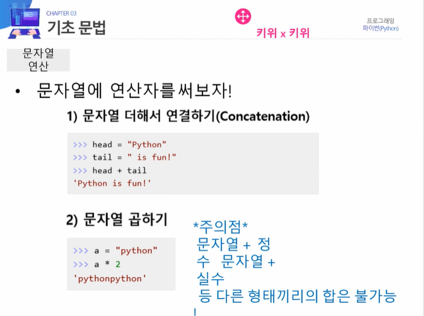
숫자 -정수(integer) -실수(float) -문자열(string) (문자열끼리 더할수있다.)
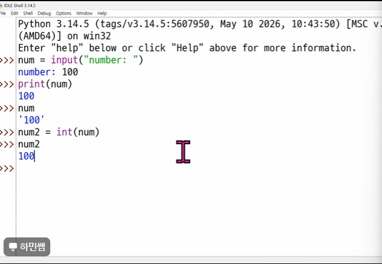

</details>

</details>

<details>

<summary>인덱스</summary>

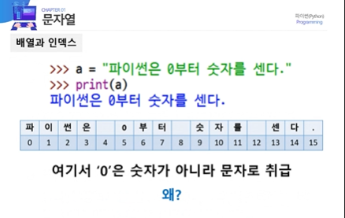
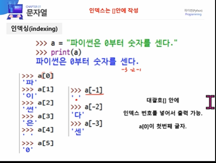
![변수명\[시작인덱스:끝인덱스\]](../assets/d8e58ee91313522729cc.png)
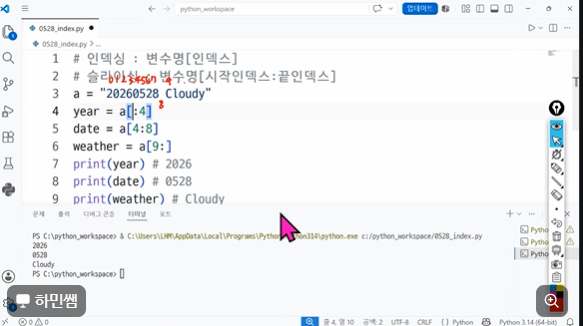
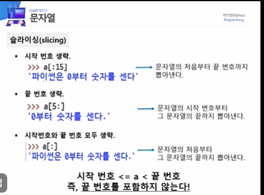

<details>

<summary>리스트</summary>

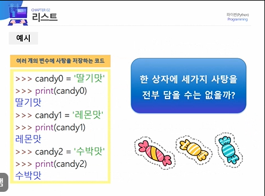
![리스트란?: 변수안에 \[\]를 넣고 여러개의 값을 모을 수 있는 것.( 순서가 존재한다:인덱스)](../assets/a3a418fb65a7fb0ac7ca.png)
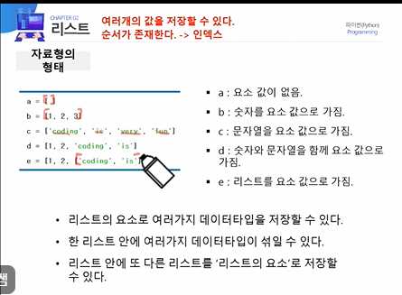

<details>

<summary>설명 자료</summary>

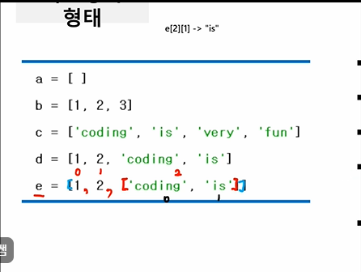
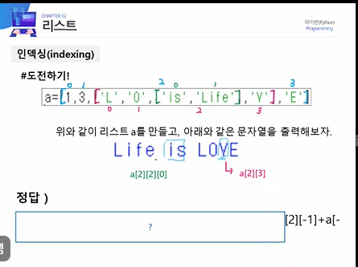
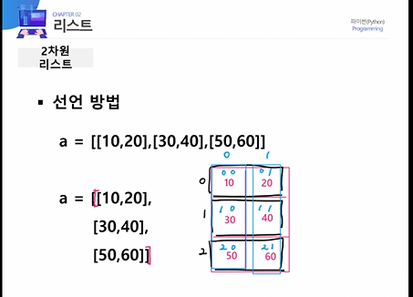
리스트를 자르면 리스트다.
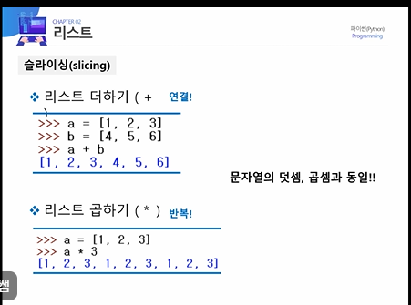
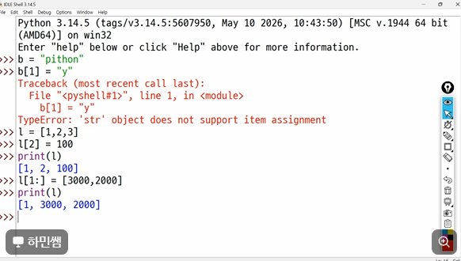

</details>

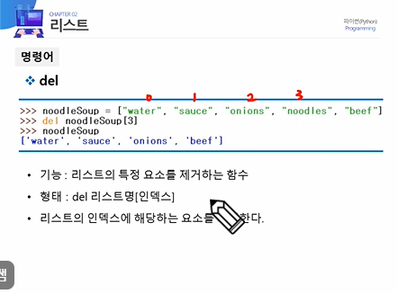

<details>

<summary>튜플(tuple)</summary>

특징\[ 리스트와 같지만 수정이 불가능하다.()하면 튜플\]
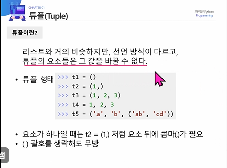
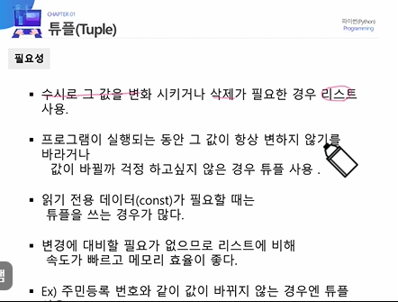

</details>

<details>

<summary>딕셔너리(dictionary)</summary>

<details>

<summary>한방정리.</summary>

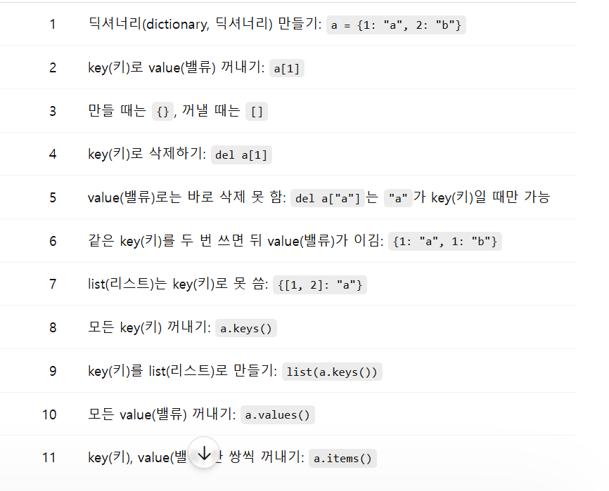

</details>

특징:\{”키”:”밸류”\}     꺼낼 때는:\[”name”\] 꺼낼 떄는\[\]써야 한다.<br>\{\}쓰면 딕셔너리
```text
person= {
"name":"철수",
"age":20
}
```
`{}` 중괄호로 만들었고, 안에 `key: value`(키 밸류) 구조가 있으니까 딕셔너리야.
```text
"name" 이름표 = "철수"
"age" 이름표 = 20
```
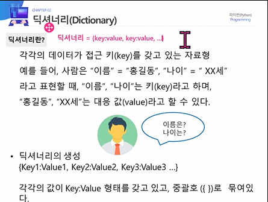
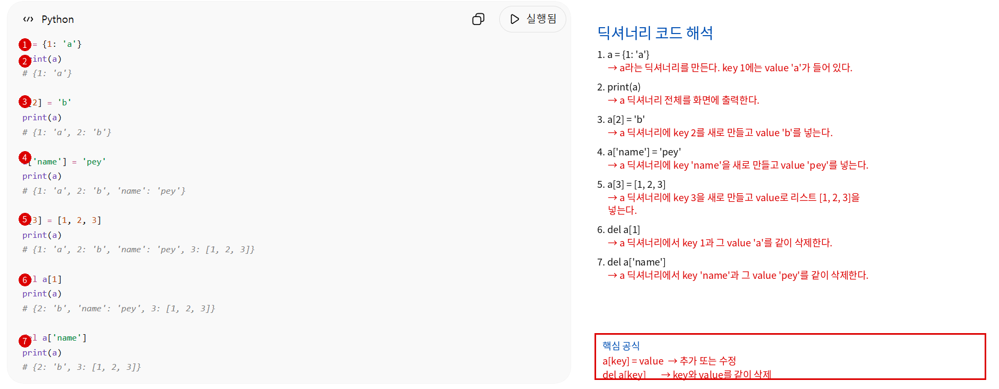
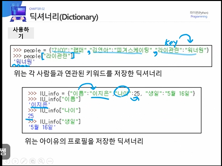
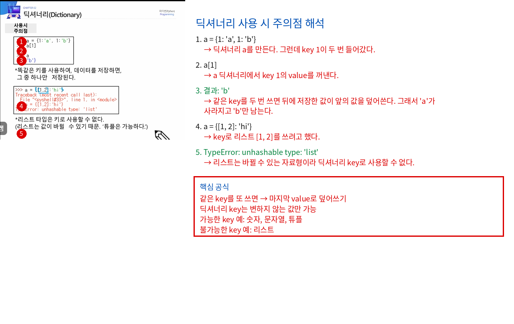
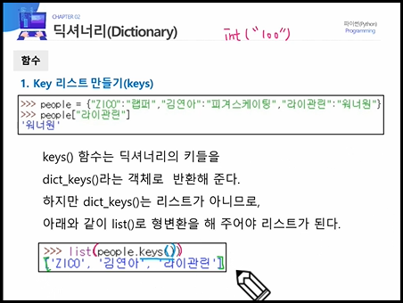
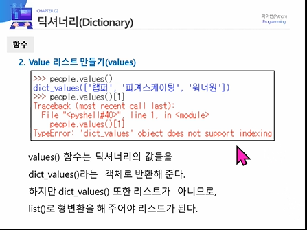
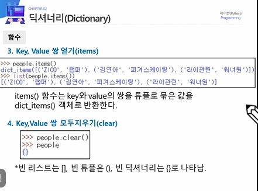

</details>

<details>

<summary>집합 (set)</summary>

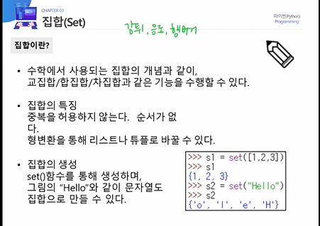


</details>

<details>

<summary>불리안(boolean)</summary>


</details>

<details>

<summary>복습</summary>


**if age \< 0 or age \> 150:<br>  print("올바른 나이를 입력하세요.(0세\~150세)")<br>else:<br>  # 정상 나이 입력시<br>  # 나이에 따른 요금 계산<br>  if age \< 8:<br>    price = 450<br>  elif age \<= 19:<br>    price = 720<br>  else:<br>    price = 1250<br>  print(f"지하철 요금은 \{price\}원 입니다.")**


</details>

<details>

<summary>제어문(if, elif, else)</summary>


</details>

<details>

<summary>for문</summary>


<details>

<summary>포문 예제)</summary>


</details>

<details>

<summary>range(레인지 함수)</summary>

레인지 함수(특징):((시작값),(끝값뺴고),(간격))


</details>

<details>

<summary>이중 반복문 (예제)</summary>

핵심: 이중 for(포)문은
> **바깥 값 하나 고정 → 안쪽 값 전부 반복 → 바깥 다음 값으로 이동**


<details>

<summary>힌트</summary>


</details>

# 핵심 한 방 정리 🔥
꺼낸 숫자 `i`를 합계 `b`에 계속 더하겠다.


<details>

<summary>답</summary>


</details>


<details>

<summary>답</summary>


</details>


<details>

<summary>정해 놓은 답)</summary>


</details>


<details>

<summary>아스키코드</summary>


</details>


</details>

</details>

<details>

<summary>f(f-string)에프 스트링</summary>


</details>

<details>

<summary>while문</summary>


<details>

<summary>예제)</summary>


</details>


<details>

<summary>예제) 문제풀이</summary>


```python
a=int(input("층:"))
i=1
while i<=a:
    print("*"*i)
    i=i+1
```


</details>

</details>

<details>

<summary>함수</summary>


<details>

<summary>예제)</summary>


<details>

<summary>답</summary>


</details>


<details>

<summary>답</summary>


</details>

</details>

</details>

</details>

</details>

<details>

<summary>알고리즘</summary>


<details>

<summary>답</summary>


</details>


<details>

<summary>답</summary>


</details>


</details>

<details>

<summary>디버깅</summary>


<details>

<summary>답</summary>


korean = 92<br>english = 47<br>mathematics = 86<br>science = 81
print(min(korean, english, mathematics, science) \>= 50)

</details>


<details>

<summary>답</summary>


</details>


<details>

<summary>답</summary>


</details>


<details>

<summary>답</summary>


</details>


<details>

<summary>답</summary>


</details>

<details>

<summary>타자게임</summary>


</details>

<details>

<summary>가위바위보</summary>


</details>

</details>

<details>

<summary>세트 표현식</summary>


<details>

<summary>예제&답</summary>


</details>

</details>

<details>

<summary>문제집</summary>

<details>

<summary>기초문제</summary>


</details>

<details>

<summary>소수찾기</summary>


<details>

<summary>풀이, 답</summary>


</details>

</details>

<details>

<summary>로그인</summary>


<details>

<summary>풀이,답</summary>


</details>

</details>

<details>

<summary>극장예약문제</summary>


<details>

<summary>답</summary>


</details>

</details>

<details>

<summary>투표문제</summary>


<details>

<summary>답</summary>


</details>

</details>

<details>

<summary>타자연습</summary>


<details>

<summary>답</summary>

</details>

</details>

<details>

<summary>hangman 게임</summary>


<details>

<summary>풀이&답</summary>

<details>

<summary>join</summary>

`join`(조인, 이어 붙이기)은 **리스트 안에 있는 문자열들을 하나의 문자열로 합치는 기능**이야(문자 추가 후 붙이는 것도 가능)


</details>

<details>

<summary>미션&답</summary>


</details>

</details>

</details>

<details>

<summary>숫자야구게임</summary>


<details>

<summary>답&풀이</summary>


</details>

</details>

<details>

<summary>악어게임</summary>


<details>

<summary>답&풀이</summary>


</details>

</details>

<details>

<summary>통아저씨게임</summary>


<details>

<summary>답&풀이</summary>

</details>

</details>

</details>

<details>

<summary>순서도</summary>


</details>

</details>

<details>

<summary>Project(프로젝트)</summary>

</details>
