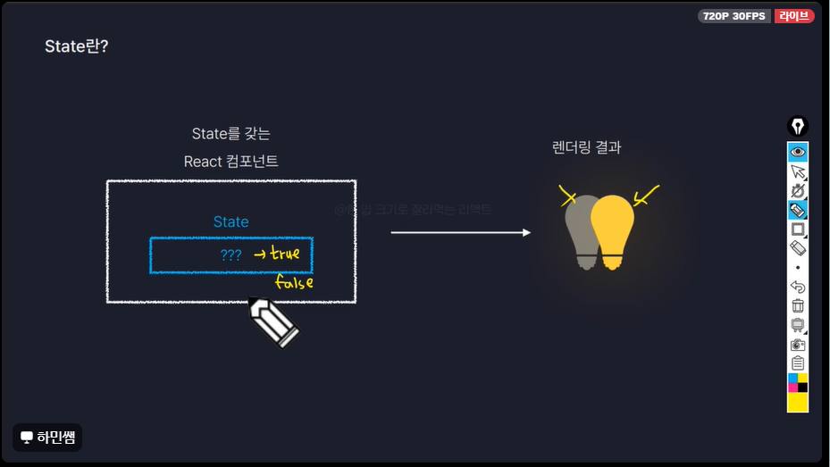
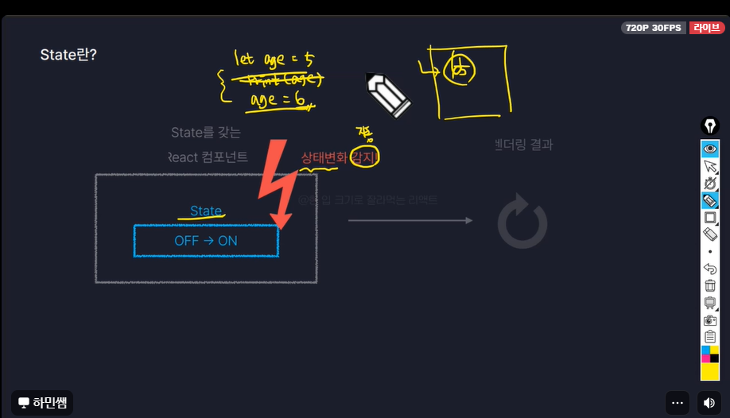
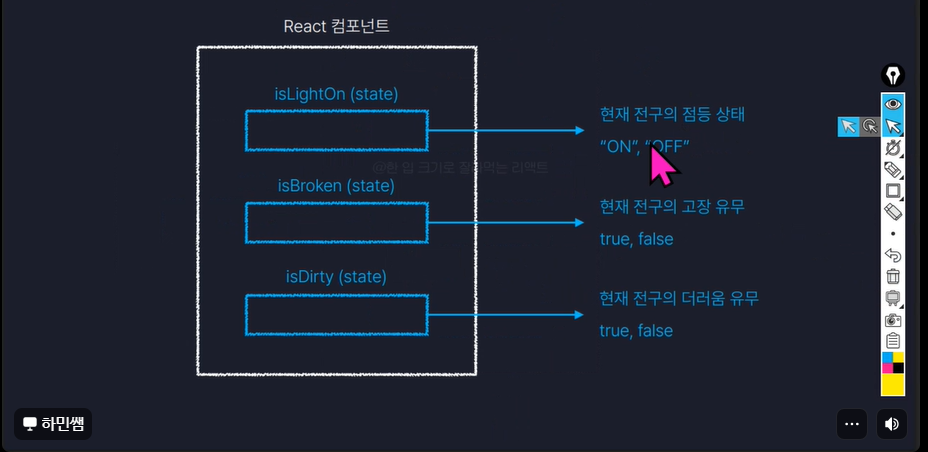

> 학습 원본 보존 문서. 개인 프로젝트 성과나 전체 코드의 직접 작성 사실을 주장하지 않음.
> 출처: [.기초수업](https://app.notion.com/p/36cddb1a637780758fd2f1a040247136), 원본 행 10754–10759.

# 리액트 to

[**https://soft-servant-6ca.notion.site/4-AI-34b8fc31f6b980529072dc8648f7cb1b?source=copy_link**](https://soft-servant-6ca.notion.site/4-AI-34b8fc31f6b980529072dc8648f7cb1b?source=copy_link)** 성철썜 노드**
---
