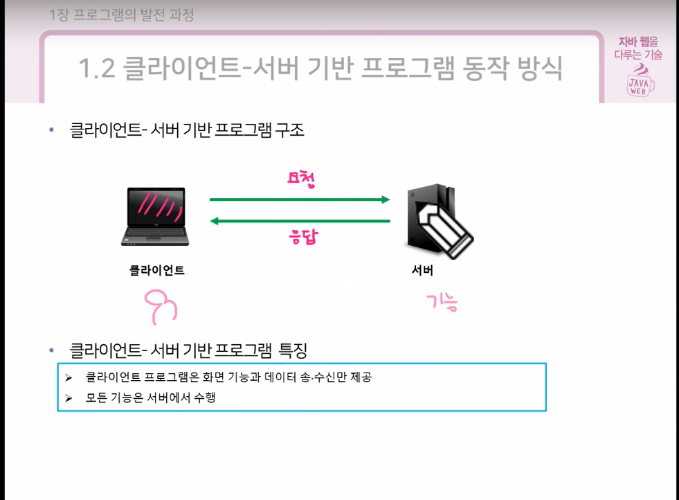
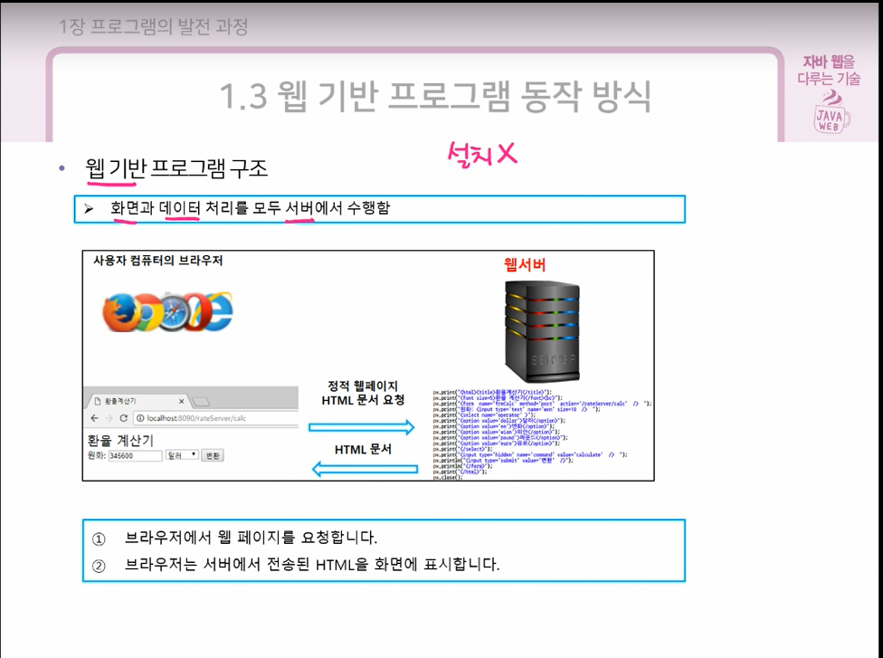
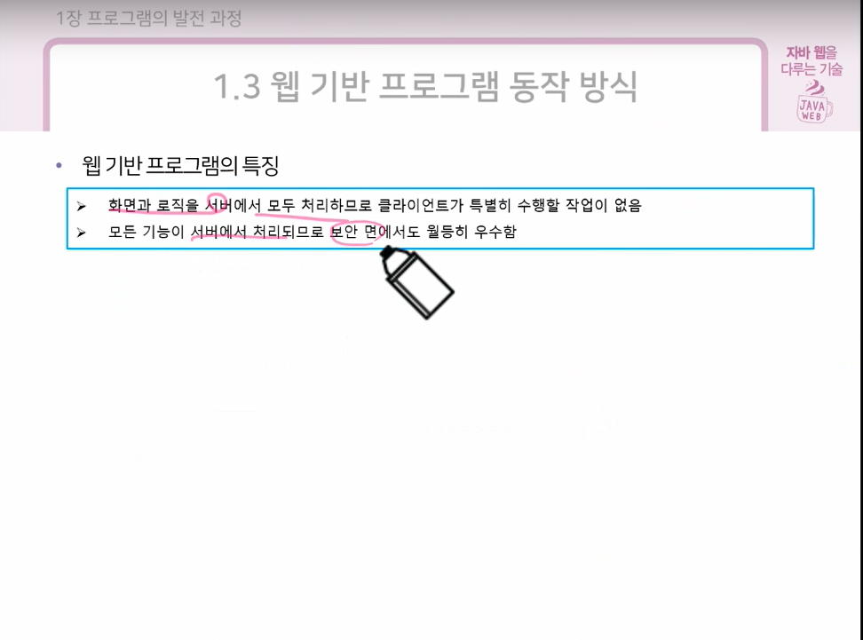
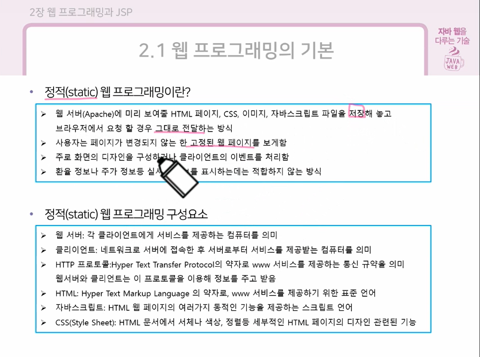
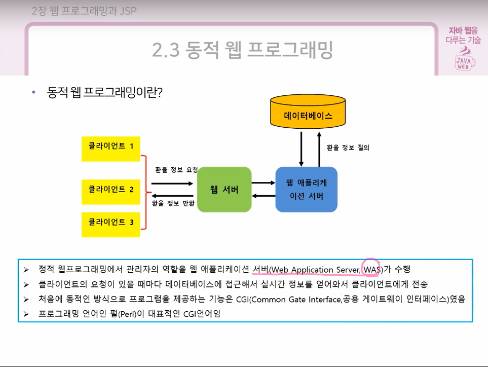
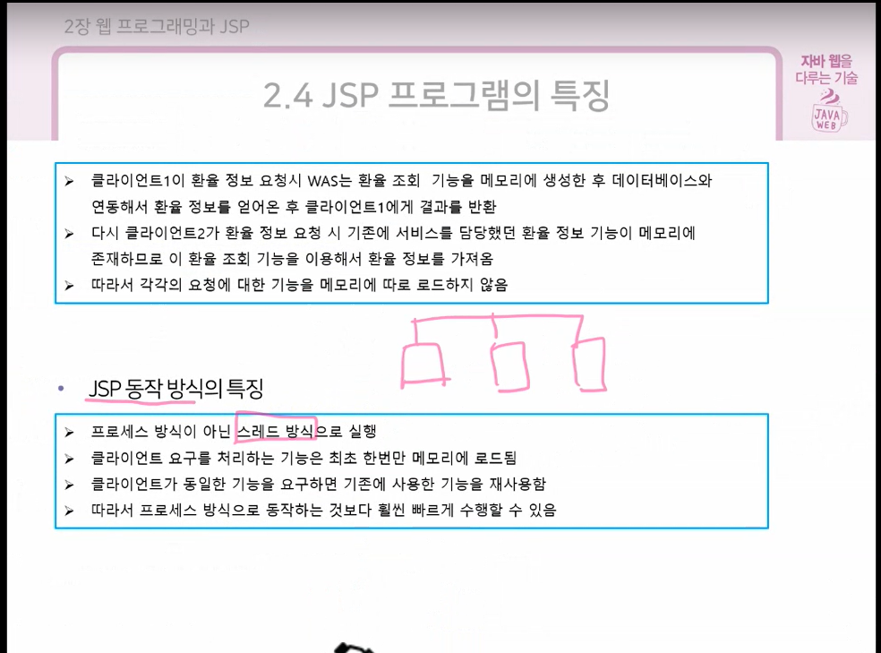
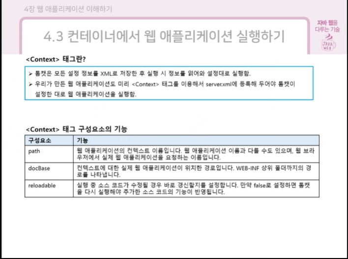
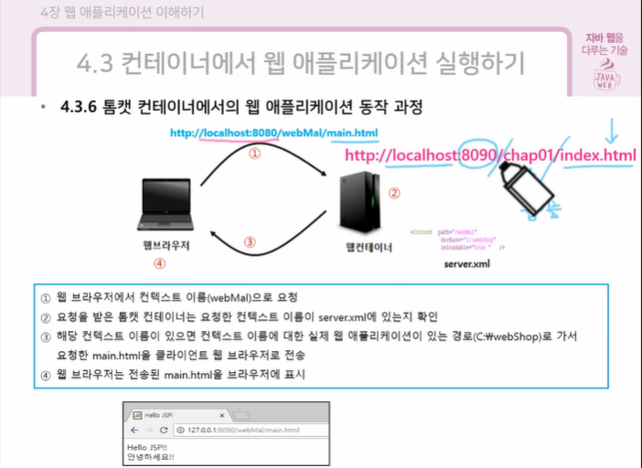

> 학습 원본 보존 문서. 개인 프로젝트 성과나 전체 코드의 직접 작성 사실을 주장하지 않음.
> 출처: [.기초수업](https://app.notion.com/p/36cddb1a637780758fd2f1a040247136), 원본 행 10048–10568.

# 서블릿 TO









<details>

<summary>문제</summary>

기초 mtml(로그인)
```javascript
<!DOCTYPE html>
<html>
<head>
<meta charset="UTF-8">
<title>Insert title here</title>
</head>
<body>
    <form action="login" method="post">
    <input type="text" id="uid" placeholder="아이디 입력">
    <input type="password" id="pw" placeholder="비밀번호 입력">
    <input type="submit" value="로그인">
    </form>
</body>
</html>

서블렛

package sec02;

import jakarta.servlet.ServletException;
import jakarta.servlet.annotation.WebServlet;
import jakarta.servlet.http.HttpServlet;
import jakarta.servlet.http.HttpServletRequest;
import jakarta.servlet.http.HttpServletResponse;
import java.io.IOException;

@WebServlet("/post")
public class loginServlet extends HttpServlet {
	private static final long serialVersionUID = 1L;
	
	//클라이언트가 로그인 클릭시 호출
	protected void doPost(HttpServletRequest request, HttpServletResponse response) throws ServletException, IOException {
		//로그인 비지니스 로직
		//1.사용자가 입력한 아이디와 패스워드 받기
		// getParameter(name) : form태그의 name 속성과 일치하는 파라미터 value 가져오기
		// 파라미터 -> 클라이언트 요청에 저장된 값(name:value 쌍으로 존재)
		String id = request.getParameter("user ID");
		String pw = request.getParameter("user PW");
		
		System.out.println("아이디 :" + id);
		System.out.println("비밀번호 :" + pw);
		
		//2. DB에 회원 테이블에서 아이디와 패스워드를 비교
		if (id.equals("java") && pw.equals("123")) {
			System.out.println("로그인 성공");
		}else {
			System.out.println("로그인 실패");
			
		}
		
		//3. 사이트 회원인 경우 로그인성공 아니면 로그인 실패 응답
	}

}

```
<br>
```javascript
<!doctype html>
<html lang="ko">
  <head>
    <meta charset="UTF-8" />
    <meta name="viewport" content="width=device-width, initial-scale=1.0" />

    <title>프로필 입력</title>

    <style>
      :root {
        --primary-color: #2563eb;
        --primary-hover-color: #1d4ed8;
        --border-color: #d1d5db;
        --text-color: #1f2937;
        --background-color: #f5f6f8;
        --card-color: #ffffff;
      }

      * {
        box-sizing: border-box;
      }

      body {
        margin: 0;
        padding: 40px 20px;
        background-color: var(--background-color);
        color: var(--text-color);
        font-family:
          -apple-system, BlinkMacSystemFont, "Segoe UI", Roboto,
          "Helvetica Neue", Arial, sans-serif;
      }

      .profile-form {
        width: 100%;
        max-width: 500px;
        margin: 0 auto;
      }

      fieldset {
        margin: 0;
        padding: 24px;
        border: 1px solid var(--border-color);
        border-radius: 8px;
        background-color: var(--card-color);
      }

      legend {
        padding: 0 8px;
        font-size: 1.25rem;
        font-weight: 700;
      }

      .form-group {
        display: flex;
        flex-direction: column;
        gap: 6px;
        margin-bottom: 18px;
      }

      .form-label,
      .group-title {
        font-size: 0.875rem;
        font-weight: 600;
      }

      .text-input {
        width: 100%;
        padding: 10px 12px;
        border: 1px solid var(--border-color);
        border-radius: 6px;
        font-size: 1rem;
        transition:
          border-color 0.2s,
          box-shadow 0.2s;
      }

      .text-input:focus {
        outline: none;
        border-color: var(--primary-color);
        box-shadow: 0 0 0 3px rgba(37, 99, 235, 0.1);
      }

      .option-group {
        display: flex;
        flex-wrap: wrap;
        gap: 12px 16px;
        margin-top: 4px;
      }

      .option-label {
        display: inline-flex;
        align-items: center;
        gap: 6px;
        font-size: 0.875rem;
        font-weight: normal;
        cursor: pointer;
      }

      .submit-button {
        width: 100%;
        padding: 12px;
        border: none;
        border-radius: 6px;
        background-color: var(--primary-color);
        color: #ffffff;
        font-size: 1rem;
        font-weight: 600;
        cursor: pointer;
        transition: background-color 0.2s;
      }

      .submit-button:hover {
        background-color: var(--primary-hover-color);
      }
    </style>
  </head>

  <body>
    <form class="profile-form" action="profile" method="post">
      <fieldset>
        <legend>프로필 입력</legend>

        <div class="form-group">
          <label class="form-label" for="userName">이름</label>

          <input
            class="text-input"
            id="userName"
            type="text"
            name="name"
            placeholder="이름"
            autocomplete="name"
            required
          />
        </div>

        <div class="form-group">
          <label class="form-label" for="userAge">나이</label>

          <input
            class="text-input"
            id="userAge"
            type="number"
            name="age"
            min="0"
            max="150"
            placeholder="나이"
            required
          />
        </div>

        <div class="form-group">
          <span class="group-title">성별</span>

          <div class="option-group">
            <label class="option-label">
              <input type="radio" name="gender" value="male" checked />
              남자
            </label>

            <label class="option-label">
              <input type="radio" name="gender" value="female" />
              여자
            </label>
          </div>
        </div>

        <div class="form-group">
          <label class="form-label" for="userPhone">전화번호</label>

          <input
            class="text-input"
            id="userPhone"
            type="tel"
            name="phone"
            placeholder="<REDACTED_PHONE_NUMBER>"
            pattern="[0-9]{3}-[0-9]{3,4}-[0-9]{4}"
            autocomplete="tel"
          />
        </div>

        <div class="form-group">
          <label class="form-label" for="userEmail">이메일</label>

          <input
            class="text-input"
            id="userEmail"
            type="email"
            name="email"
            placeholder="example@email.com"
            autocomplete="email"
          />
        </div>

        <div class="form-group">
          <span class="group-title">취미</span>

          <div class="option-group">
            <label class="option-label">
              <input type="checkbox" name="hobby" value="운동" />
              운동
            </label>

            <label class="option-label">
              <input type="checkbox" name="hobby" value="애니감상" />
              애니감상
            </label>

            <label class="option-label">
              <input type="checkbox" name="hobby" value="음악감상" />
              음악감상
            </label>

            <label class="option-label">
              <input type="checkbox" name="hobby" value="게임" />
              게임
            </label>

            <label class="option-label">
              <input type="checkbox" name="hobby" value="독서" />
              독서
            </label>
          </div>
        </div>

        <button class="submit-button" type="submit">프로필 저장</button>
      </fieldset>
    </form>
  </body>
</html>
-------서블릿-------
package sec02;

import jakarta.servlet.ServletException;
import jakarta.servlet.annotation.WebServlet;
import jakarta.servlet.http.HttpServlet;
import jakarta.servlet.http.HttpServletRequest;
import jakarta.servlet.http.HttpServletResponse;
import java.io.IOException;
import java.io.PrintWriter;


@WebServlet("/commit1")
public class LoginServlet2 extends HttpServlet {
    private static final long serialVersionUID = 1L;
    
    //
    protected void doGet(HttpServletRequest request, HttpServletResponse response) 
            throws ServletException, IOException {
        System.out.println("로그인 서블릿 doGet() 호출");
    }


    protected void doPost(HttpServletRequest request, HttpServletResponse response) 
            throws ServletException, IOException {
        request.setCharacterEncoding("utf-8");

        response.setContentType("text/html; charset=utf-8");

        String u_id = request.getParameter("userID");
        String u_pw = request.getParameter("userPW");

        // 응답 화면 구현
        // PrintWriter : html (웹문서)에 content 를 작성한느 기능을 가진 객체
        PrintWriter out = response.getWriter();

        out.print("<html><body>");
        out.print("<h1>"+u_id+"님 환영합니다!</h1>");
        out.print("</body></html>");
    }

}
```
db코드
```javascript
package sec01;

import java.util.Date;

public class MemberDTO {
	private String id;
	private String pw;
	private String name;
	private String email;
	private Date joinDate;

	public MemberDTO() {
	}

	public MemberDTO(String id, String pw, String name, String email, Date joinDate) {
		super();
		this.id = id;
		this.pw = pw;
		this.name = name;
		this.email = email;
		this.joinDate = joinDate;
	}

	public String getId() {
		return id;
	}

	public void setId(String id) {
		this.id = id;
	}

	public String getPw() {
		return pw;
	}

	public void setPw(String pw) {
		this.pw = pw;
	}

	public String getName() {
		return name;
	}

	public void setName(String name) {
		this.name = name;
	}

	public String getEmail() {
		return email;
	}

	public void setEmail(String email) {
		this.email = email;
	}

	public Date getJoinDate() {
		return joinDate;
	}

	public void setJoinDate(Date joinDate) {
		this.joinDate = joinDate;
	}

	@Override
	public String toString() {
		return "MemberDTO [id=" + id + ", pw=" + pw + ", name=" + name + ", email=" + email + ", joinDate=" + joinDate
				+ "]";
	}

}

MemberDTO.java
2KB
package sec01;

import jakarta.servlet.ServletException;
import jakarta.servlet.annotation.WebServlet;
import jakarta.servlet.http.HttpServlet;
import jakarta.servlet.http.HttpServletRequest;
import jakarta.servlet.http.HttpServletResponse;
import java.io.IOException;
import java.util.List;

@WebServlet("/member")
public class MemberServlet extends HttpServlet {
	private static final long serialVersionUID = 1L;
       
	protected void doGet(HttpServletRequest request, HttpServletResponse response) throws ServletException, IOException {
	request.setCharacterEncoding("utf-8");
	
	// DB에 저장된 회원 정보 반환
	MemberDAO dao = new MemberDAO();
	// 전체 회원 반환
	List<MemberDTO> members = dao.listMembers();
	
	for (MemberDTO member : members) {
		System.out.println(member);
	}
	}

}

MemberServlet.java
1KB
package sec01;

import java.sql.Statement;
import java.sql.Connection;
import java.sql.DriverManager;
import java.sql.ResultSet;
import java.sql.SQLException;
import java.util.ArrayList;
import java.util.Date;
import java.util.List;

public class MemberDAO {
	private Connection conn;
	private Statement stmt; 

	public MemberDAO() {
		String url = "jdbc:mysql://localhost:3306/my_db?serverTimezone=UTC";
		String user = "root";
		String pw = "root";

		try {
			// 1. JDBC 드라이버 로드 (MySQL 8.0 이상 기준)
			Class.forName("com.mysql.cj.jdbc.Driver"); 
            // 참고: MySQL 5.x 버전이라면 "com.mysql.jdbc.Driver"를 사용합니다.

			// 2. DB 연결
			conn = DriverManager.getConnection(url, user, pw);
			stmt = conn.createStatement();
			System.out.println("DB연결 성공");
		} catch (ClassNotFoundException e) {
			System.out.println("JDBC 드라이버를 찾을 수 없습니다.");
			e.printStackTrace();
		} catch (SQLException e) {
			System.out.println("DB연결 실패");
			e.printStackTrace();
		}
	}

	public List<MemberDTO> listMembers() {
		List<MemberDTO> members = new ArrayList<>();
		
        // stmt가 null일 경우 NullPointerException을 방지하기 위한 방어 코드 추가
		if (stmt == null) {
			System.out.println("DB가 연결되지 않아 목록을 불러올 수 없습니다.");
			return members;
		}

		String query = "SELECT * FROM member";

		try {
			ResultSet rs = stmt.executeQuery(query);

			while (rs.next()) {
				String id = rs.getString("id");
				String pw = rs.getString("pw");
				String name = rs.getString("name");
				String email = rs.getString("email");
				Date joinDate = rs.getDate("joinDate");

				MemberDTO member = new MemberDTO(id, pw, name, email, joinDate);
				members.add(member);
			}
		} catch (SQLException e) {
			e.printStackTrace();
		}

		return members;
	}
}
```

</details>
