> 학습 원본 보존 문서. 개인 프로젝트 성과나 전체 코드의 직접 작성 사실을 주장하지 않음.
> 출처: [.기초수업](https://app.notion.com/p/36cddb1a637780758fd2f1a040247136), 원본 행 10646–10667.

# 스프링 부트
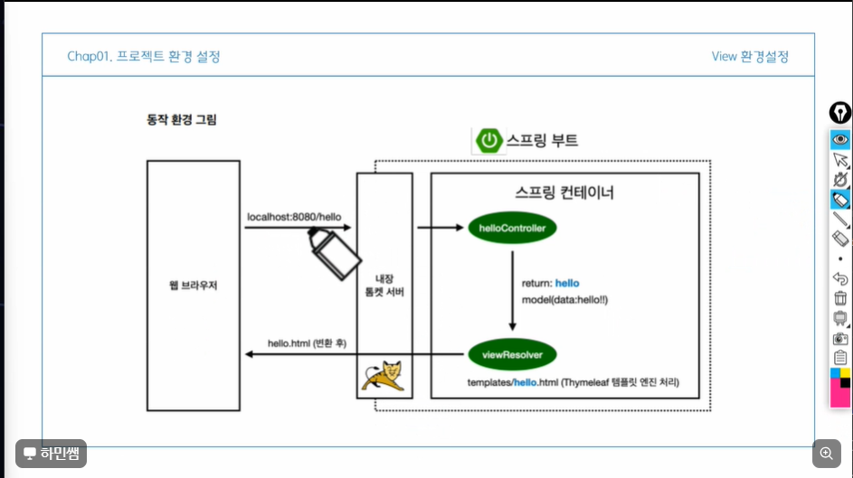
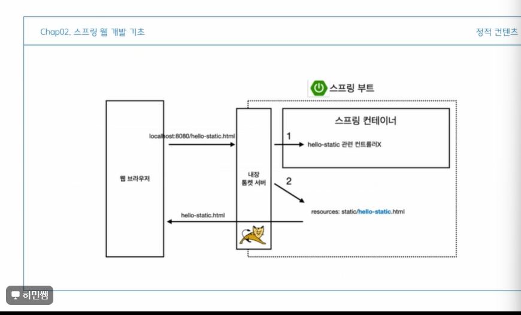
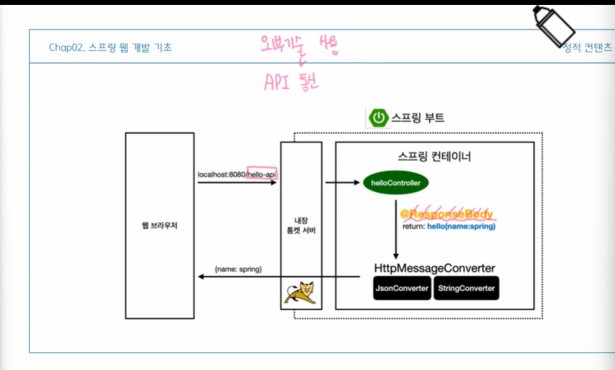
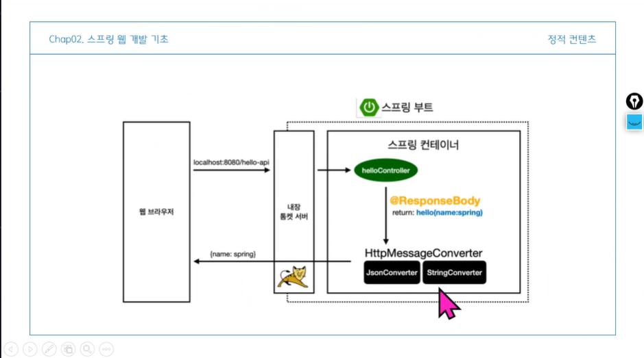
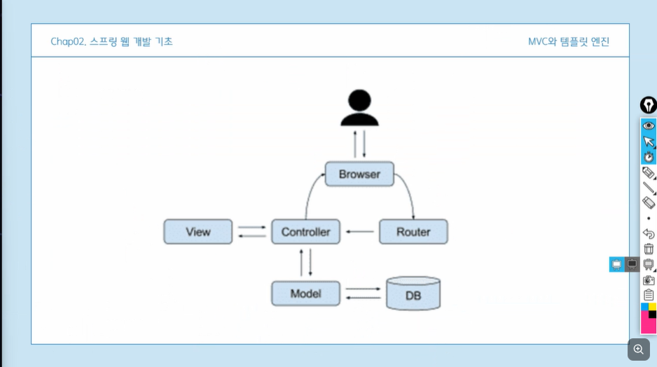
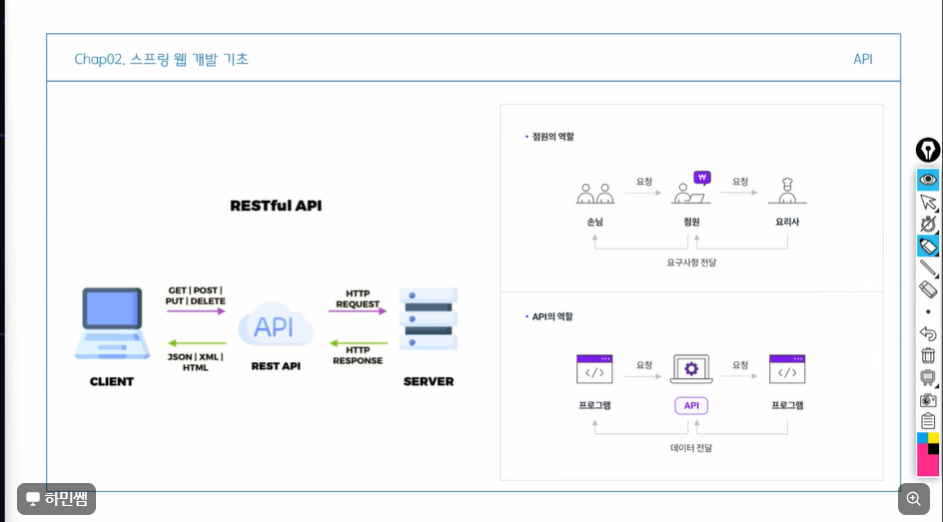
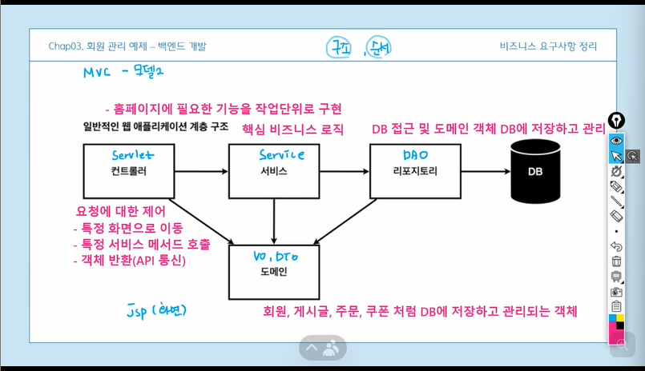
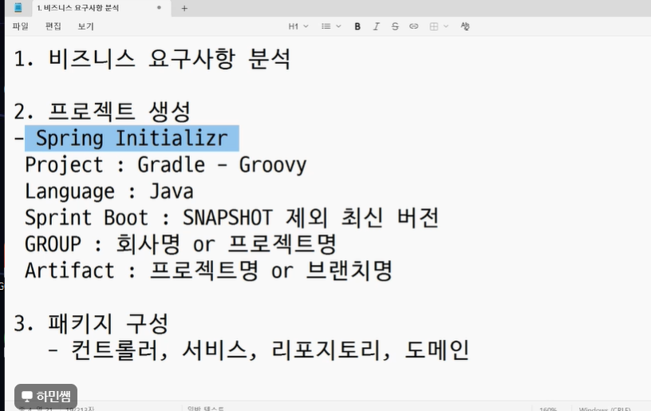
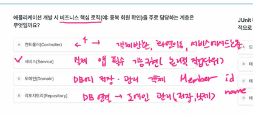
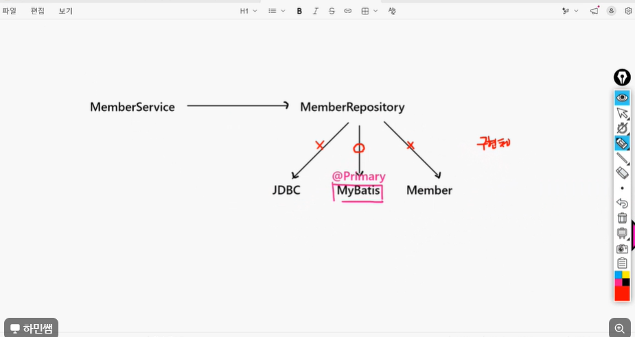
## 서브 프로젝트
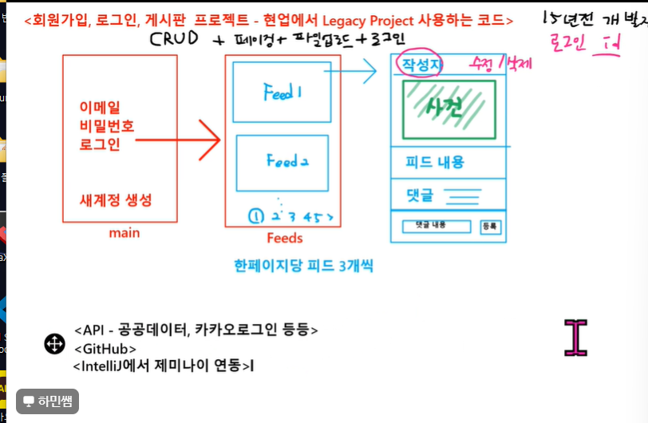
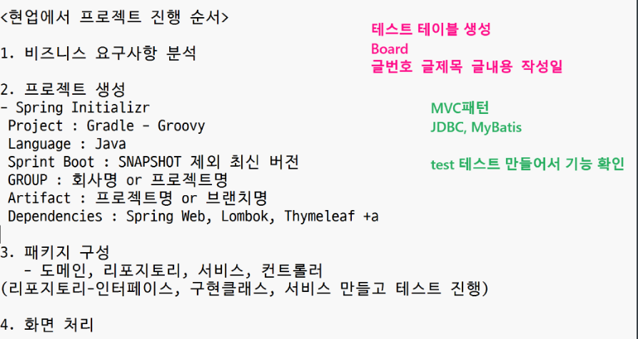
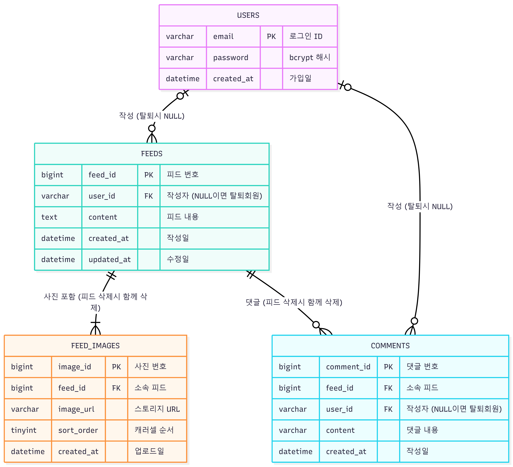
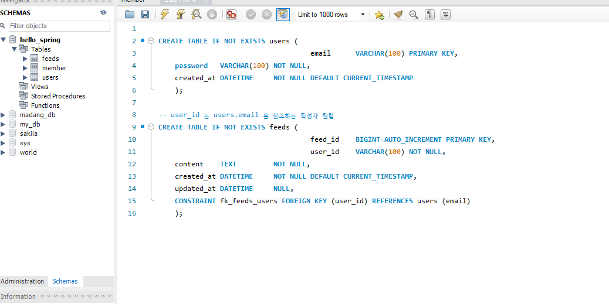
<meeting-notes readOnlyViewMeetingNoteUrl="https://app.notion.com/p/36cddb1a637780758fd2f1a040247136#3b8ddb1a637780ed86b7d540e714732c">
회의 <mention-date start="2026-08-10"/>
<notes>
템플릿 ,자동 맵핑,의존성.**Talend api 사용해보기**
</notes>
</meeting-notes>
