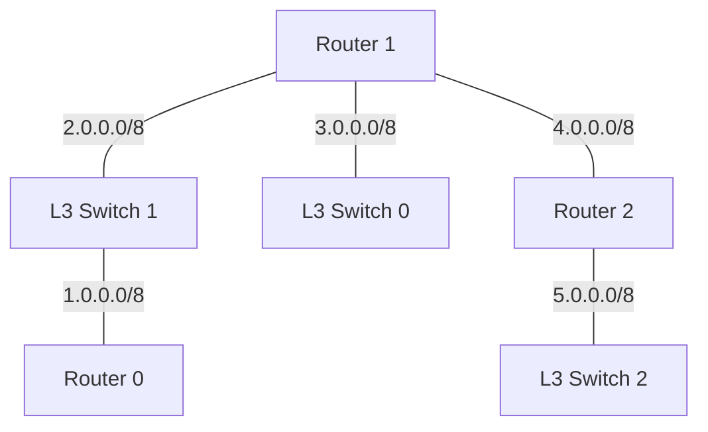

# LAB 01 / NETWORK · VLAN과 Routing

VLAN 10·20으로 단말 그룹을 나누고 SVI·라우팅 포트·RIP v2로 서로 다른 네트워크를 연결한 실습입니다. **설정 원문·최종 구성도는 보존했으며, 실제 경로 출력과 종단 간 통신 결과는 미첨부입니다.**

## Architecture

원본 구성도의 라우팅 장비 연결입니다. 단말 스위치와 전체 구성도는 노션에 보존했습니다.



## Environment / IP Plan

- 환경: Packet Tracer의 Router·L3 Switch·일반 Switch·단말 구성. 실행 버전은 원본에 없습니다.
- 설정: 8개 장비, 원문 명령 222개. **노트 전사**이며 장비에서 내보낸 running-config는 아닙니다.
- 1.0.0.0/8~5.0.0.0/8은 가상 실습의 연결망 주소이며 운영망용 사설 주소 설계로 제시하지 않습니다.

| 라우팅 연결 | 한쪽 주소 | 반대쪽 주소 |
|---|---|---|
| Router 0 ↔ L3 Switch 1 | G0/1 · 1.0.0.1/8 | G0/1 · 1.0.0.2/8 |
| L3 Switch 1 ↔ Router 1 | F0/24 · 2.0.0.1/8 | G0/2 · 2.0.0.2/8 |
| L3 Switch 0 ↔ Router 1 | G0/1 · 3.0.0.1/8 | G0/1 · 3.0.0.2/8 |
| Router 1 ↔ Router 2 | G0/0 · 4.0.0.1/8 | G0/0 · 4.0.0.2/8 |
| Router 2 ↔ L3 Switch 2 | G0/1 · 5.0.0.1/8 | G0/1 · 5.0.0.2/8 |

| Gateway 장비 | 포트 / VLAN | 단말망 Gateway 주소 |
|---|---|---|
| Router 0 | G0/0 · G0/2 | 192.168.20.1/25 · 192.168.20.129/25 |
| L3 Switch 1 | F0/1 | 192.168.10.1/24 |
| L3 Switch 0 | VLAN 10 · VLAN 20 | 192.168.30.1/24 · 192.168.40.1/24 |
| L3 Switch 0 | F0/3 | 192.168.50.1/24 |
| Router 2 | G0/2 | 192.168.60.1/24 |
| L3 Switch 2 | VLAN 10 · VLAN 20 | 192.168.70.1/26 · 192.168.70.65/26 |
| L3 Switch 2 | F0/2 · F0/3 | 192.168.70.129/26 · 192.168.70.193/26 |

## Key Configuration

| WHY | COMMAND | RESULT 의미 |
|---|---|---|
| 단말을 한 그룹에 소속 | `switchport mode access`, `switchport access vlan` | 단말 포트의 VLAN 지정 |
| 두 VLAN을 한 연결로 전달 | `switchport mode trunk`, `switchport trunk allowed vlan 10,20` | 스위치 사이에서 10·20번 전달 |
| 그룹의 Gateway 구성 | `interface vlan`, `ip address`, `ip routing` | 가상 인터페이스에서 다른 망으로 라우팅 |
| 물리 포트에서 직접 라우팅 | `no switchport`, `ip address` | 해당 포트를 L3 연결로 사용 |
| 세부 서브넷 경로 교환 | `router rip`, `version 2`, `no auto-summary` | /25·/26 정보를 유지해 경로 교환 |

[전체 설정](configs/)에는 Router 0·1·2, L3 Switch 0·1·2, Switch 2·3이 있습니다. Switch 6·7은 **도면 기반 보완**으로 노션에 별도 표시했으며 원문 설정 파일에는 섞지 않았습니다.

## Verification

| 확인 | 명령 | 읽을 결과 | 현재 근거 |
|---|---|---|---|
| 주소·포트 | `show ip interface brief` | 주소, Status, Protocol | 명령 기록; 출력 미첨부 |
| VLAN·Trunk | `show vlan brief`, `show interfaces trunk` | access 소속, 허용·활성 VLAN | 구성도·설정 기록 |
| 경로 | `show ip route`, `show ip protocols` | 원격 대역의 R 경로·다음 홉·RIP v2 | 실제 경로표 미첨부 |
| 종단 통신 | 아래 ping 순서 | Gateway → 같은 VLAN → 다른 VLAN → 원격 서버 | 재검증 기준; 성공 출력 아님 |

Laptop 0 `192.168.30.2`에서 실행하는 확인 순서입니다.

```text
ping 192.168.30.1
ping 192.168.30.3
ping 192.168.40.2
ping 192.168.70.194
```

## Troubleshooting

실제 통신 장애의 실행 로그는 확보되지 않았으므로 해결 성공담을 만들지 않았습니다. 확인 가능한 변경은 **초기·최종 구성도의 주소 중복 정정**입니다.

| 단계 | 근거와 판단 |
|---|---|
| Symptom | 초기 그림에서 PC2·Laptop0가 192.168.30.2, PC3·Laptop1이 192.168.70.2로 중복 표기. 실제 통신 증상은 미기재. |
| Check | 초기·최종 주소표 비교. |
| Layer | L3 주소 배정. |
| Cause | 문서상 동일 서브넷의 중복 주소. 장비에도 중복 적용됐는지는 미확인. |
| Fix | 최종 그림에서 PC2=192.168.30.3, PC3=192.168.70.3으로 구분. |
| Verification | 최종 그림·주소표의 중복 해소 확인. 실제 ping 결과는 미첨부. |
| Lesson | 구성도 수정과 실제 장비 적용·통신 검증을 별도 증거로 남긴다. |

## Learned

- Trunk는 여러 VLAN을 전달하고 SVI는 각 VLAN의 Gateway를 맡습니다. 포트의 전달 설정과 Gateway 주소 설정을 구분했습니다.
- 인터페이스 활성화 → VLAN 전달 → 경로 학습 → 종단 통신 순서로 실패 구간을 좁힙니다.
- 초록색 연결선이나 완성된 명령 목록만으로 전체 통신 성공을 주장하지 않습니다.

[출처·보완 범위](PROVENANCE.md) · [노션 설정과 구성도](https://app.notion.com/p/3e3ddb1a6377814098b1f6f3d4f9ad96)
