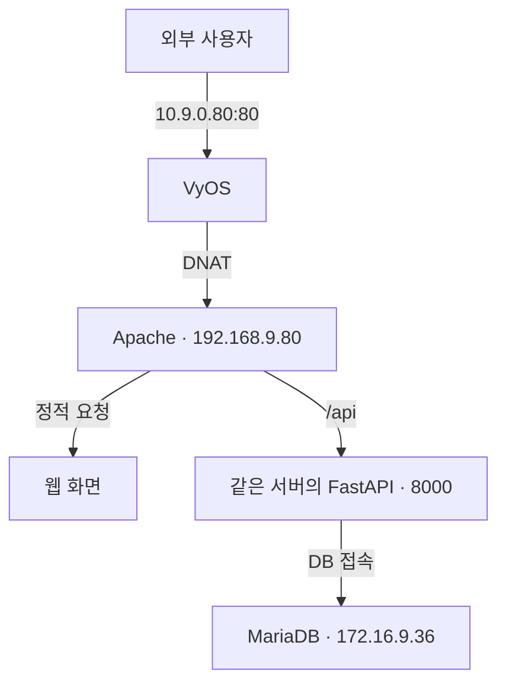

# LAB 02 / SERVER · Web과 DB 연동

VyOS의 주소 변환을 통해 외부 HTTP 요청을 웹 서버로 전달하고, 같은 서버의 FastAPI가 별도 MariaDB에 접근하도록 구성한 기본 실습 기록입니다. **Web·App은 같은 서버이며 DB만 별도 서버입니다.**

[Notion 상세 설정과 원본 화면](https://app.notion.com/p/3e3ddb1a6377810f8416ec6ce8471c71)

## 현재 증거 상태

- 확보: 장비별 설정 명령, 웹·DB 연결값, 어댑터와 DB 주소 설정 화면이 연결된 원문.
- 미확보: 실제 HTTP 응답, DB 입력·재조회 결과, 한글 저장 결과, 재부팅 후 검증 출력.
- 이번 문서 검토에서 실제 장비 명령을 실행하지 않았습니다. 설정을 기록했다는 사실과 검증 완료를 구분합니다.
- VyOS는 1.3 문법을 기준으로 정리했으며 실제 설치 버전 출력은 확보하지 못했습니다.

## 구성과 요청 흐름

| 대상 | 주소·역할 |
|---|---|
| VyOS 외부 | 10.9.0.80/8, 상위 게이트웨이 10.0.0.1 |
| VyOS 웹망 | 192.168.9.1/24 |
| VyOS DB망 | 172.16.9.1/24 |
| Web·FastAPI | 192.168.9.80/24, Apache 80 → localhost 8000 |
| MariaDB | 172.16.9.36/24, WebTest, kedu 계정 |

## 주요 설정과 이유

| 목적 | 파일 | 적용 이유 |
|---|---|---|
| 네트워크 출입구 설정 | [주소·기본 경로](configs/02-vyos-address-route.commands) | 서로 다른 내부망의 게이트웨이와 외부 경로 지정 |
| 서버의 외부 통신 | [SNAT](configs/03-vyos-snat.commands) | eth0로 나가는 두 내부망의 출발지 주소 변환 |
| 외부 HTTP·SSH 전달 | [DNAT](configs/04-vyos-dnat.commands) | 외부 80·22 요청을 웹 서버로 전달 |
| DB 문자·수신 주소 | [99-kedu.cnf](configs/99-kedu.cnf) | utf8mb4와 DB 서버 자신의 수신 주소 지정 |
| DB 사용자와 CRUD 권한 | [계정 생성](configs/10-db-create-user.sql.example), [권한](configs/12-db-grants.sql) | 웹 서버 주소에서 접속하는 전용 계정의 범위 지정 |
| DB 출발지 허용 | [firewalld](configs/13-db-firewalld.commands) | 웹 서버 출발지의 3306 접속 허용 |
| App DB 연결 | [접속값 조각](configs/database-settings.py.example) | 계정·DB 주소·포트·데이터베이스 이름 일치 |
| HTTP 요청 중계 | [프록시 설정](configs/httpd-proxy.conf) | /api만 같은 서버의 8000번으로 전달 |
| App 실행 | [직접 실행](configs/22-fastapi-start.commands) | 기존 과제 프로그램의 main.py 실행 |

전체 설치·파일 전송·계정·방화벽·실행 코드는 [configs](configs/)에 원문 순서로 분리했습니다. 실행 장비와 대화형 입력 단계가 다르므로 여러 파일을 합쳐 일괄 실행하는 자동 설치 스크립트가 아닙니다.

## 검증 기준

| 왜 확인하는가 | 현재 기록된 명령·작업 | 결과의 의미 | 실제 결과 |
|---|---|---|---|
| DB 프로세스 | `systemctl is-active mariadb` | active이면 서비스 실행 중 | 미확보 |
| 웹 프로세스 | `systemctl is-active httpd` | 웹 서비스 실행 상태 | 미확보 |
| 웹 설정 문법 | `httpd -t` | Syntax OK이면 문법 검사 통과 | 미확보 |
| DB 구조 | `USE WebTest;` → `SHOW TABLES;` | SQL 가져오기 후 테이블 확인 | 미확보 |
| 실제 기능 | 브라우저 접속 → 입력 → 재조회 | 프록시·App·DB가 기능으로 연결 | 미확보 |

화면 표시만으로 데이터 저장 성공을 판정하지 않습니다. 정상 기준과 실제 결과를 구분해 두었으며, 실행 출력 파일은 생성하지 않았습니다.

## 정적 점검에서 발견한 접속값 불일치

1. **관찰:** 기존 원문의 계정 생성문과 프로그램 설정에 서로 다른 비밀번호 표기가 있었습니다.
2. **확인:** DB 계정과 프로그램의 접속값을 문서에서 대조했습니다.
3. **수정:** 공개 문서와 예제는 동일한 `CHANGE_ME_DB_PASSWORD`로 통일했습니다.
4. **재검증:** 실제 인증 실패 로그와 수정 후 성공 출력은 확보되지 않았습니다. 당시 장애를 해결한 사례라고 단정하지 않습니다.

실제 장애 발생 시에는 가상망·주소 → 외부 HTTP 전달 → Apache 프록시 → FastAPI 실행 → DB 계정·권한 → 저장·재조회 순서로 대상을 분리해 확인합니다.

## 재사용 범위와 미완료 항목

- `.conf`, `.sql`, `.example`은 원문에서 분리한 설정 조각입니다. `database-settings.py.example`은 완전한 애플리케이션이 아닙니다.
- 실제 `fastapi_3tier_v3.zip`과 `webtest_DB.sql` 본문은 확보하지 못해 대체 코드나 테이블 정의를 만들지 않았습니다.
- WebTest 생성은 제공 SQL이 선행되어야 합니다. 계정·프로그램 비밀번호는 같은 실습값으로 변경합니다.
- `/var/www/html/database.py` 배치와 root 비밀번호 SSH 허용은 당시 실습 기록입니다. 현재 자료에는 소스 HTTP 차단이나 운영용 계정 분리의 검증 결과가 없습니다.
- DB의 특정 출발지 accept 규칙만으로 나머지 출발지 차단을 단정하지 않습니다. 활성 zone과 기존 허용 규칙, 실제 거부 결과가 필요합니다.
- FastAPI는 직접 실행이며 자동 실행 unit이 없습니다. Apache 재부팅 자동 시작도 현재 기록에서 확인되지 않습니다.

## 출처

[SOURCE_MANIFEST.json](SOURCE_MANIFEST.json)은 각 파일의 원문 페이지·토글·코드 블록 번호·추출 시 편집시간·변환 내역을 연결합니다. 원문 설정을 재사용 파일로 분리했으며 실행 성공을 재현한 것은 아닙니다.
