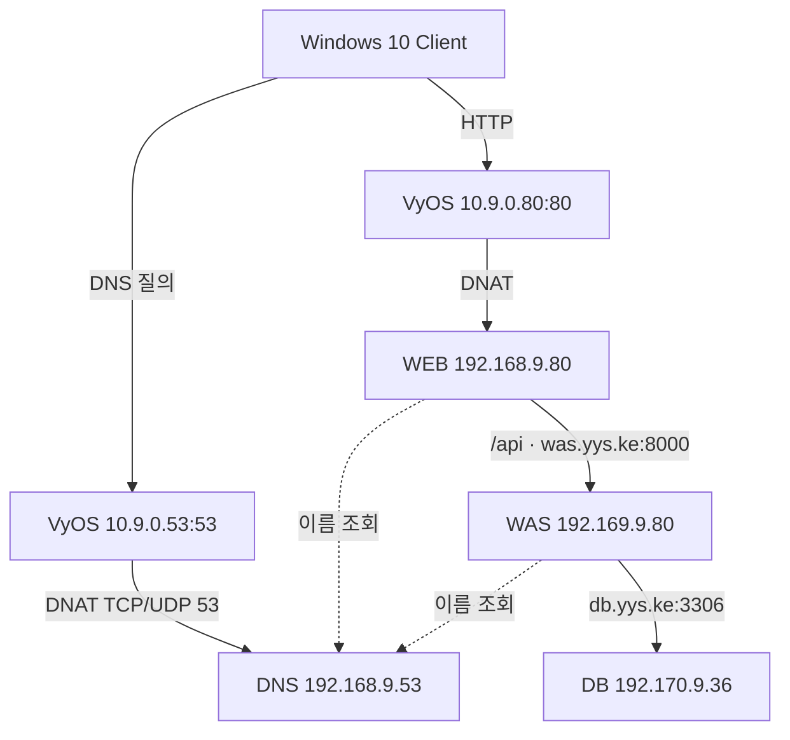

# LAB 03 / SERVER · Domain과 역할 분리

기존 WEB을 WAS로 전환하고 새 WEB·DNS·DB를 분리했습니다. 정적 화면은 WEB, API는 FastAPI, 데이터는 MariaDB가 처리하며 서버 사이의 연결에는 Domain을 사용합니다. **2026년 9월 25일 실습·복구 기록이며 현재 서버를 재조회한 결과가 아닙니다.**

## Architecture



Client의 `www.yys.ke`는 **외부 DNAT 주소 10.9.0.80**을 가리킵니다. WEB의 실제 내부 주소는 **192.168.9.80**입니다. WEB과 WAS는 내부 DNS를 사용해 다음 서버의 내부 주소를 찾습니다.

## Environment / IP Plan

환경은 VMware의 VyOS·Rocky Linux 9.7·Windows 10입니다. BIND·Apache httpd·FastAPI/Uvicorn·MariaDB를 사용했습니다. VyOS NAT 파일은 기존 규칙의 **변경분**이며 전체 장비 설정은 아닙니다.

| 장비 / 연결 | 실습 주소 | Gateway | 이름 / 역할 |
|---|---|---|---|
| VyOS eth0 · VMnet0 | 10.9.0.1/8 · 10.9.0.53/8 · 10.9.0.80/8 | 강의장 외부망 | 외부 통신 출발지 · DNS 공개 · WEB 공개 |
| VyOS eth1 · VMnet1 | 192.168.9.1/24 | — | DNS·WEB망 Gateway |
| VyOS eth2 · VMnet2 | 192.169.9.1/24 | — | WAS망 Gateway |
| VyOS eth3 · VMnet3 | 192.170.9.1/24 | — | DB망 Gateway |
| DNS · VMnet1 | 192.168.9.53/24 | 192.168.9.1 | ns.yys.ke |
| WEB · VMnet1 | **192.168.9.80/24** | 192.168.9.1 | Apache · 정적 화면·프록시 |
| WAS · VMnet2 | 192.169.9.80/24 | 192.169.9.1 | was.yys.ke · FastAPI |
| DB · VMnet3 | 192.170.9.36/24 | 192.170.9.1 | db.yys.ke · MariaDB |
| Client · VMnet0 | 원본에 고정값 미기재 | 외부망 할당값 | DNS 조회 대상 10.9.0.53 |

192.169·192.170 대역은 과제 주소이며 운영망용 RFC 1918 사설 주소 설계로 제시하지 않습니다. 후속 본사·지사 과제 주소와도 혼합하지 않습니다.

## Key Configuration

| WHY | 기록된 설정 | RESULT 의미 / 파일 |
|---|---|---|
| 이름으로 역할에 연결 | www=10.9.0.80, was=192.169.9.80, db=192.170.9.36 | [DNS zone](configs/yys.ke.zone), [수신·재귀 조회](configs/named-options.fragment.conf) |
| 외부 진입과 서버 간 통신 분리 | SNAT 100·110·120, DNS DNAT 3 | [VyOS 변경분](configs/vyos-nat-recorded-delta.txt); NAT와 접근 차단 검증은 구분 |
| API만 WAS로 전달 | ProxyPass /api, ProxyPassReverse | [httpd 설정](configs/httpd-proxy.fragment.conf) |
| 별도 WEB의 요청 수신 | 기존 서비스 --host 127.0.0.1 → 0.0.0.0 | [ExecStart 변경 줄](configs/fastapi-execstart.fragment.txt), [9월 25일 전체 서비스 기록](recovery/fastapi.service.recorded) |
| DB 접근 주소·인증 일치 | bind-address, WAS 출발지 계정, WebTest CRUD 권한 | [DB 바인딩](configs/mariadb-bind.fragment.cnf), [비밀값 제거 SQL](configs/was-account.example.sql) |

WEB의 `httpd_can_network_connect`, WAS의 WEB 출발지 TCP 8000 허용, DB의 WAS 출발지 TCP 3306 허용을 각각 설정했습니다. 기존 데이터와 서비스를 재사용하며 전체 설정 파일을 일부 조각으로 덮어쓰지 않습니다.

## Verification

| 확인 | 명령 / 행동 | 통과 기준 | 증거 수준 |
|---|---|---|---|
| DNS | WAS에서 `getent ahostsv4 db.yys.ke` | 192.170.9.36 조회 | [9월 25일 실제 출력 회수](recovery/domain-dns-http-failure.png). 같은 화면의 HTTP 결과는 실패 본문이므로 분리 판단. |
| DB 데몬 | `ss -lntp` · `ip -br addr` | OS 주소와 대기 주소 일치 | [변경 전 불일치](recovery/domain-db-address-before.png), [OS 주소 복구](recovery/domain-db-address-after.png) 화면 회수. 최종 전체 서비스 출력은 별도 미확보. |
| DB 조회 | WAS에서 `/api/board/list` 호출 | 게시글 목록 또는 정상 빈 목록 | [HTTP 200·본문 fail 실제 화면](recovery/domain-dns-http-failure.png) 회수. 최종 조회 성공은 기록 서술이며 화면 미확보. |
| 사용자 흐름 | 로그인 → 목록 → 글 작성 → 다시 열기 | 저장 내용 재조회 | **9월 25일 원본에 성공 서술**, 결과 캡처 미첨부 |
| 접근 제한·재부팅 | 금지 출발지 접속·재기동 후 확인 | 외부 WAS·DB 직접 접근 제한, 설정·서비스 유지 | 완료 증거 미첨부 |

원문의 조회 확인 명령입니다. 응답 본문의 `status`가 `fail`이면 HTTP 200이어도 실패입니다.

```bash
getent hosts db.yys.ke
curl --noproxy "*" --retry 5 --retry-connrefused --retry-delay 1 --max-time 20 -i http://127.0.0.1:8000/api/board/list
```

## Troubleshooting

| Symptom | Check / Layer | Cause | Fix | Verification / Lesson |
|---|---|---|---|---|
| WAS에서 DB 연결 실패 | DB 실제 IP·DNS·프로그램 대상 비교 / L3·서비스 | DB는 172.16.9.36, 대상은 192.170.9.36 | DB 주소·Gateway·bind-address 일치 | 전체 복구 후 기능 성공 서술. OS 주소와 서비스 대기 주소를 함께 확인. |
| DB망 연결 실패 | 다시 연결한 eth3 주소 / L3 | Gateway 192.170.9.1 누락 | eth3 주소 복구 후 commit·save | NIC 연결과 IP 설정을 구분. [eth3 UP·IPv4 누락 실제 화면](recovery/domain-vyos-eth3-no-ipv4.png) 추가 회수. |
| 통신 복구 후 1045 | 사용자·접속 출발지 / DB 인증 | yongsu@192.169.9.80 인증 거부 | 계정·비밀값·WebTest 권한 일치 | 네트워크와 인증을 분리. 계정 부재인지 비밀값 차이인지는 단정하지 않음. |
| WAS DNS 조회 문제 | Host VMnet2·VyOS 주소 / L2 주소 대응·L3 | 두 장치가 192.169.9.1 중복 | Host VMnet2만 .99/24로 변경, 해당 Host Gateway·잘못된 주소 대응 정보 제거 | 실제 DNS 조회 출력과 `sudo ip neigh flush to 192.169.9.1 dev ens160` 명령을 추가 회수. [복구 명령](recovery/domain-recovery-recorded.commands). |

## Learned

- Domain 조회 → 네트워크 도달 → 서비스 대기 → DB 인증 → 데이터 조회를 나누어 실패 계층을 좁혔습니다.
- 1045가 나타난 단계에서는 DB까지 도달했으므로 네트워크 설정을 반복하기보다 계정·출발지·권한을 확인했습니다.
- systemd의 실제 실행 인자와 프로그램 파일의 값을 구분하고 중복 실행에 따른 포트 충돌을 피하도록 실행 경로를 정리했습니다.
- 설정 명령·원문 성공 서술·실제 출력 증거를 구분합니다. 이번 정리는 현재 장비의 재실행 검증이 아닙니다.

[전체 설정 조각](configs/) · [검증 명령](verification/recorded-checks.txt) · [출처·범위](PROVENANCE.md) · [노션 전체 기록](https://app.notion.com/p/3e3ddb1a637781af9665f2df397232d6)

## 추가 회수한 WAS 복구 증거

9월 25일 실제 로그에서 `Could not import module "main"`과 자동 재시작 반복을 확인했습니다. 같은 시점의 파일 목록에는 `database.py`만 있어 프로그램 파일 누락으로 범위를 좁혔습니다. 과제 ZIP의 동적 파일을 복구한 뒤 로그에 `Application startup complete`와 `0.0.0.0:8000` 대기가 나타났습니다.

- [모듈 로딩 실패](recovery/domain-fastapi-import-error.png) → [실행 경로의 파일 누락](recovery/domain-app-files-missing.png) → [프로그램 시작 완료](recovery/domain-fastapi-started.png).
- [전체 서비스 파일 기록](recovery/fastapi.service.recorded)과 [장비별 복구 명령](recovery/domain-recovery-recorded.commands) 추가. `root` 실행은 당시 실습값이며 운영환경의 권장값으로 제시하지 않습니다.
- `getent` 조회 성공 이후에도 게시글 API가 200과 실패 본문을 반환했습니다. 프로그램 실행·DNS·DB 인증·실제 기능을 각각 검증해야 한다는 실제 근거입니다.
- 원본 ZIP 15개 파일과 `webtest_DB.sql`을 회수했습니다. 제공된 수업용 프로그램이며 최종 배포 서버 전체 Export가 아닙니다. 공개본은 비밀값과 비밀값 포함 디버그 출력만 제거했습니다.
- [원본·복구 범위·화면별 의미](recovery/RECOVERED_SOURCES.md), [출처와 파일 해시](recovery/RECOVERY_SOURCE_MAP.json).

최종 로그인·게시글 저장·재조회 성공은 기존 원문과 인계문 서술로 유지합니다. 새로 찾은 중간 실패 화면을 최종 성공 화면으로 바꾸어 해석하지 않습니다.

## 본사·지사 후속 확장

9월 27일~10월 1일의 후속 구성은 [본사·지사 기록](hq-branch/README.md)에 분리했다. 실제 지사 DNS 응답·NAT 카운터·FastAPI 기동과 WEB→WAS·DB 인증 장애 화면을 포함한다. 9월 25일 성공 서술을 후속 환경의 검증 결과로 재사용하지 않는다.
