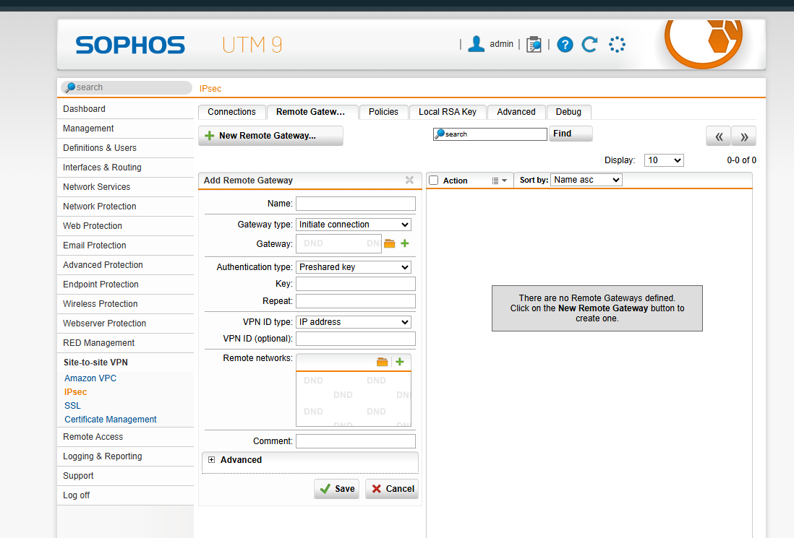

# VPN recovered evidence — 2026-09-11
## Actual problem report
프로젝트 대화 「인프라 vpn」에서 사용자는 “본사는 게이트웨이까지 핑이 가능한데 지사는 게이트웨이까지 핑이 안돼”라고 보고했다. 이는 본사와 지사의 Gateway 도달 결과가 달랐다는 사용자 보고다. 원시 ping 응답과 이후 확정 원인·수정 내역·해결 후 출력은 현재 회수 자료에 없다.

| 단계 | 증거와 판단 |
|---|---|
| Symptom | 본사 Gateway 도달 가능, 지사 Gateway 도달 불가 — 사용자 보고 |
| Check | 양쪽의 자기 Gateway 도달성을 먼저 구분 |
| Layer | 지사 단말↔Gateway 사이의 주소·가상망 연결·인터페이스·ICMP 조건 우선 점검 필요. 원인 확정 아님 |
| Cause / Fix | 확정 기록 미확보 |
| Verification | 지사 Gateway 재시험 및 VPN 경유 양방향 단말 통신 출력 미확보 |
| Lesson | 로컬 Gateway 도달과 상대 내부망 도달을 별도로 검증 |

## Recovered configuration progress
- **2026-09-11 10:20 KST:** Sophos UTM `Add Remote Gateway` 생성 화면. `Initiate connection`, `Preshared key`, `VPN ID type: IP address` 표시. 화면에는 `There are no Remote Gateways defined`가 있어 이 시점 저장된 Gateway가 없음을 확인. 이후 저장·터널 성립은 별도 확인 필요.
- **2026-09-11 11:06 KST:** 과제 캡처에 지사 `192.168.100.10` → 본사 `192.168.10.10` 및 `ping 192.168.10.10` 시험 안내. 이는 예제 주소와 시험 방법이며 실제 단말 할당·성공 응답은 아님.
- 같은 날 Firewall 규칙 화면은 확보했으나 사이트·필터 범위·VPN 장애와의 관계가 확인되지 않아 원인·해결 증거로 사용하지 않음.

## Evidence boundary
Remote Gateway 생성 화면 원본을 직접 확인하고 업로드 날짜 및 현재 노션 설정 기록과 대조했다. 시험 안내와 그 밖의 화면은 첨부의 추출 텍스트로 확인한 범위를 구분했다. Gateway 생성 폼의 존재를 완성된 설정이나 터널 성공으로 바꾸지 않는다. 세부 출처는 노션의 추가 회수 기록에 보존한다.

[노션 상세 기록](https://app.notion.com/p/3e3ddb1a637781abb451d24591e9f0d5)

